# 第11章 模块和包

## 11.1 模块

### 11.1.1 模块概述

Python中一个以.py结尾的源文件即为一个模块（Module）。其中可以包含变量、函数和类等。通常情况下，我们把能够实现某一特定功能的代码放置在一个文件中作为一个模块。

使用模块提高了代码的可维护性，也提高了代码的复用性。即编写好一个模块后，只要是实现该功能的程序，都可以导入这个模块实现。另外，使用模块也可以避免名称冲突，相同名字的函数或变量可以分别存在与不同的模块中。

### 11.1.2 创建模块

模块名区分大小写，且不能与Python自带的标准模块重名。

> 自定义模块：p02_my_math_module.py

```python
"""
    自定义模块
"""
def add(a,b):
    return a+b

def subtract(a,b):
    return a-b

def multiply(a,b):
    return a*b

def divide(a,b):
    return a/b

def _remainder(a,b): # 为后面演示需要，故意以_开头
    return a%b
```

> 自定义模块：p02_my_shape_module.py

```python
"""
    自定义模块
"""
def print_rectangle(width, height):
    """
    打印矩形
    :param width: 宽度
    :param height: 高度
    :return:
    """
    for i in range(height):
        for j in range(width):
            print("*", end="")
        print()

def print_diamond(lines):
    """
    打印菱形
    :param lines: 层数
    :return:
    """
    if not lines % 2 != 0:
        raise ValueError("lines 必须是奇数")
    center = int(lines // 2)
    for i in range(lines):
        for j in range(lines):
            if abs(i-center) + abs(j-center) <= center:
                print("*", end="")
            else:
                print(" ", end="")
        print()

# 为了演示重名，故意与p01_my_math_module中的multiply()方法重名
def multiply(a, b):
    """
    重复打印b次的a接收的数据
    :param a: 要重复的数据
    :param b: 重复b次
    :return:
    """
    print(f"{a}"* b)
```


### 11.1.3 导入模块

#### 1、import 模块：导入模块所有成员

语法格式：

```python
import 模块名 【as 模块别名】
```

- 导入模块的所有成员，通过模块名.成员名的方式访问。即使多次使用 import导入同一模块，模块也只会被导入一次。

示例代码：

```python
"""
    导入某个模块的全部成员
"""
import p02_my_math_module as my
import p02_my_shape_module

print(f"10+2={my.add(10,2)}")
print(f"10-2={my.subtract(10,2)}")
print(f"10*2={my.multiply(10,2)}")
print(f"10÷2={my.divide(10,2)}")
print(f"10%2={my._remainder(10,2)}")

print("打印9行菱形")
p02_my_shape_module.print_diamond(9)
print("打印9行5列矩形")
p02_my_shape_module.print_rectangle(9,5)
print("打印5个$")
p02_my_shape_module.multiply('$',5)
```

#### 2、from模块import成员：指定导入模块具体成员

语法格式：

```python
from 模块名 import 成员名1[as 别名], 成员名2[as 别名],…
```

- 只能使用其导入的成员，未导入的成员不能使用。
- 指定导入模块的部分成员，直接通过成员名的方式访问，无需加`模块名.`。
- 如果多个模块中存在重名成员，后一次导入会覆盖前一次导入。此时可以通过给成员取不同的别名来区分。

示例代码：

```python

"""
    指定导入模块的具体成员
"""
from p02_my_math_module import add,subtract as sub,multiply as mul,_remainder as mod
from p02_my_shape_module import multiply as mul_star

print(f"10+2={add(10,2)}")
print(f"10-2={sub(10,2)}")
print(f"10*2={mul(10,2)}")
# print(f"10÷2={div(10,2)}") # 报错， div() 未导入
print(f"10%2={mod(10,2)}")

print("打印5个$")
mul_star('$',5)
```

#### 3、 from模块import *：导入模块所有非私有成员

语法格式：

```python
from 模块名 import *
```

- 导入模块中所有不以单下划线开头的成员，直接通过成员名的方式访问。

示例代码：

```python

"""
    导入模块所有非私有成员
"""
from p02_my_math_module import *
from p02_my_shape_module import *

# 2个模块有重名成员，需要使用as 别名解决
from p02_my_math_module import multiply as mul_num
from p02_my_shape_module import multiply as mul_star

print(f"10+2={add(10,2)}")
print(f"10-2={subtract(10,2)}")
print(f"10*2={mul_num(10,2)}")
print(f"10÷2={divide(10,2)}")
# print(f"10%2={_remainder(10,2)}") # 报错，# import * 只能导入模块中所有不以单下划线开头的成员

print("打印9行菱形")
print_diamond(9)

print("打印5个$")
mul_star('$',5)
```

#### 4、`__all__`指定import *可导入成员

使用from import *导入模块时，可以在被导入的模块中使用 `__all__`设置哪些内容可以被导入。`__all__ `的设置只针对使用 from import * 导入模块时有效。

> 创建模块：p06_my_math_module.py
>

```python
"""
    自定义模块
"""
__all__ = ["add","sub","mul"]

def add(a,b):
    return a+b

def sub(a,b):
    return a-b

def mul(a,b):
    return a*b

def div(a,b):
    return a/b
```

> 导入p06_my_math_module.py，测试

```python
"""
    演示__all__ + from import *
"""
from p06_my_math_module import *

print(f"10+2={add(10,2)}")
print(f"10-2={sub(10,2)}")
print(f"10*2={mul(10,2)}")
# print(f"10÷2={div(10,2)}") # 报错， div成员未在__all__中
```

#### 5、使用`__name__`变量检查是否主模块

在 Python 中，`__name__ `是一个特殊的内置变量 

- 当一个Python文件被直接运行时，该文件的`__name__`属性值为`__main__`。
- 当一个Python文件作为模块被导入时，`__name__`属性会被设置为该模块的名称（即文件名，不包含 .py 后缀）。

有时我们会在模块中写一些测试代码，当模块被其他文件导入时这些测试代码会被执行。为了避免模块被导入时测试代码被执行，我们可以在被导入模块中添加对 `__name__ `属性的检查：

```python
if __name__ == "__main__":
    测试代码
```

> 创建模块：p07_my_math_module.py

```python
"""
    自定义模块
"""
def add(a,b):
    return a+b

def sub(a,b):
    return a-b

def mul(a,b):
    return a*b

def div(a,b):
    return a/b

# 测试代码
print(f"10+2={add(10,2)}")
print(f"10-2={sub(10,2)}")
print(f"10*2={mul(10,2)}")
print(f"10÷2={div(10,2)}")

# 使用__name__变量检查是否主模块，如果是主模块，则执行测试代码
# if __name__ == "__main__":
#     print(f"10+2={add(10, 2)}")
#     print(f"10-2={sub(10,2)}")
#     print(f"10*2={mul(10,2)}")
#     print(f"10÷2={div(10,2)}")
```

> 测试导入p07_my_math_module.py模块

```python
"""
    演示导入其他模块，查看其他模块的测试代码是否被执行
"""
from p07_my_math_module import *
```

- 发现`p07_my_math_module`模块中不在`if __name__ == "__main__":`中的测试代码被执行了

#### 6、模块搜索顺序

当导入一个模块时，会按照以下顺序进行查找：

（1）当前目录。

（2）PYTHONPATH环境变量中的目录。

（3）包含标准 Python 模块以及这些模块所依赖的任何 extension module 的目录。

（4）site-packages - 查找第三方包安装路径

可以使用以下方式查看模块搜索顺序：

```python
import sys

print(sys.path)
```

路径顺序说明：

- sys.path 列表中的路径按照优先级顺序排列
- Python会从列表的第一个元素开始查找，直到找到所需的模块
- 如果在某个路径中找到了模块，就会停止搜索并加载该模块
- 可以通过 sys.path.append() 或 sys.path.insert() 动态修改搜索路径

这个查找机制确保了模块能够被正确加载，同时允许开发者自定义模块搜索路径

```python
import sys

print(sys.path)

# sys.path.append("d:\\atguigu\\python")
sys.path.insert(0,"d:\\atguigu\\python")

print(sys.path)
```


## 11.2 dir()函数

dir() 是一个内置函数，主要用于：

- `dir(对象)`：列出一个对象的名称列表（即属性和方法）
- `dir(导入的模块名)`：列出一个模块中定义的名称列表（即函数、类、变量等）
- `dir()`：列出当前作用域中定义的名称列表（即函数、类、变量等）

并以一个字符串列表的形式返回。

```python
"""
    演示dir()函数
"""
import math

# 查看math模块下的名称列表
print(f"math模块的名称列表：{dir(math)}")

# 自定义类
class Person:
    home = "earth"

    def __init__(self, name=None):
        self.name = name

    def eat(self):
        print(f"{self.name} is eating")

# 创建对象
p = Person("张三")
print(f"p对象的名称列表：{dir(p)}")

# 定义函数
def test(info):
    print(f"test函数作用域的名称列表：{dir()}") # dir()函数
# 调用函数
test("hello world")

print(f"当前模块作用域的名称列表：{dir()}")
```


## 11.3 包

### 11.3.1 包概述

包是一种管理 Python 模块命名空间的形式，包可以理解为是一个模块集。

通过使用`包.模块名`来构造Python模块命名空间的一种方式。例如，`包名A.模块名B`表示名为A的包中名为B的子模块。通常我们将多个有联系的模块放入一个包中。包与文件夹相似，不过该文件夹下必须有一个`__init__.py`文件。`__init__.py `可以只是一个空文件，也可以执行包的初始化代码或设置 `__all__ `变量。

> 假设要为统一处理声音文件与声音数据设计一个模块集（包）。

声音文件的格式很多（通常以扩展名来识别，例如：.wav，.aiff,.au），因此，为了不同文件格式之间的转换，需要创建和维护一个不断增长的模块集合。为了实现对声音数据的不同处理（例如：混声、添加回声、均衡器功能、创造人工立体声效果），还要编写无穷无尽的模块流。下面这个分级文件树展示了这个包的架构：

```
sound/                          最高层级的包
      __init__.py               初始化 sound 包
      formats/                  用于文件格式转换的子包
              __init__.py
              wavread.py
              wavwrite.py
              aiffread.py
              aiffwrite.py
              auread.py
              auwrite.py
              ...
      effects/                  用于音效的子包
              __init__.py
              echo.py
              surround.py
              reverse.py
              ...
      filters/                  用于过滤器的子包
              __init__.py
              equalizer.py
              vocoder.py
              karaoke.py
              ...
```

### 11.3.2 通用的项目目录结构

```
my_project/  # 项目根目录（工作目录）
├── main.py   # 自定义的主运行文件（入口）
├── pkg1/     # 自定义包1
│   ├── __init__.py
│   ├── mod1.py  # 包1的模块1
│   └── sub_pkg/ # 包1的子包
│       ├── __init__.py
│       └── mod2.py # 子包的模块2
└── pkg2/     # 自定义包2
    ├── __init__.py
    └── mod3.py  # 包2的模块3
```

> 避坑关键：

1、**关注Python 的搜索路径**：解释器会按顺序在`sys.path`列表中查找包 / 模块，`sys.path`包含：当前工作目录、Python 安装目录的 site-packages（第三方包安装路径）、PYTHONPATH 环境变量路径等。可以通过`print(sys.path)`查看当前的搜索路径。

2、**包的标识**：必须有`__init__.py`文件（Python 3.3 + 可省略，但建议加，避免和普通文件夹混淆），该文件可以是空的，也可以写包的初始化代码（如批量导出模块、定义包的版本等）。

3、**主程序的工作目录**：运行 Python 代码时，**工作目录是项目根**是关键，否则会出现`ModuleNotFoundError`（模块找不到）。

### 11.3.3 准备工作：创建包

#### 1、创建mygraphic包及其模块

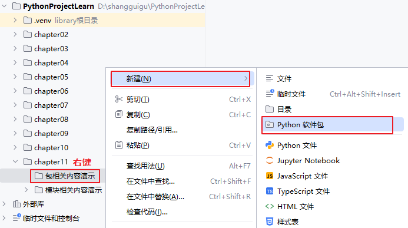


（1）创建模块circle.py

```python
"""circle.py"""

PI = 3.1415926

def area(radius):
    return PI * radius * radius

def perimeter(radius):
    return 2 * PI * radius

```

（2）创建模块rectangle.py

```python
"""rectangle.py"""

def area(width, height):
    return width * height

def perimeter(width, height):
    return 2 * (width + height)

```

#### 2、创建mymath包及其模块

（1）basic_arithmetic.py

```python
def add(a,b):
    return a+b

def subtract(a,b):
    return a-b

def multiply(a,b):
    return a*b

def divide(a,b):
    return a/b

def remainder(a,b):
    return a%b
```

（2）advance_calculate.py

```python
def my_power(a,b):
    return a ** b

def my_sqrt(a):
    return a ** 0.5
```

#### 3、创建主运行文件

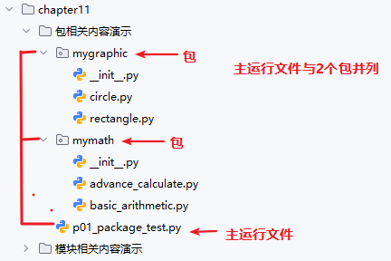


### 11.3.4 导入包的模块

#### 1、import包

语法格式：

```python
import 包名
import 包名.子包名 
```

如果最后一项是包，那么必须在被导入包的`__init__.py`文件中，指定导入包中的哪些模块。这是python导包的一个优化机制，避免导入过多模块。并且在`__init__.py`中指定导入模块的时候，建议使用相对路径。例如：

```python
from . import basic_arithmetic # . 代表当前目录，即当前__init__.py文件的路径下找模块文件
```

如果不加from . ，它会把导入的模块basic_arithmetic作为顶级模块，直接从sys.path中是找basic_arithmetic模块，而不是找mymath包下的basic_arithmetic模块。

```python
import basic_arithmetic # 如果不加from . ，就相当于直接从sys.path中是找basic_arithmetic模块（会报错）
```

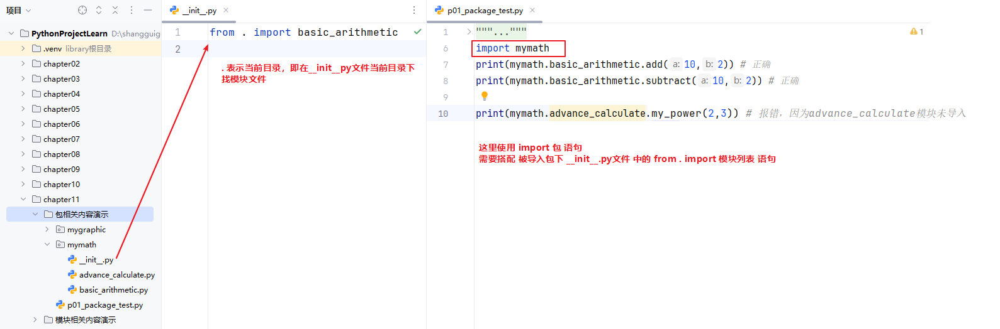

> 主运行文件p01_package_test.py的代码

```python
"""
# 演示导入包
"""
import mymath
print(mymath.basic_arithmetic.add(10,2)) # 正确，因为basic_arithmetic模块在mymath包的__init__.py文件中导入了
print(mymath.basic_arithmetic.subtract(10,2)) # 正确

# print(mymath.advance_calculate.my_power(2,3)) # 报错，因为advance_calculate模块未导入
```

#### 2、import包.模块/from包import模块

语法格式：

```python
import 包名.模块名 [as 别名]

# 或

from 包名 import 模块名 [as 别名]
```

> 主运行文件p02_package_test.py的代码
>

```python
# import mymath.advance_calculate as ma
from mymath import advance_calculate as ma

print(ma.my_power(2,3))
print(ma.my_sqrt(9))
```

#### 3、from包.模块import 成员

语法格式：

```python
from 包名.模块名 import 成员名 [as 别名]
```

> 主运行文件p03_package_test.py的代码
>

```python
from mymath.advance_calculate import my_power as mpo,my_sqrt as msq

print(mpo(2,3))
print(msq(9))
```

#### 4、`__all__`指定import*可导入模块

语法格式：

```python
from 包名 import *
```

当我们使用 from import * 时，Python并不会查找并导入包的所有子模块，因为这将花费很长的时间，并且可能会产生我们不想要的副作用。

唯一的解决办法是提供包的显式索引。如果包的 `__init__.py `中定义了` __all__`，运行 from import * 时，它就是被导入的模块名列表。

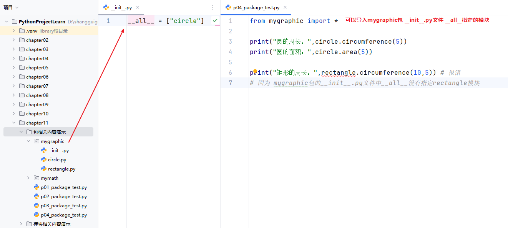

> mygraphic包`__init__.py`中`__all__`定义如下：

```python
__all__ = ["circle"]
```

> 主运行文件p04_package_test.py的代码
>

```py
from mygraphic import *

print("圆的周长：",circle.circumference(5))
print("圆的面积：",circle.area(5))

# print("矩形的周长：",rectangle.circumference(10,5)) # 报错
# 因为 mygraphic包的__init__.py文件中__all__没有指定rectangle模块
```

## 11.4 标准库

标准库指的是在安装Python时就一同安装。这些库经过精心挑选和开发，旨在为Python开发者提供通用且强大的工具集，涵盖各种不同的应用领域。更多标准库可参考https://docs.python.org/zh-cn/3/library/index.html。

### 11.4.1 常用标准库

| **名称**            | **说明**                                                     |
| ------------------- | ------------------------------------------------------------ |
| **os**              | 多种操作系统接口。                                           |
| **sys**             | 系统相关的形参和函数。                                       |
| **time**            | 时间的访问和转换。                                           |
| **datetime**        | 提供了用于操作日期和时间的类。                               |
| **math**            | 数学函数。                                                   |
| **random**          | 生成伪随机数。                                               |
| **re**              | 正则表达式匹配操作。                                         |
| **json**            | JSON 编码器和解码器。                                        |
| **collections**     | 实现了一些专门化的容器，提供了对 Python 的通用内建容器 dict、list、set 和 tuple 的补充。 |
| **functools**       | 高阶函数，以及可调用对象上的操作                             |
| **hashlib**         | 安全哈希与消息摘要。                                         |
| **urllib**          | URL 处理模块。                                               |
| **smtplib**         | SMTP  协议客户端，邮件处理。                                 |
| **zlib**            | 与 gzip 兼容的压缩。                                         |
| **gzip**            | 对 gzip 文件的支持。                                         |
| **bz2**             | 对 bzip2 压缩算法的支持。                                    |
| **multiprocessing** | 基于进程的并行。                                             |
| **threading**       | 基于线程的并行。                                             |
| **copy**            | 浅层及深层拷贝操作。                                         |
| **socket**          | 低层级的网络接口。                                           |
| **shutil**          | 提供了一系列对文件和文件集合的高阶操作，特别是提供了一些支持文件拷贝和删除的函数。 |
| **glob**            | Unix 风格的路径名模式扩展。                                  |

### 14.4.2 日期时间库

#### 1、datetime库

> 部分常用函数

|          分类           |                      函数 / 方法                       |                      作用说明                       |
| :---------------------: | :----------------------------------------------------: | :-------------------------------------------------: |
|     **模块级函数**      |                `datetime.date.today()`                 |         获取当前本地日期（返回 date 对象）          |
|                         |               `datetime.datetime.now()`                |     获取当前本地日期时间（返回 datetime 对象）      |
|                         |              `datetime.date(年、月、日)`               |                    返回date对象                     |
|                         |      `datetime.datetime(年、月、日、时、分、秒)`       |                  返回datetime对象                   |
|                         |     `datetime.datetime.fromtimestamp(1710000000)`      |         将时间戳（秒）转换为 datetime 对象          |
|                         | `datetime.datetime.strptime("2026-03-04", "%Y-%m-%d")` |       将字符串按指定格式解析为 datetime 对象        |
|    **date 对象方法**    |               `date对象.year/month/day`                |       获取日期的年 / 月 / 日（属性，非方法）        |
|                         |                  `date对象.weekday()`                  |          获取星期几（0 = 周一，6 = 周日）           |
|                         |                `date对象.isoweekday()`                 |          获取星期几（1 = 周一，7 = 周日）           |
|                         |          `date对象.strftime("%Y年%m月%d日")`           |           将 date 对象格式化为指定字符串            |
|  **datetime 对象方法**  |    `datetime对象.year/month/day/hour/minute/second`    | 获取 datetime 的年 / 月 / 日 / 时 / 分 / 秒（属性） |
|                         |                 `datetime对象.date()`                  |           从 datetime 对象提取 date 对象            |
|                         |                 `datetime对象.time()`                  |           从 datetime 对象提取 time 对象            |
|                         |      `datetime对象.strftime("%Y-%m-%d %H:%M:%S")`      |         将 datetime 对象格式化为指定字符串          |
|                         |               `datetime对象.timestamp()`               |         将 datetime 对象转换为时间戳（秒）          |
| **timedelta（时间差）** |       `datetime.timedelta(days=..., hours=...)`        |          创建时间差对象，用于日期时间加减           |
|                         |            `datetime对象1 - datetime对象2`             |                   创建时间差对象                    |
|                         |              `timedelta对象.days/seconds`              |           获取时间差的天数 / 秒数（属性）           |

> 常用格式化指令：
>

| 格式指令 |          含义          |            示例             |
| :------: | :--------------------: | :-------------------------: |
|   `%Y`   |        4 位年份        |            2026             |
|   `%y`   |   2 位年份（00-99）    |       26（对应 2026）       |
|   `%m`   |   2 位月份（01-12）    |         01（一月）          |
|   `%d`   |   2 位日期（01-31）    |             24              |
|   `%H`   | 24 小时制小时（00-23） |             10              |
|   `%I`   | 12 小时制小时（01-12） |         10（上午）          |
|   `%M`   |   2 位分钟（00-59）    |             30              |
|   `%S`   |   2 位秒数（00-59）    |             00              |
|   `%A`   |        星期全称        |          Saturday           |
|   `%a`   |        星期简称        |             Sat             |
|   `%w`   |         星期值         |      0(0=周日，6=周六)      |
|   `%b`   |        月份简称        |             Jan             |
|   `%B`   |        月份全称        |           January           |
|   `%p`   |  上午 / 下午（AM/PM）  |   AM/PM（配合 % I 使用）    |
|   `%j`   |     这一年的第几天     | 2026-12-31是这一年的第365天 |

```python
from datetime import datetime

date1 = datetime(year=2026, month=6, day=5)
print("某一天", date1)
str1 = date1.strftime("%Y-%m-%d 是这一天的第%j天")
print("日期转为字符串：",str1)

date2 = datetime.now()
print("现在日期时间：",date2)
print("获取年：", date2.year)
print("获取月份：",date2.month)
print("获取日期：",date2.day)
print("获取星期值：",date2.weekday())
print("获取星期单词",date2.strftime("%A"))
print("两个日期间隔：",date2 - date1)
str2 = date2.strftime("%Y年%m月%d日 %H:%M:%S")
print("日期转为字符串：", str2)

date3 = datetime.strptime("2026-05-01", "%Y-%m-%d")
print("字符串转为日期：" , date3)

time4 = datetime.timestamp(datetime.now())
print("日期转为时间戳：", time4)
```


#### 2、time库

> 基础时间获取

|           函数           |                    作用                     |                             示例                             |
| :----------------------: | :-----------------------------------------: | :----------------------------------------------------------: |
|      `time.time()`       |          获取当前时间戳（浮点数）           |        `print(time.time()) # 输出：1741567890.123456`        |
| `time.localtime([secs])` | 将时间戳转为本地结构化时间（默认当前时间）  | `t = time.localtime() # 输出：time.struct_time(tm_year=2026, tm_mon=3, ...)` |
|  `time.gmtime([secs])`   | 将时间戳转为 UTC 结构化时间（格林威治时间） |           `t = time.gmtime() # 比北京时间晚8小时`            |
|   `time.ctime([secs])`   |    将时间戳转为易读的字符串（本地时间）     |    `print(time.ctime()) # 输出：Tue Mar 10 10:11:30 2026`    |

> 时间格式化 / 解析

|              函数               |               作用               |                             示例                             |
| :-----------------------------: | :------------------------------: | :----------------------------------------------------------: |
|  `time.strftime(format, [t])`   | 将结构化时间转为指定格式的字符串 | `time.strftime("%Y-%m-%d %H:%M:%S", t) # 输出：2026-03-10 10:11:30` |
| `time.strptime(string, format)` |  将字符串按格式解析为结构化时间  |          `time.strptime("2026-03-10", "%Y-%m-%d")`           |

> 时间延迟 / 计时

|         函数          |              作用              |             示例              |
| :-------------------: | :----------------------------: | :---------------------------: |
|  `time.sleep(secs)`   |   程序暂停指定秒数（浮点数）   | `time.sleep(2.5) # 暂停2.5秒` |
| `time.perf_counter()` | 高精度计时（用于代码耗时统计） |          见下方示例           |

```python
import time

# 1. 获取当前时间并格式化
now_timestamp = time.time()  # 时间戳
print("当前时间戳：", now_timestamp)
now_local = time.localtime(now_timestamp)  # 本地结构化时间
print("当前本地结构化时间：", now_local)
formatted_time = time.strftime("%Y-%m-%d %H:%M:%S", now_local)
print("当前格式化时间：", formatted_time)  # 输出：2026-03-10 10:15:20

# 2. 解析字符串时间为结构化时间
str_time = "2026-03-01 08:30:00"
parsed_time = time.strptime(str_time, "%Y-%m-%d %H:%M:%S")
print("解析后的时间：", parsed_time)

# 3. 代码耗时统计
start = time.perf_counter()
sum([i for i in range(1000000)])  # 模拟耗时操作
end = time.perf_counter()
print(f"代码耗时：{end - start:.4f} 秒")

# 4. 暂停程序
print("暂停3秒...")
time.sleep(3)
print("继续执行")
```

#### 3、calendar库

`calendar` 库专注于**日历生成、星期计算、月份 / 年份的日历展示**，常用函数 / 属性如下：

> 基础日历属性

|             函数 / 属性              |                   作用                   |                             示例                             |
| :----------------------------------: | :--------------------------------------: | :----------------------------------------------------------: |
| `calendar.weekday(year, month, day)` | 返回指定日期的星期（0 = 周一，6 = 周日） |      `calendar.weekday(2026, 3, 10) # 输出：1（周二）`       |
|       `calendar.weekheader(n)`       |   返回星期缩写（n 是每个缩写的字符数）   | `calendar.weekheader(3) # 输出：'Mon Tue Wed Thu Fri Sat Sun'` |
|  `calendar.monthrange(year, month)`  |    返回 (该月第一天的星期，该月天数)     | `calendar.monthrange(2026, 3) # 输出：(5, 31) → 3月1日是周六，共31天` |

> 日历生成

|              函数               |                作用                |               示例               |
| :-----------------------------: | :--------------------------------: | :------------------------------: |
|  `calendar.month(year, month)`  |      返回指定月份的日历字符串      | `print(calendar.month(2026, 3))` |
|    `calendar.calendar(year)`    |    返回指定年份的完整日历字符串    | `print(calendar.calendar(2026))` |
| `calendar.prmonth(year, month)` | 直接打印指定月份的日历（无返回值） |   `calendar.prmonth(2026, 3)`    |
|     `calendar.prcal(year)`      | 直接打印指定年份的日历（无返回值） |      `calendar.prcal(2026)`      |

> 辅助判断

|            函数             |                  作用                  |                   示例                    |
| :-------------------------: | :------------------------------------: | :---------------------------------------: |
|   `calendar.isleap(year)`   |             判断是否是闰年             |   `calendar.isleap(2024) # 输出：True`    |
| `calendar.leapdays(y1, y2)` | 返回 y1 到 y2 之间的闰年数（左闭右开） | `calendar.leapdays(2000, 2026) # 输出：7` |

```python
import calendar

# 1. 判断某日期是星期几（0=周一，6=周日）
week_num = calendar.weekday(2026, 3, 10)
week_names = ["周一", "周二", "周三", "周四", "周五", "周六", "周日"]
print(f"2026-03-10 是 {week_names[week_num]}")  # 输出：周二

# 2. 获取某月份的天数和第一天的星期
first_week, month_days = calendar.monthrange(2026, 3)
print(f"2026年3月有{month_days}天，第一天是{week_names[first_week]}")  # 输出：31天，第一天是周六

# 3. 打印2026年3月的日历
print("2026年3月日历：")
calendar.prmonth(2026, 3)

# 4. 判断闰年
print(f"2024是闰年吗？{calendar.isleap(2024)}")  # True
print(f"2000-2026之间有{calendar.leapdays(2000, 2026)}个闰年")  # 7
```


### 14.4.3 string库

常量是 `string` 模块中最常被使用的部分，用于快速获取各类字符集合，避免手动定义。

|          常量名          |                 说明                 |                     示例值（部分）                     |
| :----------------------: | :----------------------------------: | :----------------------------------------------------: |
|  `string.ascii_letters`  |     所有大小写字母（a-z + A-Z）      | 'abcdefghijklmnopqrstuvwxyzABCDEFGHIJKLMNOPQRSTUVWXYZ' |
| `string.ascii_lowercase` |         所有小写字母（a-z）          |              'abcdefghijklmnopqrstuvwxyz'              |
| `string.ascii_uppercase` |         所有大写字母（A-Z）          |              'ABCDEFGHIJKLMNOPQRSTUVWXYZ'              |
|     `string.digits`      |           所有数字（0-9）            |                      '0123456789'                      |
|   `string.punctuation`   |    所有标点符号（!@#$%^&*() 等）     |           '!"#$%&'()*+,-./:;<=>?@[\]^_`{}~'            |
|   `string.whitespace`    | 所有空白字符（空格、制表符、换行等） |                   ' \t\n\r\x0b\x0c'                    |

```python
import string

# 常用字符串常量
print(string.ascii_letters)  # 所有大小写字母
print(string.digits)         # 数字0-9
print(string.punctuation)    # 标点符号
```

### 14.4.4 random库

> 生成不同类型、不同范围的随机数

|                 函数名                  |                             说明                             |                           示例                            |
| :-------------------------------------: | :----------------------------------------------------------: | :-------------------------------------------------------: |
|            `random.random()`            |         生成 `[0.0, 1.0)` 范围内的浮点数（左闭右开）         |       `random.random()` → 0.789456（每次结果不同）        |
|         `random.uniform(a, b)`          | 生成 `[a, b]` 范围内的浮点数（a/b 顺序不影响，如 uniform (2,5) 和 uniform (5,2) 效果一致） |              `random.uniform(1, 10)` → 5.678              |
|         `random.randint(a, b)`          |          生成 `[a, b]` 范围内的整数（包含 a 和 b）           |               `random.randint(1, 100)` → 89               |
| `random.randrange(start, stop[, step])` | 从 `range(start, stop, step)` 中随机选一个整数（不包含 stop） | `random.randrange(0, 10, 2)` → 6（选 0/2/4/6/8 中的一个） |

> 用于从序列中随机选择、打乱序列等

|                  函数名                  |                        说明                        |                             示例                             |
| :--------------------------------------: | :------------------------------------------------: | :----------------------------------------------------------: |
|           `random.choice(seq)`           | 从非空序列（列表 / 字符串 / 元组）中随机选一个元素 |            `random.choice(['a', 'b', 'c'])` → 'b'            |
| `random.choices(seq, weights=None, k=n)` |  从序列中**有放回**随机选 n 个元素（可指定权重）   | `random.choices([1,2,3], weights=[0.1,0.1,0.8], k=2)` → [3,3] |
|        `random.sample(seq, k=n)`         | 从序列中**无放回**随机选 n 个元素（n ≤ 序列长度）  |           `random.sample([1,2,3,4], k=2)` → [3,1]            |
|          `random.shuffle(seq)`           | 原地打乱可变序列（如列表，不可用于字符串 / 元组）  |   `lst = [1,2,3]; random.shuffle(lst)` → lst 变为 [2,1,3]    |

```python
import random

# 生成0-1的浮点数
print(random.random())  # 输出示例: 0.3456789

# 生成10-20的浮点数
print(random.uniform(10, 20))  # 输出示例: 15.8901

# 生成1-5的整数（包含5）
print(random.randint(1, 5))  # 输出示例: 3

# 生成0-100的偶数（步长2）
print(random.randrange(0, 101, 2))  # 输出示例: 48

# 随机选一个元素（比如抽奖选1个人）
names = ['小明', '小红', '小刚']
print(random.choice(names))  # 输出示例: 小红

# 有放回选3个（比如抽奖可重复中奖）
print(random.choices(names, k=3))  # 输出示例: ['小刚', '小红', '小刚']

# 无放回选2个（比如抽奖不可重复中奖）
print(random.sample(names, k=2))  # 输出示例: ['小明', '小刚']

# 打乱列表（比如打乱答题顺序）
nums = [1,2,3,4,5]
random.shuffle(nums)
print(nums)  # 输出示例: [3,1,5,2,4]
```

### 14.4.5 math库

`math` 模块核心是**高精度常量**（pi/e）和**专业数学函数**（取整、幂对数、三角函数）

- **参数类型**：`math` 模块函数仅支持**数值类型**（int/float），传入字符串会报错；
- **浮点数精度**：所有运算返回浮点数（如 `math.pow(2,3)` 返回 8.0 而非 8）；
- **复数运算**：`math` 模块不支持复数，如需处理复数（如 √-1），使用 `cmath` 模块；
- **内置 vs math**：简单运算（如加减乘除、幂运算 `**`）用内置即可，复杂运算（如三角函数、高精度常量）用 `math`。

> `math` 模块定义了高精度的数学常量，避免手动输入近似值。

|   常量名   |          说明          |     近似值      |             示例              |
| :--------: | :--------------------: | :-------------: | :---------------------------: |
| `math.pi`  |        圆周率 π        | 3.1415926535... |    `math.pi` → 3.14159...     |
|  `math.e`  |       自然常数 e       | 2.7182818284... |     `math.e` → 2.71828...     |
| `math.tau` |  2π（圆周率的 2 倍）   | 6.2831853071... |    `math.tau` → 6.28318...    |
| `math.inf` |        正无穷大        |        -        |  `math.inf` > 1000000 → True  |
| `math.nan` | 非数字（Not a Number） |        -        | `math.isnan(math.nan)` → True |

```python
import math

# 计算圆的面积（面积=πr²）
r = 5
area = math.pi * (r **2)
print(area)  # 输出: 78.53981633974483

# 自然指数运算
print(math.e** 2)  # 输出: 7.3890560989306495
```

> 取整函数（区分不同取整规则）

|     函数名      |                 说明                  |                      示例                      |
| :-------------: | :-----------------------------------: | :--------------------------------------------: |
| `math.ceil(x)`  |  向上取整（取大于等于 x 的最小整数）  |  `math.ceil(3.2)` → 4；`math.ceil(-3.2)` → -3  |
| `math.floor(x)` |  向下取整（取小于等于 x 的最大整数）  | `math.floor(3.8)` → 3；`math.floor(-3.8)` → -4 |
| `math.trunc(x)` | 截断取整（只保留整数部分，忽略小数）  | `math.trunc(3.8)` → 3；`math.trunc(-3.8)` → -3 |
|   `round(x)`    | 四舍五入（Python 内置，非 math 模块） |       `round(3.5)` → 4；`round(3.4)` → 3       |

```python
import math

print(math.ceil(2.1))   # 输出: 3
print(math.floor(2.9))  # 输出: 2
print(math.trunc(-2.9)) # 输出: -2
```

> 幂 / 对数函数

|        函数名         |                             说明                             |                          示例                          |
| :-------------------: | :----------------------------------------------------------: | :----------------------------------------------------: |
|   `math.pow(x, y)`    |             计算 x^y（x 的 y 次方，返回浮点数）              |                 `math.pow(2, 3)` → 8.0                 |
|    `math.sqrt(x)`     |                    计算 x 的平方根（x≥0）                    |                 `math.sqrt(16)` → 4.0                  |
|     `math.exp(x)`     |                     计算 e^x（自然指数）                     |              `math.exp(2)` → 7.389056...               |
| `math.log(x[, base])` | 对数运算（默认自然对数 ln (x)，指定 base 则为 log_base (x)） | `math.log(10)` → 2.30258...；`math.log(100, 10)` → 2.0 |
|    `math.log10(x)`    |                       以 10 为底的对数                       |                `math.log10(100)` → 2.0                 |

```python
import math

# 平方根计算
print(math.sqrt(25))  # 输出: 5.0

# 对数计算（计算log₂8）
print(math.log(8, 2))  # 输出: 3.0

# 自然指数
print(math.exp(1))  # 输出: 2.718281828459045
```

> 所有三角函数的参数都是**弧度**（而非角度），需用 `math.radians()` 转换角度→弧度，`math.degrees()` 转换弧度→角度。

|      函数名       |    说明    |                  示例（计算 30° 正弦值）                   |
| :---------------: | :--------: | :--------------------------------------------------------: |
|   `math.sin(x)`   |  正弦函数  | `math.sin(math.radians(30))` → 0.49999999999999994（≈0.5） |
|   `math.cos(x)`   |  余弦函数  | `math.cos(math.radians(60))` → 0.5000000000000001（≈0.5）  |
|   `math.tan(x)`   |  正切函数  |  `math.tan(math.radians(45))` → 0.9999999999999999（≈1）   |
|  `math.asin(x)`   | 反正弦函数 |           `math.degrees(math.asin(0.5))` → 30.0            |
|  `math.acos(x)`   | 反余弦函数 |           `math.degrees(math.acos(0.5))` → 60.0            |
|  `math.atan(x)`   | 反正切函数 |            `math.degrees(math.atan(1))` → 45.0             |
| `math.radians(x)` | 角度转弧度 |           `math.radians(180)` → 3.14159...（π）            |
| `math.degrees(x)` | 弧度转角度 |              `math.degrees(math.pi)` → 180.0               |

```python
import math

# 计算90°的正弦值
sin_90 = math.sin(math.radians(90))
print(sin_90)  # 输出: 1.0

# 弧度转角度（π弧度=180°）
print(math.degrees(math.pi))  # 输出: 180.0
```

> 其他实用函数（按需使用）

|        函数名        |                     说明                     |                  示例                  |
| :------------------: | :------------------------------------------: | :------------------------------------: |
| `math.factorial(x)`  |        计算 x 的阶乘（x 为非负整数）         | `math.factorial(5)` → 120（5×4×3×2×1） |
|   `math.gcd(a, b)`   |   计算 a 和 b 的最大公约数（Python 3.5+）    |         `math.gcd(12, 18)` → 6         |
|   `math.lcm(a, b)`   |   计算 a 和 b 的最小公倍数（Python 3.9+）    |        `math.lcm(12, 18)` → 36         |
| `math.isclose(a, b)` | 判断两个数是否近似相等（避免浮点数精度问题） |  `math.isclose(0.1+0.2, 0.3)` → True   |

```python
import math

# 阶乘计算
print(math.factorial(6))  # 输出: 720

# 浮点数精度问题解决（0.1+0.2=0.30000000000000004）
print(0.1 + 0.2 == 0.3)          # 输出: False
print(math.isclose(0.1+0.2, 0.3))# 输出: True
```

### 14.4.6 collections高级数据结构

Python 的 `collections` 模块提供了一系列**增强版的内置数据结构**，弥补了列表、字典、元组、集合的功能短板，是日常开发中提升效率的核心工具。

1、`defaultdict`：带默认值的字典

解决普通字典 `dict` 访问不存在的键时报 `KeyError` 的问题，可指定键的默认值类型。

- 初始化时指定「默认值工厂函数」（如 `int`/`list`/`set`）；
- 访问不存在的键时，自动创建该键并赋值为默认值（如 `int` → 0，`list` → []）。

```python
import collections

# 案例1：统计单词出现的次数
words = ["hello", "world", "hello", "hello", "atguigu", "python"]
word_count_dict = collections.defaultdict(int)
for w in words:
    word_count_dict[w] += 1
print(dict(word_count_dict))

# 案例2：按照奇偶分组
nums = [5,8,7,9,4,6,7,2,1]
odd_even_dist = collections.defaultdict(list)
for n in nums:
    if n % 2 == 0:
        odd_even_dist["even"].append(n)
    else:
        odd_even_dist["odd"].append(n)
print(dict(odd_even_dist))
```

2. `Counter`：计数器（哈希对象计数）

专门用于统计可哈希对象（字符串、列表、元组等）的元素频次，是 `defaultdict(int)` 的简化版。

**核心方法**：

- `Counter(iterable)`：初始化计数器；
- `most_common(n)`：返回频次最高的前 n 个元素（n=None 时返回所有）；
- `update(iterable)`：更新计数（累加）；
- `elements()`：返回迭代器，包含所有元素（按频次重复）。

```python
from collections import Counter

# 统计字符串字符频次
s = 'hello world'
char_count = Counter(s)
print(char_count)  # 输出: Counter({'l': 3, 'o': 2, 'h': 1, 'e': 1, ' ': 1, 'w': 1, 'r': 1, 'd': 1})

# 获取频次最高的2个元素
print(char_count.most_common(2))  # 输出: [('l', 3), ('o', 2)]

# 统计列表并更新计数
nums = [1,2,2,3]
num_count = Counter(nums)
num_count.update([2,3,3,3])  # 累加：2→3次，3→4次
print(num_count)  # 输出: Counter({3: 4, 2: 3, 1: 1})
```

3. `deque`：双端队列（高效增删）

替代列表的高性能双端队列，解决列表「头部增删元素（`insert(0)`/`pop(0)`）效率低」的问题（列表头部操作时间复杂度 O (n)，deque 是 O (1)）。

原因：为了平衡「双端增删的高效性」和「内存连续性」，Python 的 `deque` 采用了**固定大小的数组块（block）** 串联成的双向链表结构。简化的逻辑效果图：

```txt
[块1: 元素0, 元素1, ..., 元素63] <--> [块2: 元素64, 元素65, ...] <--> [块3: ...]
 ↑（头指针）                          ↑（中间块）                   ↑（尾指针）
```

|    结构类型     |      头尾增删效率      |             随机访问效率             |       内存开销       |
| :-------------: | :--------------------: | :----------------------------------: | :------------------: |
|   纯双向链表    |          O(1)          |                 O(n)                 | 高（每个节点存指针） |
| 纯数组（列表）  | 头部 O (n)/ 尾部 O (1) |                 O(1)                 |          低          |
| deque（块链表） |          O(1)          | 接近 O (1)（块内 O (1)，跨块 O (k)） |          中          |

**核心方法**：

- `deque(iterable)`：创建队列
- `append(x)`：右侧添加元素；
- `appendleft(x)`：左侧添加元素；
- `pop()`：右侧删除元素；
- `popleft()`：左侧删除元素；
- `extend(iterable)`：右侧扩展；
- `extendleft(iterable)`：左侧扩展（元素顺序反转）；
- `rotate(n)`：队列旋转（n>0 右移，n<0 左移）。例如：[10, 20, 30, 40, 50, 60]，队列.rotate(2)结果是[50, 60, 10, 20, 30, 40]，队列.rotate(-2)结果是[30, 40, 50, 60, 10, 20]

```python
from collections import deque

# 初始化双端队列
dq = deque([1,2,3])

# 左侧添加/删除
dq.appendleft(0)  # dq: deque([0,1,2,3])
dq.popleft()      # dq: deque([1,2,3])

# 右侧添加/删除
dq.append(4)      # dq: deque([1,2,3,4])
dq.pop()          # dq: deque([1,2,3])

# 旋转（模拟队列循环）
dq.rotate(1)      # 右移1位，右边的补到前面去: deque([3,1,2])
dq.rotate(-1)     # 左移1位，左边的补到最后去: deque([1,2,3])

# 场景：实现队列（先进先出FIFO）
queue = deque()
queue.append(1)
queue.append(2)
print(queue.popleft())  # 输出: 1（先进先出）
```

### 14.4.7 正则re库

Python的re模块提供了正则表达式匹配操作。re模块中提供了一些方法用于查找或处理字符串。

- `re.search(pattern, string, flags)`：扫描整个 string 查找正则表达式 pattern 产生匹配的第一个位置，并返回相应的 Match。如果字符串中没有与模式匹配的位置则返回 None。
- `re.match(pattern, string, flags)`：如果 string `开头`的零个或多个字符与正则表达式 pattern 匹配，则返回相应的 Match。如果字符串开头与模式不匹配则返回 None。
- `re.findall(pattern, string, flags)`：返回 pattern 在 string 中的所有非重叠匹配，以字符串列表或字符串元组列表的形式。对 string 的扫描从左至右，匹配结果按照找到的顺序返回。空匹配也包括在结果中。
- `re.sub(pattern, repl, string, count=0)`：返回通过使用 repl 替换在 string 最左边非重叠出现的 pattern 而获得的字符串。如果样式没有找到，则不加改变地返回 string。
  - repl 可以是字符串或函数。如果 repl 是一个函数，该函数接受单个 Match 参数，并返回替换字符串。

  - 可选参数 count 是要替换的最大次数；count 必须是非负整数。如果省略这个参数或设为 0，所有的匹配都会被替换。

- `re.split(pattern, string, maxsplit=0)`：用 pattern 分开 string 。 如果在 pattern 中捕获到括号，那么所有的组里的文字也会包含在列表里。如果 maxsplit 非零， 最多进行 maxsplit 次分隔， 剩下的字符全部返回到列表的最后一个元素。

```python
#搜索数字
text_one = "今天是2026年1月25日，天气不错。2026年5月1日不知道天气怎么样？"
print(re.match(r"\d+", text_one))#None  只搜索开头
print(re.search(r"\d+", text_one))#<re.Match object; span=(3, 7), match='2026'>  搜索第一次匹配的，返回Match对象
print(re.findall(r"\d+", text_one))#['2026', '1', '25', '2026', '5', '1']  搜索所有的， 返回列表

m = re.search(r"\d+", text_one)
print("match对象的group()：",m.group()) #找到的数字结果
print("match对象的span()：",m.span())#找到的数字结果的索引范围(3, 7)


text_two = "2026年2月16日是除夕，2026年5月1日是劳动节！"
print(re.match(r"\d+", text_two))#<re.Match object; span=(0, 4), match='2026'>  只搜索开头
print(re.search(r"\d+", text_two))#<re.Match object; span=(3, 7), match='2026'>  搜索第一次匹配的，返回Match对象
print(re.findall(r"\d+", text_two))#['2026', '1', '25', '2026', '5', '1']  搜索所有的， 返回列表
```

```python
"""
    捕获组：
        从左往右数(，遇到第1个(就是第1组，第2个(就是第2组
    
    ((\d{4})年((0?[1-9]|1[0-2])月(0?[1-9]|[12]\d|3[01])日))
    第1组：((\d{4})年((0?[1-9]|1[0-2])月(0?[1-9]|[12]\d|3[01])日))
    第2组：(\d{4})
    第3组：((0?[1-9]|1[0-2])月(0?[1-9]|[12]\d|3[01])日)
    第4组：(0?[1-9]|1[0-2])
    第5组：(0?[1-9]|[12]\d|3[01])
"""
text_four = "今天是2026年1月25日，天气不错。"
m = re.search(r"((\d{4})年((0?[1-9]|1[0-2])月(0?[1-9]|[12]\d|3[01])日))",text_four)
print("总的匹配结果：",m.group())
for i in range(1,6):
    print(f"第{i}组：{m.group(i)}")

text_five = "出生日期：2002年5月6日，毕业日期：2025-7-1，入职日期：2026/3/8"
date_list = re.findall(r"(\d{4})[年/-](0?[1-9]|1[0-2])[月/-](0?[1-9]|[12]\d|3[01])日?", text_five)
print(date_list)
```

```python
# str_demo = "hello"
# #把字符串中e替换为a
# str_demo = str_demo.replace("e","a")
# print(str_demo)


text = "123hello89world45python472"
# 去除字符串首尾的数字
text = re.sub(r"^\d+|\d+$", "", text)
print(text)

# # 替换字符串中的数字为 -
text = re.sub(r"\d+", "-", text)
print(text)

#  text = "123hello89world45python472"
#非开头和结尾的数字替换为-
# result = re.sub(r'(?<=[a-zA-Z])\d+(?=[a-zA-Z])', '-', text)
# result = re.sub(r'(?<=[^\d])\d+(?=[^\d])', '-', text)
# result = re.sub(r'(?<=\D)\d+(?=\D)', '-', text)
print(result)
"""
(1)找\d+，即找数字
(2)(?<=[a-zA-Z])它在数字前面，表示，找到数字后，往数字的前面找1个[a-zA-Z]，如果找到了，该数字说明满足条件，否则该数字不是它要查找的目标
    例如：123，但是123前面没有[a-zA-Z]，所以123被排除了
(3)(?=[a-zA-Z])它在数字的后面，表示，找到数字后，往数字的后面找1个[a-zA-Z]，如果找到了，该数字说明满足条件，否则该数字不是它要查找的目标
    例如：472，但是472后面没有[a-zA-Z]，所以472被排除了
    
    例如：89前后都找到了[a-zA-Z]，89是目标
"""


# 使用 re.sub() 方法将数字替换为对应的单词
sentence = "I have 2 apples and 3 oranges."
# 定义数字到词的映射
num_map = {"1": "one", "2": "two", "3": "three", "4": "four", "5": "five"}
print(re.sub(r"(\d)", lambda x: num_map[x[0]], sentence))
# I have two apples and three oranges.
```

```python
# 按多个分隔符分割
text = "apple,banana;orange:grape"
print(re.split(r"[,;:]",text))

# 捕获组会保留分隔符
text = "apple,banana;orange:grape"
print(re.split(r"([,;:])",text))
```


## 11.5 引入第三方库

当需要使用Python中没有内置的库时，可以通过以下方式安装第三方库

### 11.5.1 pip命令方式

pip是Python包管理工具，该工具提供了对 Python 包的查找、下载、安装、卸载的功能。pip 默认的源是 Python Package Index（PyPI），其地址为 https://pypi.org/simple/，如果下载比较慢，还可以指定其它的源

- 阿里云：https://mirrors.aliyun.com/pypi/simple/
- 豆瓣：http://pypi.douban.com/simple/
- 清华大学：https://pypi.tuna.tsinghua.edu.cn/simple/

通过Windows命令行的方式安装，是将第三方包安装在本地python下，例如：D:\ProgramFiles\Python\Python312\Lib\site-packages

- 查看我们已经安装的软件包

```python
pip list
```

-  安装软件包：具体包名就什么可以到PyPI上查找

```python
pip install 包名  # 安装指定包
pip install 包名==版本号 # 安装指定版本
pip install --upgrade 包名 # 升级包到最新版本
pip install -r requirements.txt # 批量安装requirements.txt文件中列出的包
pip install --user 包名 # 安装到用户目录
```

```
# requirements.txt 示例内容
requests==2.31.0  # 安装指定版本
flask>=2.0.0      # 安装大于等于2.0.0的版本
numpy             # 不指定版本，安装最新版
pandas~=2.1.0     # 安装2.1.x系列的最新版（兼容更新）
```

- 查看某个包安装路径

```
pip show 包名
```


- 卸载软件包

```python
pip uninstall 包名
```

- 临时使用其他源

```python
pip install -i https://mirrors.aliyun.com/pypi/simple/ 包名
```

- 永久修改源

```python
pip config set global.index-url https://mirrors.aliyun.com/pypi/simple/
```

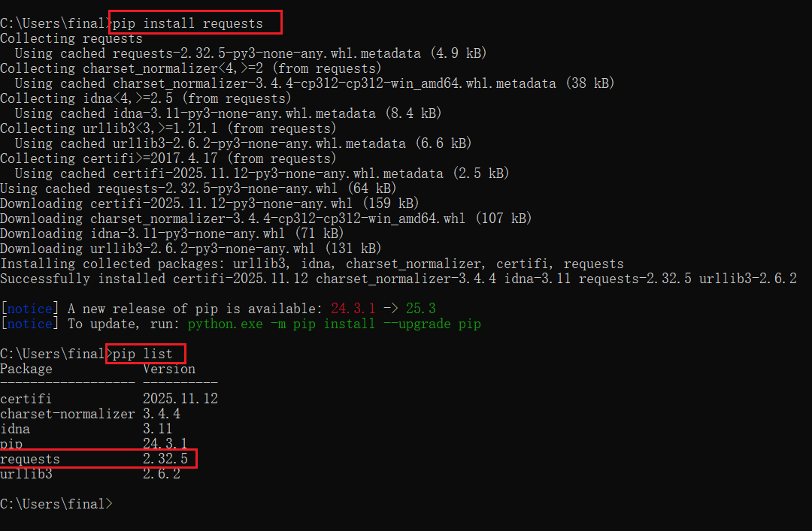

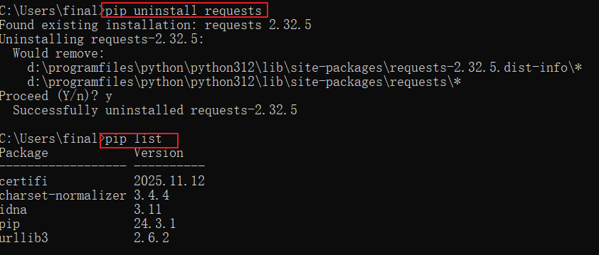

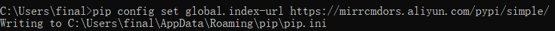

### 11.5.2 PyCharm方式

通过Pycharm安装，我们选择的解释器类型每个项目独立的，所以是将第三方包安装在当前项目环境下，例如：D:\shangguigu\PythonProject\.venv\Lib\site-packages

1）点击右下角的解释器设置

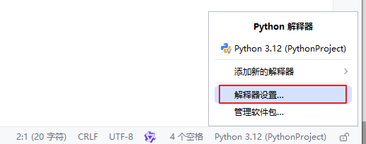

2）点击+

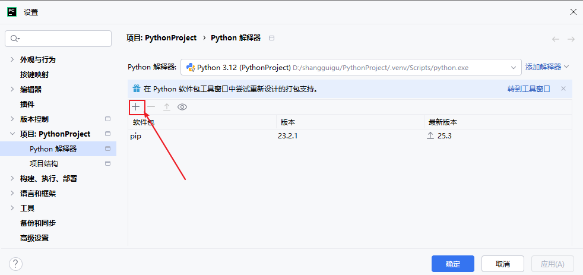

3）搜索包并安装

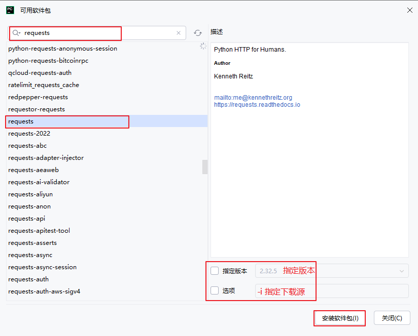

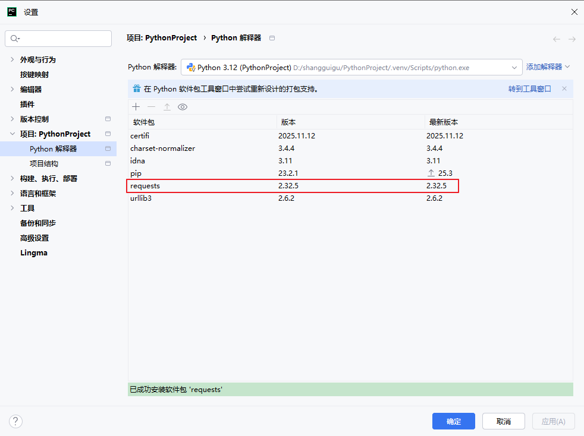

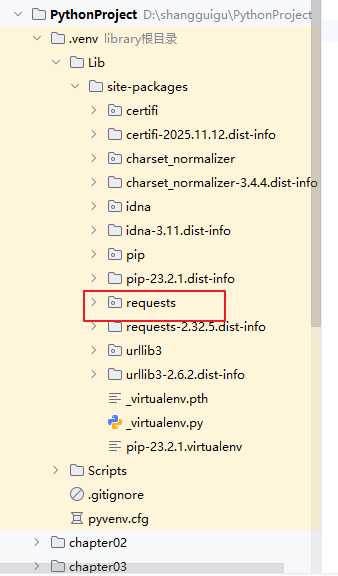

### 11.5.3 第三方库numpy

```python
import numpy as np

m1 = np.matrix([[1, 2, 3], [4, 5, 6]])
m2 = np.matrix([[10, 20, 30], [40, 50, 60]])
m3 = np.matrix([[10, 20], [30, 40],[50,60]])
print(f"m1矩阵\n{m1}")
print(f"m2矩阵\n{m2}")

print(f"矩阵m1+m2=\n{m1+m2}")
print(f"矩阵m1-m2=\n{m1-m2}")
print(f"矩阵m1*m2=\n{np.multiply(m1,m2)}")
print(f"矩阵m1*m3=\n{m1*m3}")

print(f"矩阵转置：\n{np.transpose(m1)}")
```


## 11.6 打包自己的库

### 11.6.1 先安装setuptools 库

如果不安装setuptools库，后续打包时可能会遇到报错 ModuleNotFoundError: No module named 'distutils'，所以可以提前安装 setuptools 库。在命令提示符中执行如下命令：

```python
pip install setuptools
```

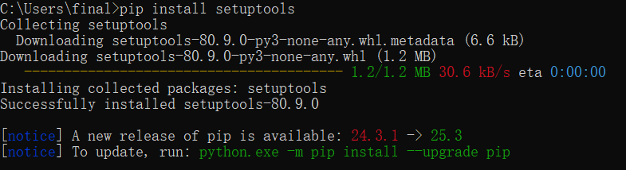

### 11.6.2 编写setup.py文件

🔴在包外创建一个 setup.py 文件

#### 1、打包多个完全独立的包

```python
from setuptools import setup

# 打包第一个独立包
def package1():
    setup(
        name="atguigu_graphic", # 打包后的包名称，必须唯一
        version="0.1.0",        # 版本说明
        packages=["mygraphic"],  # 手动指定第一个包的目录
        python_requires=">=3.7", # python版本要求
    )

# 打包第二个独立包
def package2():
    setup(
        name="atguigu_math",
        version="0.1.0",
        packages=["mymath"],  # 手动指定第二个包的目录
        python_requires=">=3.7",
    )

if __name__ == "__main__":
    # 依次执行两个包的打包（注意，分开运行）
    # package1()
    package2()
```


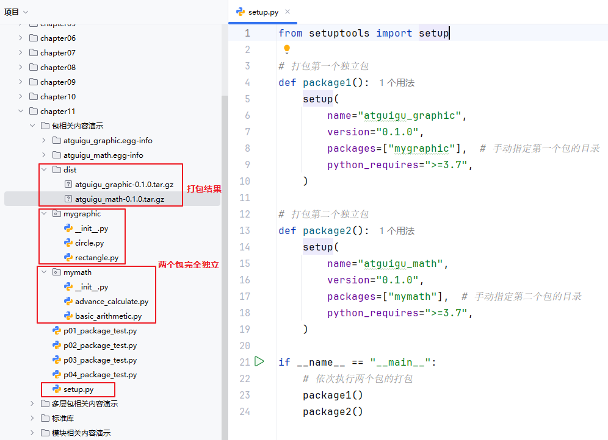

#### 2、总包下含多个子包

```python
from setuptools import setup, find_packages

setup(
    name="atguigu",  # 打包后的包名称，必须唯一
    version="0.1.0", # 版本号
    packages=find_packages(),  # 自动识别主包下的所有子包
    python_requires=">=3.7", # 指定python版本
)
```

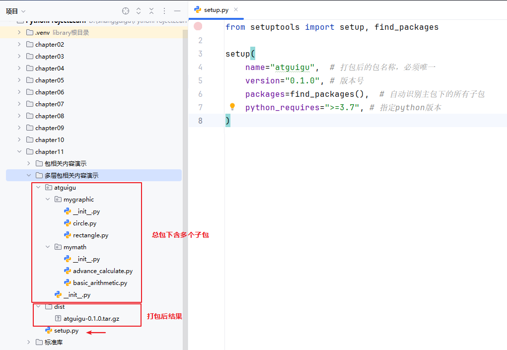


### 11.6.3 命令行方式打包

在 setup.py 同级目录下进行构建

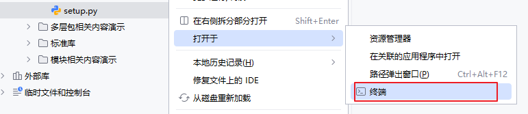

```python
python setup.py sdist # sdist构建为压缩包
```

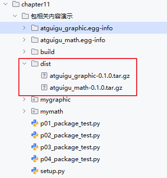


### 11.6.4 安装自己打包的库

#### 1、命令行方式

命令行方式：以你自己打包的库的路径和压缩包名为准

```python
pip install graphic-1.0.tar.gz存储的路径名
```

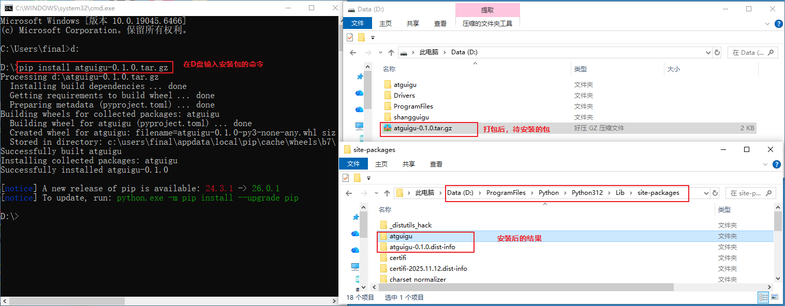


#### 2、PyCharm安装方式

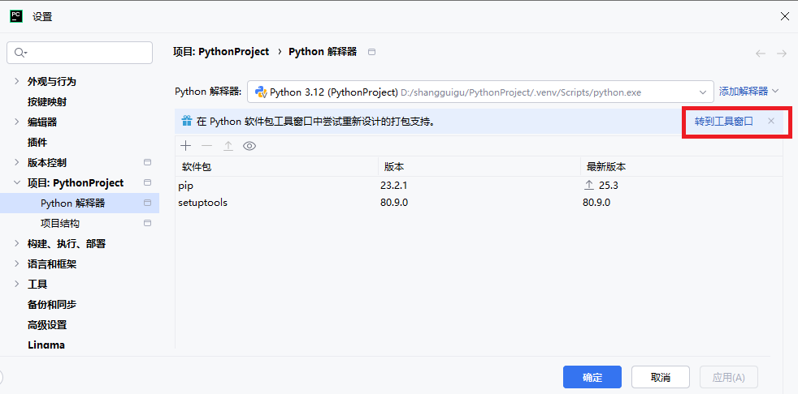

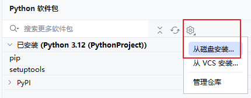

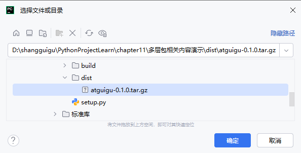

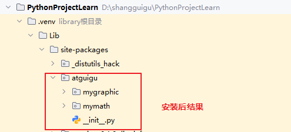

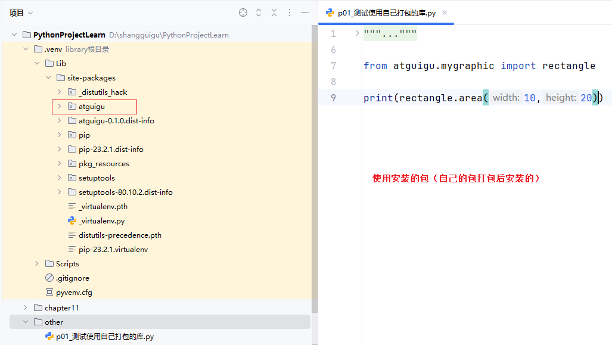
