# 第3章 Python基础语法

## 3.1 注释

注释是对代码的解释说明。

- 提高代码的可读性。
- 屏蔽掉暂时不需要的代码。
- 可以定位程序中出错的位置。

### 1、单行注释

```python
# 这是一个单行注释，可以单独一行，也可以在代码的行尾（建议在#之后留1个空格再写注释内容）
print("hello")  # 这是一个输出语句（建议在代码与注释之间留2个空格）
```

### 2、多行注释

```python
"""
    @Author:Irene
    @Time:2026/1/28
    @Desc:这是文档注释，即当前源文件中的代码说明
"""

"""
    Python中3个单引号、3个双引号引起来的文本块可以被看成多行注释。
    建议每一个python源文件（.py文件)顶部的文档注释使用3个双引号。
"""

info = """
    尚硅谷
        让天下有学不完的技术
"""
print(info)
```

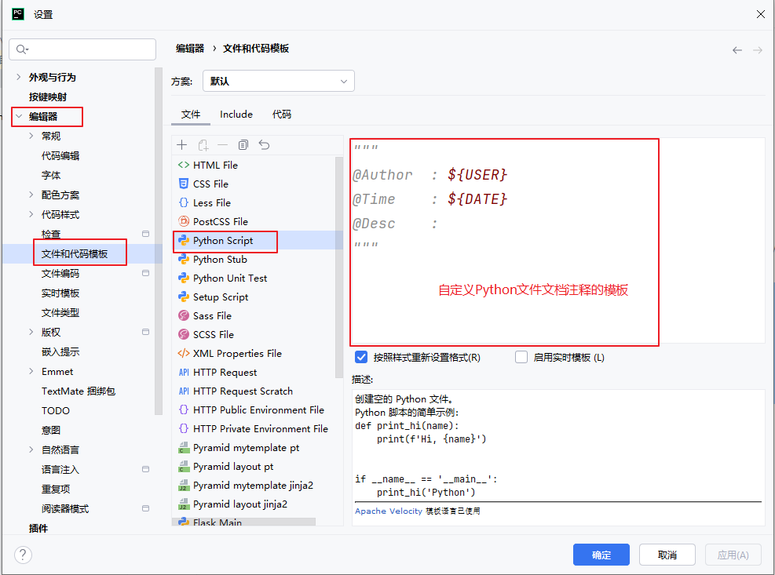

## 3.2 关键字

简单来说，**关键字是编程语言预先保留的、具有特殊含义的单词。** 它们是语言语法的一部分，用于定义程序的结构、声明数据类型、控制程序流程等。你不能将它们用作变量名、函数名或其他自定义标识符。

Python 的标准库提供了一个 keyword 模块，可以输出当前版本的所有关键字：

```python
import keyword
print(keyword.kwlist)
```

运行结果：大约35个

```
['False', 'None', 'True', 'and', 'as', 'assert', 'async', 'await', 'break', 'class', 'continue', 'def', 'del', 'elif', 'else', 'except', 'finally', 'for', 'from', 'global', 'if', 'import', 'in', 'is', 'lambda', 'nonlocal', 'not', 'or', 'pass', 'raise', 'return', 'try', 'while', 'with', 'yield']
```

> 记忆技巧

- **控制流**：if, elif, else, for, while
- **循环控制**：break, continue, pass
- **函数相关**：def, return, lambda, yield
- **异常处理**：try, except, finally, raise
- **模块导入**：import, from, as
- **类与对象**：class, is, del
- **作用域**：global, nonlocal
- **逻辑运算**：and, or, not, in
- **异步编程**：async, await
- **模式匹配**：match, case (Python 3.10+)
- **特殊值**：True, False, None

## 3.3 变量

变量的本质是代表一块内存区域，这块区域中的数据可以在程序运行期间被修改。

在代码中变量就是用一个标识符来表示一个数据，例如：age = 18。

Python中的变量不需要声明。每个变量在使用前都必须赋值，变量赋值以后该变量才会被创建。

变量创建方式：

```python
变量名 = 变量值
```

多个变量的创建：

```python
变量名1 = 变量名2 = 变量名3 = 值          #多个变量值相同
变量名1, 变量名2, 变量名3 = 值1, 值2, 值3  #多个变量值不同
```

```python
name = "张三"
age = 18
weight = 100.5
print("name = ", name, "age = ", age, "weight = ", weight)
age = 19        #变量可以重新赋值
weight = 120.0  #变量可以重新赋值
print("name = ", name, "age = ", age, "weight = ", weight)

a, b = 1, 2 #创建多个变量
c = a + b
print("a = ", a, "b = ", b, "c = ", c)

x, y = 1, 2
print("x = ", x, "y = ", y)
x, y = y, x  # 交换x,y变量的值
print("x = ", x, "y = ", y)

```

## 3.4 常量

在程序中定义后就不再修改的值为常量，Python中没有内置的常量类型。一般约定使用全大写变量名来表示常量。

```python
PI = 3.1415926
E = 2.718282

print(PI)
print(E)

PI = 3.14 #实际上可以修改，只是大家“默认”不会修改
print(PI)
```

Python 的设计哲学里有一句经典的话：**“We are all consenting adults here”**（我们都是成年人），意思是 Python 不会强制限制开发者的任何操作，更倾向于 **“约定优于强制”**。

## 3.5 标识符

程序中给变量、常量、函数等命名的字符序列称为标识符。换句话说，凡是需要自己命名的部分都是标识符。

1、python的命名规则：强烈建议遵守。

- 只能包含字母、数字和下划线
- 且不能以数字开头。
- 区分大小写，即Name和name是两个不同的标识符。
- 不能直接使用关键字当标识符。
- 一个标识符名中不能包含空格。

2、python的命名规范：非常自由，只能说尽量遵守。总的原则：保证可读性好即可。

- 大驼峰命名法（upper camel case）：每个单词首字母大写，一般用于类、异常的命名。常见。
  - 例如：`ValueError`（值错误类）、`ZeroDivisionError`（除0错误类）、multiprocessing模块的`Pool`（进程池类）等

- 小驼峰命名法（lower camel case）：第一个单词首字母小写, 之后每个单词首字母大写，一般用于方法/函数、变量的命名。`但很少用`。
  - 例如：unittest测试包的case模块下TestCase类的`assertEqual`方法等

- 全小写（all lower case）：所有单词都小写，一般用于变量、函数/方法、包、模块等的命名。常见。
  - 例如：random模块的`randint`函数、datetime模块datetime类的`fromtimestamp`方法

- 全大写（all upper case）：所有单词都大写，一般用于常量命名。常见。
  - 例如：datetime模块的`MAXYEAR`变量、`MINYEAR`变量

- 蛇形命名法（snake case）：有时候为了提高可读性，会给全小写和全大写的标识符，在单词间用下划线连接。
  - 全小写：例如`_pydatetime`模块的`_check_date_fields(年,月,日)`
  - 全大写：例如`_pydatetime`模块的`_DAYS_IN_MONTH`

> 另外：
>
> - 如果变量或函数以单个下划线开头或两个下划线开头，表示私有的非公开的（私有请看第9章）。例如：`_pydatetime`模块的`_check_date_fields(年,月,日)`
> - 如果函数名以两个下划线开头和结尾，表示特殊的魔法方法（关于魔法方法见面向对象部分）。例如：`__init__`、`__str__`等

## 3.6 数据类型

### 3.6.1 Python数据类型概述

Python 是一种动态类型语言，虽然Python中变量不用显式声明类型，但是变量不同的值是有不同数据类型的。Python的数据类型非常丰富，下面仅列出最常用最基础的一小部分：

- 数值类型number：包括整数int, 浮点数float, 布尔bool, 复数complex
- 容器类型：包括
  - 字符串str
  - 列表list
  - 元组tuple
  - 集合set
  - 字典dict
- 特殊的类型：None

### 3.6.2 数据类型判断

- 可以使用 type() 来查看变量类型，使用 isinstance() 来判断变量类型。
- type() 和 isinstance() 的区别在于 type() 不会认为子类是一种父类类型，isinstance() 会认为子类是一种父类类型。

```python
a = 10
b = True
print("a = 10的类型：", type(a)) # int
print("b = True的类型：", type(b)) #bool
print("type(a) == type(b)", type(a) == type(b)) #False

print(isinstance(a, bool)) # False
print(isinstance(a, int)) # True
print(isinstance(b, bool)) # True
print(isinstance(b, int)) # True, Python3中bool是int的子类型
```


### 3.6.3 整数int

Python可以处理任意大小的整数，包括负整数。Python3.6+版本支持，书写很大的数时可使用`下划线`将其中的数字分组，使其更清晰易读，又不影响计算。

```python
a = 10
print(a)

a = 323_352_202_896_214_563_213_456_789
print(a)
```

Python对待小整数和大整数有所不同：

1. 小整数池：Python将 [-5, 256] 的整数维护在小整数对象池中。这些整数提前创建好且不会被垃圾回收，避免了为整数频繁申请和销毁内存空间。不管在程序的什么位置，使用的位于这个范围内的整数都是同一个对象。
   - 不同的 Python 实现：小整数池的范围和实现细节可能因 Python 的不同实现（如 CPython、Jython、IronPython 等）而有所不同。上述提到的[-5, 256]范围是 CPython 的默认实现。
2. 大整数池：一开始大整数池为空，每创建一个大整数就会向池中存储一个。
   - 有时连续赋值的相同大整数也可能指向同一对象，这是因为Python环境的优化机制，但是这个优化不是绝对的，也取决于解释器以及交互式脚本环境。

```python
a = 10
b = 10
print(a == b)
print(id(a) == id(b))

a = 300
b = 300
print(a == b)
print(id(a) == id(b))
```

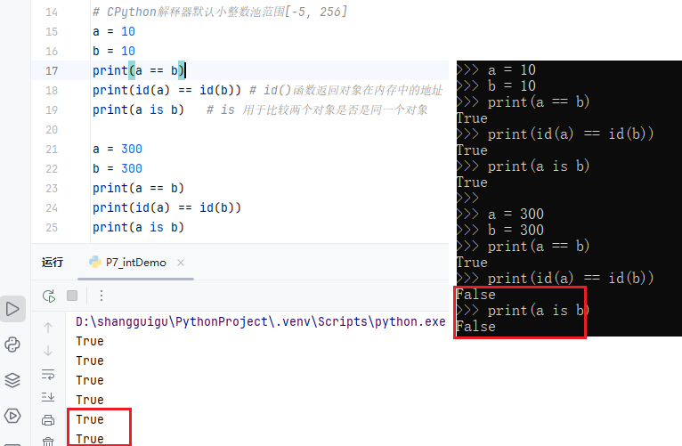

### 3.6.4 小数float和Decimal

|                | float                  | Decimal                                                      |
| -------------- | ---------------------- | ------------------------------------------------------------ |
| 内置还是标准库 | 内置                   | decimal模块的Decimal类型                                     |
| 表示方式       | a = 0.1                | a = decimal.Decimal("0.1")   不加""无法保证精度              |
| 精度范围       | 整数+小数总位数16-17位 | decimal.Decimal("值")  可以表示任意精度，但是计算时的精度位数由decimal.getcontext().prec（prec默认28） 确定 |

注意：输出显示精度，可以通过round或格式化文本来控制

```python
a = 3.1415926
print(a)

a = 3.1415926e7 # 科学计数法表示
print(a)

a = 3.14_15_926 #使用下划线作为数字分隔符
print(a)

a = 0.1
b = 0.2
c = 0.10000000000000001
print(a + b) # 计算有误差
print(a == c) # 近似就相等

from decimal import Decimal
a = Decimal('0.1')
b = Decimal('0.2')
c = Decimal('0.10000000000000001')
print(a + b) #计算更精确
print(a == c) #一致才相等

#decimal.getcontext().prec = 50 #（默认是28） 
print(1.0/3) 
print(Decimal('1')/Decimal('3'))
```

### 3.6.5 布尔bool

布尔型变量只有 True 和 False，用于真假的判断。Python3中，bool 是 int 的子类，True 和 False 可以和数字相加。（True为1，False为0）。

在Python中，能够解释为假的值不只有False：

- False
- 0
- 0.0
- None
- 所有的空容器（空列表、空元组、空字典、空集合、空字符串）

```python
a = True
b = 1
c = False
d = 0

print(a == b)
print(c == d)
print(a + 1)

print(a is b)
print(c is d)

flag = None
if flag:
    print("None")

flag = 0.0
if flag:
    print("0.0")

flag = ""
if flag:
    print("空字符串")

flag = []
if flag:
    print("空列表")
```

### 3.6.6 初识字符串

- 在Python中，用引号括起的都是字符串，其中的引号可以是单引号，也可以是双引号。
- 也可以使用三个引号表示多行字符串。三引号允许一个字符串跨多行，字符串中可以包含换行符、制表符以及其他特殊字符。让程序员从引号和特殊字符串的泥潭里面解脱出来，自始至终保持一小块字符串的格式是所谓的WYSIWYG（所见即所得）格式的。
- 字符串缓冲池：每个（字符串），不夹杂空格或者特殊符号，默认开启intern机制，共享内存，靠引用计数决定是否销毁。相同的字符串默认只保留一份，当创建一个字符串，它会先检查内存里有没有这个字符串，如果有就不再创建新的了。
- 在字符中使用特殊字符时，Python用反斜杠 \ 转义字符：

| **转义字符** | **说明**                           |
| ------------ | ---------------------------------- |
| `\`          | 在多行文本块中，用在行尾表示续行符 |
| `\\`         | 反斜杠符号                         |
| `\'`         | 单引号                             |
| `\"`         | 双引号                             |
| `\b`         | 退格                               |
| `\n`         | 换行                               |
| `\t`         | 横向制表符                         |
| `\r`         | 回车，回到行首                     |

```py
# 序列类型之字符串类型
a = 'hello'  # 字符串可以是单引号
print("a = 'hello'的类型：", type(a))

a = "hello"  # 字符串可以是双引号
print('a = "hello"的类型', type(a))

# 多行文本可以使用"""
a = """
    hello
    world
""""
# 多行文本也可以使用'''
a = '''
    hello
    atguigu
'''
print("a的类型",type(a))

# 转义字符
a = "hello\tworld\njava"
print(a)

# 在多行文本中行尾的\表示不换行，或者续行符
a = """
    hello\
    world
"""
print(a)

# 字符串intern机制：创建字符串对象时，如果字符串对象已经创建过，那么Python解释器就会返回之前创建的字符串对象，从而节省内存开销
a = "hello"
b = "hello"
print(a is b)
```

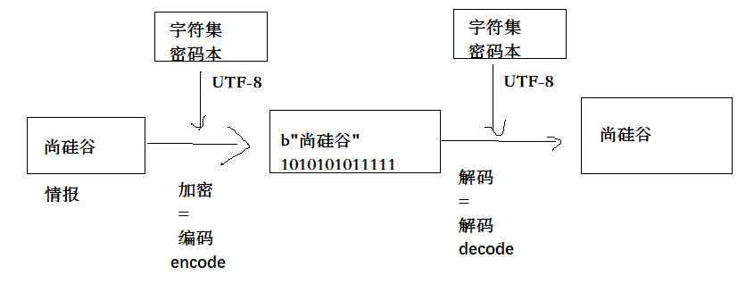

```python
"""
    5、字符的编码问题
    内存中，或计算机世界中只有0和1的二进制，任何的数据：包括数字、文本、图片、视频最终都要转为二进制。
    每一个字符（字母、标点符号等）也要转为数字，例如：a字母对应的数字是97
    规定每一个字符对应的数字编码表称为字符集，最早的字符集是ASCII码表。
    这张表中记录了0-127范围的数字与字符的对应关系，共128个字符。
    需要记几个特殊的字符即可：
    a：97,   b：98 ...
    A：65，  B：66
    '0'：48
    
    查看单个字符编码的函数 ord(单个字符)，逆操作是chr(编码值)函数
    查看多个字符编码的函数 字符串.encode(编码方式)，逆操作是字节数组.decode(编码方式)
"""
letter = '0'
print(letter,"的Unicode编码值：", ord(letter)) # 看 letter变量中的字母对应的Unicode编码值

string = "hello"
print(string, "的编码结果：",  string.encode("UTF-8")) # b'hello'是一个字节数组
for i in string.encode("UTF-8"): # 遍历字节数组，查看每一个元素
    print(i)

code = 100
zi = chr(code) # 将数字转为字符
print(code,"编码对应的字符：", zi)

string = "尚硅谷"
bytes_code = string.encode("UTF-8") # 编码：将字符转为数字
print(string, "的编码结果：",  string.encode("UTF-8"))
result = bytes_code.decode("UTF-8") # 解码：将数字转为字符
print(result, "的解码结果：", result)

# UTF-8，GBK， ISO8859-1等都是编码方式，它们都兼容一个ASCII表
# 中文编码：Big5（繁体），简体GB2312，统一GBK
# 日文：Shift-JIS
# 万国码：Unicode字符集，它在一个表中可以表示世界上所有国家的常用文字。Unicode字符集对应的编码方式有UTF-8,UTF-16等
```


### 3.6.7 数据类型转换

#### 1.自动类型转换

自动类型转换：自动类型转换遵循Python的"鸭子类型"哲学——只要操作有意义，Python会尝试自动处理类型兼容问题。

- 两个布尔类型数据进行算术运算时自动升级为int
- 两个int类型数据进行除法/运算时自动升级为float
- 两个不同数值类型数据进行混合运算，小的类型自动升级为大的类型 bool<int<float<complex

🔴Java等其他语言中，任何类型与字符串进行+，都为转为字符串，但是python中不支持这种隐式转换。python中字符串只能与字符串进行+拼接。

```py
a = 2
b = 3.0
print(a + b)  # 5.0

a = 2
b = 3
print(a / b)

# Python中+运算符重载了字符串的拼接操作，但是只支持字符串与字符串的拼接，不支持其他类型与字符串的拼接
a = 2
b = "hello"
print(a + b) # 错误，unsupported operand type(s) for +: 'int' and 'str'
```


#### 2.强制类型转换

可以通过函数对数据类型进行转换。

| **函数**                 | **说明**                                            |
| ------------------------ | --------------------------------------------------- |
| **int(x [,base])**       | 将x转换为一个整数，x若为字符串可用base指定进制      |
| **float(x)**             | 将x转换为一个浮点数                                 |
| **complex(real[,imag])** | 创建一个实部为real，虚部为imag的复数                |
| **str(x)**               | 将对象x转换为一个字符串                             |
| **repr(x)**              | 将对象x转换为一个字符串，可以转义字符串中的特殊字符 |
| **eval(x)**              | 执行x字符串表达式，并返回表达式的值                 |
| **bin(x)**               | 将一个整数转换为一个二进制字符串                    |
| **oct(x)**               | 将一个整数转换为一个八进制字符串                    |
| **hex(x)**               | 将一个整数转换为一个十六进制字符串                  |
| **ord(x)**               | 将一个字符转换为它的ASCII整数值                     |
| **chr(x)**               | 将一个整数转换为一个Unicode字符                     |
| **tuple(s)**             | 将序列s转换为一个元组                               |
| **list(s)**              | 将序列s转换为一个列表                               |
| **set(s)**               | 转换s为可变集合                                     |

```py
a = 123
b = "456"
print("a 数据类型为:", type(a))
print("类型转换前，b数据类型为:", type(b))

c = int(b)  # 强制转换为整型
print("对b类型转换后，c数据类型为:", type(c))

num_sum = a + c
print("a 与 c 相加结果为:", num_sum)
print("num_sum 数据类型为:", type(num_sum))

d = str(a) # 强制转换为字符串
print("对a类型转换后，d数据类型为:", type(d))
num_str = b + d
print("b 与 d 相加结果为:", num_str)
print("num_str 数据类型为:", type(num_str))
```


## 3.7 运算符

### 3.7.1 算术运算符

| **运算符** | **说明**                      | **实例**     |
| ---------- | ----------------------------- | ------------ |
| **+**      | 加 、或取正（取正通常都省略） | a +  b  、+a |
| **-**      | 减、或取负                    | a - b、-a    |
| *****      | 乘                            | a *  b       |
| **/**      | 除                            | a / b        |
| **//**     | 整除，除后向下取整            | a //  b      |
| **%**      | 模，返回除法的余数            | a % b        |
| ***\***    | 幂                            | a **  b      |

```py
# -------------算术运算符---------------
a = 5
b = 2

c = a + b
print(a , "+" , b , "的结果为" , c)

c = a - b
print(a , "-" , b , "的结果为" , c)

c = a * b
print(a , "*" , b , "的结果为" , c)
print("-" * 30) # 输出30次-

c = a ** b
print(a , "的" , b , "次方结果为" , c)

c = a / b  #注意：结果为浮点类型
print(a , "/" , b , "的结果为" , c)

c = a // b
print(a , "//" , b , "的结果为" , c)

c = a % b
print(a , "%" , b , "的结果为" , c)
```


### 3.7.2 赋值运算符

| **运算符** | **说明**                                                     | **实例**                                             |
| ---------- | ------------------------------------------------------------ | ---------------------------------------------------- |
| **=**      | 赋值                                                         | a =  1                                               |
| **+=**     | 加法赋值                                                     | a += 2，等同于a = a + 2                              |
| **-=**     | 减法赋值                                                     | a -=  2，等同于a = a - 2                             |
| ***=**     | 乘法赋值                                                     | a *= 2，等同于a = a * 2                              |
| **/=**     | 除法赋值                                                     | a /=  2，等同于a = a / 2                             |
| **//=**    | 整除赋值                                                     | a //= 2，等同于a = a // 2                            |
| **%=**     | 模赋值                                                       | a %=  2，等同于a = a % 2                             |
| ***\*=**   | 幂赋值                                                       | a **= 2，等同于a = a \*\* 2                          |
| **:=**     | 海象运算符，在表达式中同时进行赋值和返回赋值的值。Python3.8 版本新增 | num1 = 20  print((num2 := 3**2) > num1)  print(num2) |

```py
# -------------赋值运算符---------------
a = 30
b = 40
sum = a + b
print(sum)

a += 50  # a = a + 50
print(a)

print( (a:=3) > 2) # a = 3，然后取3与2比较大小
```

### 3.7.3 比较运算符/关系运算符

| **运算符** | **说明**           | **实例** |
| ---------- | ------------------ | -------- |
| **==**     | 相等，比较两者的值 | a ==  b  |
| **!=**     | 不相等             | a != b   |
| **>**      | 大于               | a  > b   |
| **<**      | 小于               | a < b    |
| **>=**     | 大于等于           | a  >= b  |
| **<=**     | 小于等于           | a <= b   |

```python
# -------------比较运算符---------------
num1 = 10
num2 = 20
print(num1 == num2)  # False
print(num1 != num2)  # True
print(num1 > num2)   # False
print(num1 < num2)   # True
print(num1 >= num2)  # False
print(num1 <= num2)  # True

num3 = 'abc'
# 注意：不能自动转换的数据类型之间不能进行大小的比较
#print(num1 > num3)
# 如果是数字字符串比较大小，是从最左边开始逐个比较字符串中相应位置的字符的ASCII码
print('5' > '6') # False
print('15' > '6') # False
```

### 3.7.4 逻辑运算符

| **运算符** | **说明**                                          |
| ---------- | ------------------------------------------------- |
| **and**    | 与，x and y，若x为False返回x的值，否则返回y的值   |
| **or**     | 或，x or y，若x为True返回x的值，否则返回y的值     |
| **not**    | 非，not x，若x为True返回False，若x为False返回True |

```python
# -------------逻辑运算符---------------
print(False and True)  # False
print(False or True)  # True
print(not (False))  # True
print(not (True))  # True

print(5 and 8)  # 8 非0表示True，0表示False
print(0 and 8)  # 0
print(5 or 8)  # 5
print(0 or 8)  # 8
print(not (5))  # False
print(not (0))  # False
```


### 3.7.5 if-else表达式

Python确实没有传统的? :条件运算符，但提供了更清晰的if-else表达式作为替代。有些人把它称为三目运算符、三元运算符。

```python
# 其他语言的 ? : 运算符
# result = condition ? value1 : value2;

# Python的等价写法
result = value1 if condition else value2
```

```python
a = 10
b = 9
max = a if a> b else b # if-else表达式
print(max)
```

### 3.7.6 成员运算符

in 操作符是 Python 中用于检查某个元素是否存在于可迭代对象（如序列、集合等）中的成员运算符。

| **运算符** | **说明**                                                     | **实例**                 |
| ---------- | ------------------------------------------------------------ | ------------------------ |
| **in**     | 在指定的序列、集合等容器中找到值返回 True，否则返回 False    | a in  ['a', 'b', 'c']    |
| **not in** | 在指定的序列、集合等容器中没有找到值返回 True，否则返回 False | a not in ['a', 'b', 'c'] |

```python
# -------------成员运算符---------------
a = "hello"
print('h' in a) # True
print('p' in a) # False
print('p' not in a) # True

a = [1,2,3,4,5] # 列表
print(2 in a) # True
print(6 in a) # False
print(6 not in a) # True
```

### 3.7.7 身份运算符

is 运算符是 Python 中用于比较两个对象是否为同一个对象（即是否指向内存中的同一块地址）的运算符。

| **运算符** | **说明**                           | **实例**                                                     |
| ---------- | ---------------------------------- | ------------------------------------------------------------ |
| **is**     | 判断两个标识符是不是引用同一个对象 | a is  b，类似id(a) == id(b)。如果引用的是同一个对象则返回True，否则返回False |
| **is not** | 判断两个标识符是不是引用不同的对象 | a is not b，类似id(a) != id(b)。如果引用的不是同一个对象则返回True，否则返回False |

> is 与 == 的区别

| 比较方式 | 比较内容               | 示例   |
| -------- | ---------------------- | ------ |
| is       | 对象的身份（内存地址） | a is b |
| ==       | 对象的值（内容）       | a == b |

```python
# -------------身份运算符---------------
a = "123"
b = str(123)
print(a is b) # False，地址不同
print(id(a) == id(b)) # False，地址不同
print(a == b) #  True，内容相同
```

### 3.7.8 位运算符

#### 1、进制

计算机世界中只有二进制，所以计算机中存储和运算的所有数据都要转为二进制。包括数字、字符、图片、声音、视频等。常见的进制

（1）十进制：0-9，满10进1。

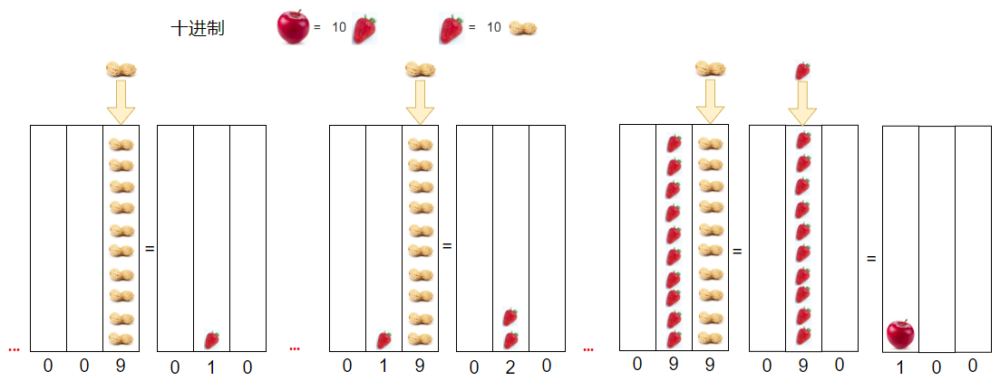

（2）二进制：0、1，满2进1。

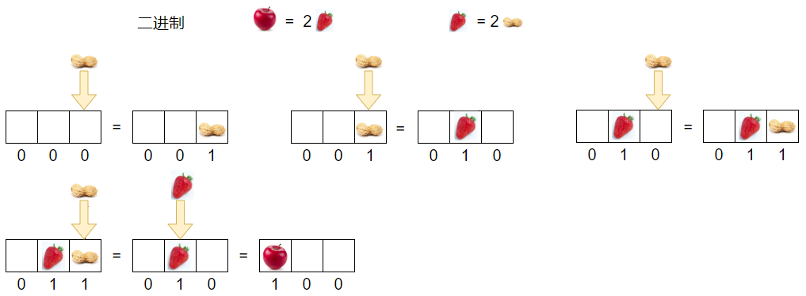

（3）八进制：0-7，满8进1。

（4）十六进制：0 - 9及A-F，满16进1。十六进制中，除了 0 到 9 十个数字外，还引入了字母，以便表示超过9的值。字母A对应十进制的10，字母B对应十进制的11，字母 C、D、E、F 分别对应十进制的 12、13、14、15。

| **二进制** | **八进制** | **十进制** | **十六进制** |
| ---------- | ---------- | ---------- | ------------ |
| **0**      | 0          | 0          | 0            |
| **1**      | 1          | 1          | 1            |
| **10**     | 2          | 2          | 2            |
| **11**     | 3          | 3          | 3            |
| **100**    | 4          | 4          | 4            |
| **101**    | 5          | 5          | 5            |
| **110**    | 6          | 6          | 6            |
| **111**    | 7          | 7          | 7            |
| **1000**   | 10         | 8          | 8            |
| **1001**   | 11         | 9          | 9            |
| **1010**   | 12         | 10         | A            |
| **1011**   | 13         | 11         | B            |
| **1100**   | 14         | 12         | C            |
| **1101**   | 15         | 13         | D            |
| **1110**   | 16         | 14         | E            |
| **1111**   | 17         | 15         | F            |
| **10000**  | 20         | 16         | 10           |
| **10001**  | 21         | 17         | 11           |

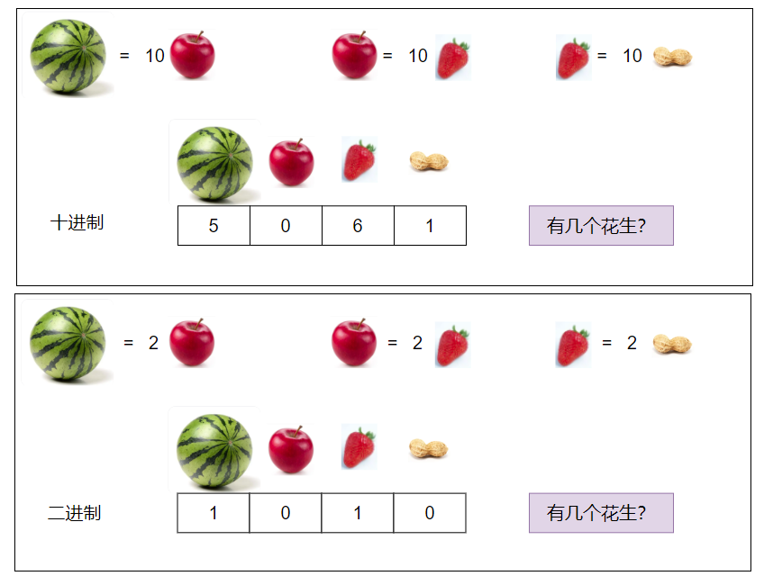

#### 2、不同进制表示整数方式

（1）二进制：以0b或0B开头表示。

（2）八进制：以0o开头表示

（3）十进制：正常数字表示。

（4）十六进制：以0x或0X开头表示，此处的A-F不区分大小写。

```python
print(0B110) # 二进制
print(110) # 十进制
print(0o110) # 八进制
print(0x110) # 十六进制
```


#### 3、了解进制的转换

- 十进制转换成二进制：将该数不断除以2，直到商为0为止，然后将每步得到的余数倒过来，就是对应的二进制。
- 十进制转换成十六进制：将该数不断除以16，直到商为0为止，然后将每步得到的余数倒过来，就是对应的十六进制。
- 十进制转换为八进制，将该数不断除以8，直到商为0为止，然后将每步得到的余数倒过来，就是对应的八进制。

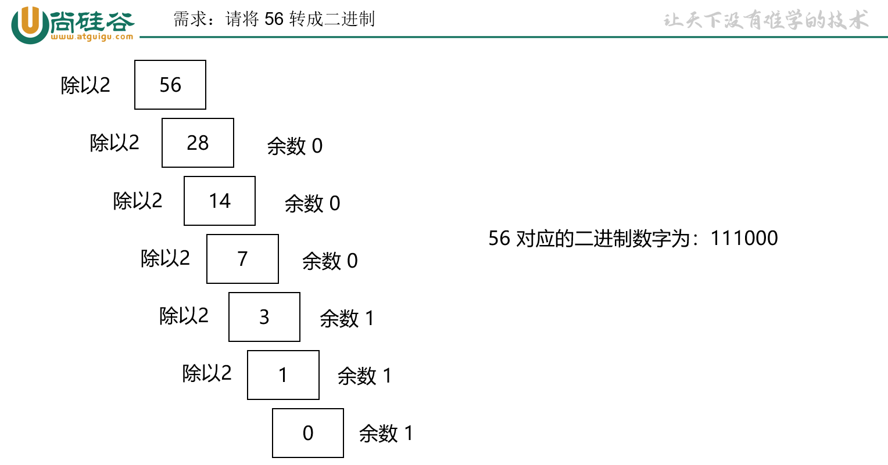

- 二进制转换成十进制：从最低位开始，将每个位上的数提取出来，乘以2的（位数-1）次方，然后求和。
- 十六进制转换成十进制：从最低位开始，将每个位上的数提取出来，乘以16的（位数-1）次方，然后求和。 
- 八进制转换为十进制就从最低位开始，将每个位上的数提取出来，就乘以8的（位数-1）次方，然后求和。

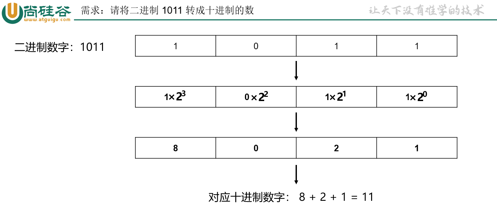


- 二进制转换成十六进制：低位开始，将二进制数每四位一组，转成对应的十六进制数即可。因为2的4次方等于16 ，所以将二进制数从右向左每 4 位分成一组。如果二进制数的位数不是 4 的倍数，则在最左边补零，使其成为 4 的倍数。
- 二进制转换为八进制：低位开始，将二进制数每三位一组，转成对应的八进制数即可。

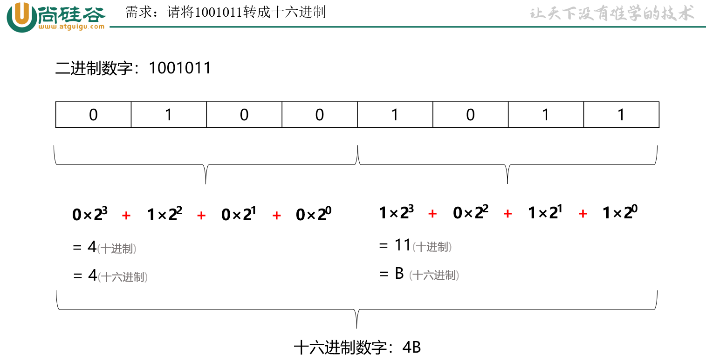

- 十六进制转换成二进制：将十六进制数每1位，转成对应的4位的一个二进制数即可。

- 八进制转换为二进制：将八进制数每1位，转成对应的3位的一个二进制数即可。

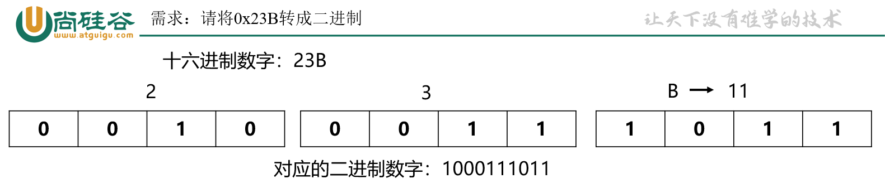

#### 4、符号位与原码反码补码

一个数在计算机中的二进制表示形式，叫做这个数的机器数。机器数是带符号的，在计算机用一个数的最高位存放符号，正数为0，负数为1。

- 正数：原码、反码、补码一致
- 负数：原码、反码、补码都不相同

位运算时，以补码形式进行计算。

|          | **正数25**                     | **负数-25**                           |
| -------- | ------------------------------ | ------------------------------------- |
| **原码** | 符号位加上真值的绝对值00011001 | 符号位加上真值的绝对值10011001        |
| **反码** | 等于原码00011001               | 原码符号位不变，其余位取反   11100110 |
| **补码** | 等于原码00011001               | 反码的基础上+1   11100111             |

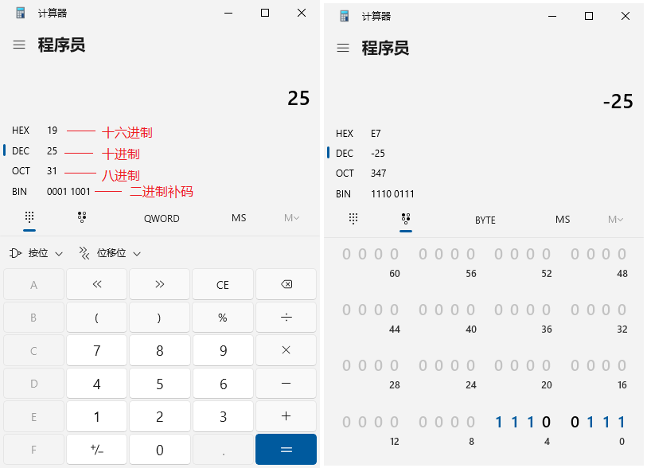

#### 5、位运算符

| **运算符** | **说明** | **实例** | 计算规则                    |
| ---------- | -------- | -------- | --------------------------- |
| **&**      | 按位与   | a  & b   | 11为0，其余为0              |
| **\|**     | 按位或   | a \| b   | 有1为1，00为0               |
| **^**      | 按位异或 | a ^  b   | 10为1，相同为0              |
| **~**      | 按位取反 | ~ a      | 1变0,0变1                   |
| **<<**     | 按位左移 | a  << 1  | 左移几位相当于乘以2的几次方 |
| **>>**     | 按位右移 | a >> 1   | 右移几位相当于除以2的几次方 |

> 以下示例图以1个字节（8个比特位）为例演示：

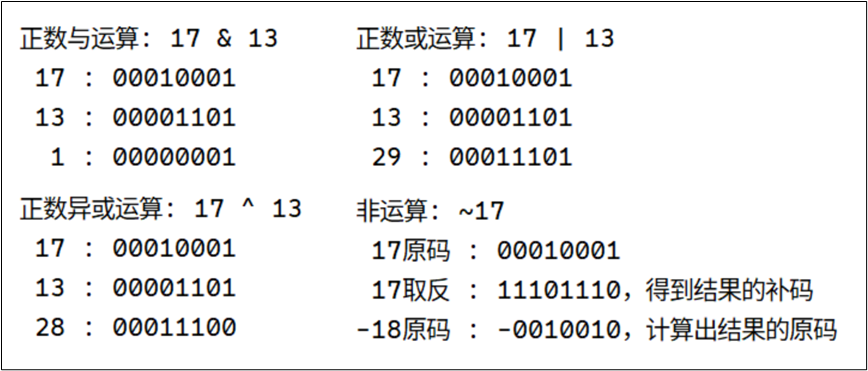

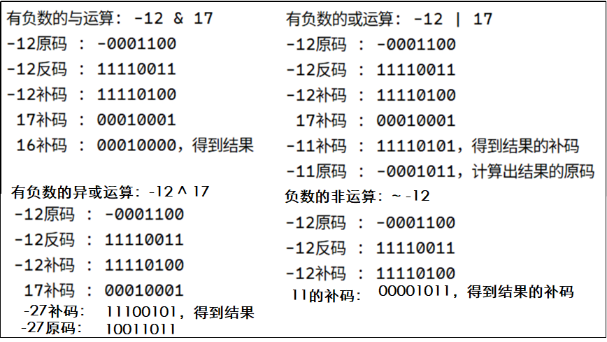

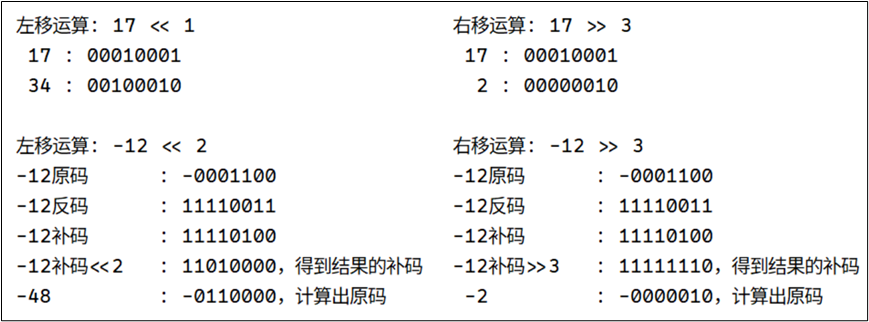

```python
# -------------位运算符---------------
a = 17
b = 13

print("正数与运算: 17 & 13 = ", a & b) # 1
print("正数或运算: 17 | 13 = ", a | b) # 29
print("正数异或运算: 17 ^ 13 = ", a ^ b) # 28
print("正数非运算: ~17 = ", ~ a) # -18

c = -12
print("有负数与运算: -12 & 17 = ", c & a) # 16
print("有负数或运算: -12 | 17 = ", c | a) # -11
print("有负数异或运算: -12 ^ 17 = ", c ^ a) # -27
print("负数非运算: ~-12 = ", ~ c) # 11

print("正数左移运算: 17 << 1 = ", a << 1) # 34
print("正数右移运算: 17 >> 3 = ", a >> 3) # 2
print("负数左移运算: -12 << 2 = ", c << 2) # -48
print("负数右移运算: -12 >> 3 = ", c >> 3) # -2
```

### 3.7.9 运算符优先级

| 优先级 | 运算符                                                       | 描述               | 结合性       |
| :----- | :----------------------------------------------------------- | :----------------- | :----------- |
| 1      | `()`                                                         | 括号（分组）       | 从左到右     |
| 2      | `**`                                                         | 幂运算             | **从右到左** |
| 3      | `*` `/` `//` `%`                                             | 乘、除、整除、取余 | 从左到右     |
| 4      | `+` `-`                                                      | 加、减             | 从左到右     |
| 5      | `<<` `>>`                                                    | 位移               | 从左到右     |
| 6      | `&`                                                          | 按位与             | 从左到右     |
| 7      | `^`                                                          | 按位异或           | 从左到右     |
| 8      | `|`                                                          | 按位或             | 从左到右     |
| 9      | `<` `<=` `>` `>=` `==` `!=`                                  | 比较运算符         | 从左到右     |
| 10     | `is` `is not` `in` `not in`                                  | 身份/成员测试      | 从左到右     |
| 11     | `not`                                                        | 逻辑非             | **从右到左** |
| 12     | `and`                                                        | 逻辑与             | 从左到右     |
| 13     | `or`                                                         | 逻辑或             | 从左到右     |
| 14     | `if` `else`                                                  | 条件表达式         | **从右到左** |
| **15** | **`=` `+=` `-=` `\*=` `/=` `//=` `%=` `\**=`** **`&=` `|=` `^=` `<<=` `>>=` `:=`** | **赋值运算符**     | **从右到左** |

```python
print( 3 ** 3 ** 2) # (1)3的平方=9 (2)3的9次
print( (3 ** 3) ** 2) # (1)3的3次=27 (2)27的平方

result = 10 + 5 > 3 * 2
print(result) # True
# > 是比较运算符，优先级低于算术运算符。

a = 5
b = 3
c = 8
result = a < b and b < c
print(result)
# and 是逻辑运算符，优先级低于比较运算符。 False and True → False
```


## 3.8 Python编程规范

随着你编写的程序越来越长，有必要了解一些代码格式设置约定。为确保所有人编写的代码的结构都大致一致， Python 程序员都遵循一些格式设置约定。PEP8（Python Enhancement Proposal ，PEP）是最古老的PEP之一，它向 Python 程序员提供了代码格式设置指南。 https://python.org/dev/peps/pep-0008/

### 3.8.1 源文件编码

Python源码请使用 UTF-8 编码（Python2 中可以使用 ASCII 编码）。

文件采用 ASCII(Python2) 或者 UTF-8（Python 3）

### 3.8.2 缩进

在 Python 中，代码块的结束不像其他一些编程语言（如 C、Java 等）使用大括号 {} 来明确界定，而是通过缩进来表示。PEP 8建议每级缩进都使用四个空格，这既可提高可读性，又留下了足够的多级缩进空间。在文本处理文档中，大家常常使用制表符而不是空格来缩进。对于文本处理文档来说，这样做的效果很好，`但混合使用制表符和空格会让 Python 解释器感到迷惑`。每款文本编辑器都提供了一种设置，可将输入的制表符转换为指定数量的空格。你在编写代码时应该使用制表符键，但一定要对编辑器进行设置，使其在文档中插入空格而不是制表符。

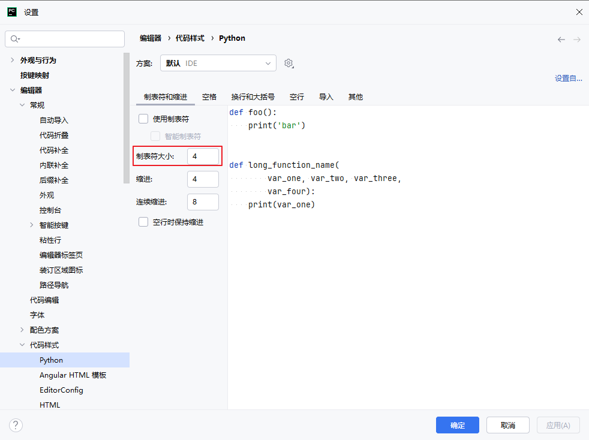

```python
# -----------缩进---------
a = 30
b = 20
if a > b:
    print("a > b")
elif a == b:
    print("a = b")
else:
    print("a < b")

list = [1, 2, 3]
for num in list:
    if num == 2:
        continue
    print(num)
```

往右增加缩进：Tab

往左减少缩进：Shift + Tab

### 3.8.3 行长

很多 Python 程序员都建议每行不超过 80 字符。最初制定这样的指南时，在大多数计算机中，终端窗口每行只能容纳 79 字符；当前，计算机屏幕每行可容纳的字符数多得多，为何还要使用 79 字符的标准行长呢？这里有别的原因。专业程序员通常会在同一个屏幕上打开多个文件，使用标准行长可以让他们在屏幕上并排打开两三个文件时能同时看到各个文件的完整行。 PEP 8 还建议注释的行长都不超过 72 字符，因为有些工具为大型项目自动生成文档时，会在每行注释开头添加格式化字符。

PEP 8 中有关行长的指南并非不可逾越的红线，有些小组将最大行长设置为 99 字符。在学习期间，你不用过多地考虑代码的行长，但别忘了，协作编写程序时，大家几乎都遵守PEP 8 指南。在大多数编辑器中，都可设置一个视觉标志，通常是一条竖线，让你知道不能越过的界线在什么地方。

### 3.8.4 空行

要将程序的不同部分分开，可使用空行。你应该使用空行来组织程序文件，但也不能滥用。例如，如果你有 5 行创建列表的代码，还有 3 行处理该列表的代码，那么用一个空行将这两部分隔开是合适的。然而，你不应使用三四个空行将它们隔开。

空行不会影响代码的运行，但会影响代码的可读性。 Python 解释器根据水平缩进情况来解读代码，但不关心垂直间距。


### 3.8.5 同一行显示多条语句

Python可以在某些时候同一行中可以使用多条语句，语句之间使用分号(;)分割，

但并不是所有情况都可以，所以不推荐这种写法。

```python
num = 6;
if num % 2 == 0:print("num是偶数"); print("num是双数"); print("num是可以被2整除的数")
else:print("num是奇数"); print("num是单数"); print("num是不可以被2整除的数")
```

### 3.8.6 分号

建议不要在行尾加分号，也不要使用分号将多条命令放在同一行。

### 3.8.7 不以空格结束一行代码

在任何地方都不要以空格结束本行代码， 因为行末的空格不可见， 这可能会闹出问题： 比如反斜杠（连字符） 如果后面接空白字符就不再能够当连字符使用。 很多编辑器不允许以空格作为行结束符。

```python
# 行尾不要加空格
a = 10
print(a)

print("hello\
      world")
```


