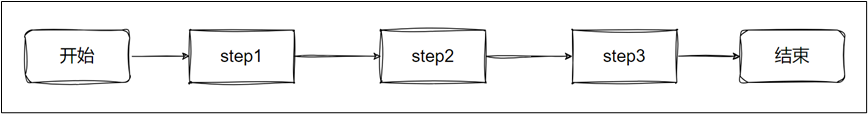
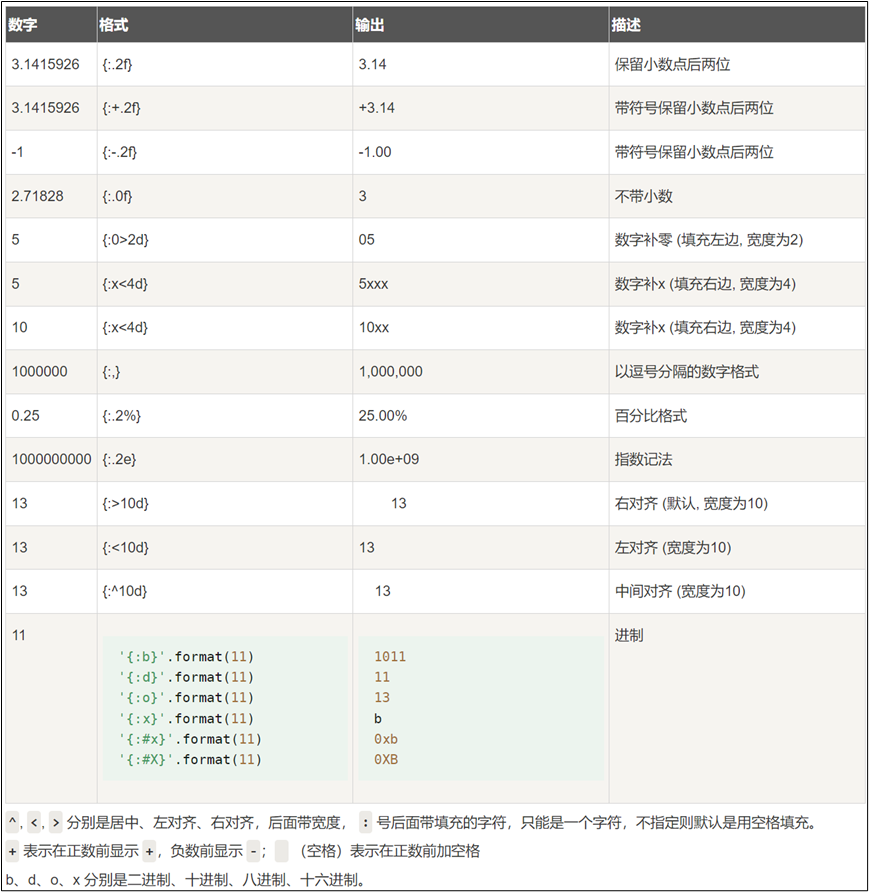
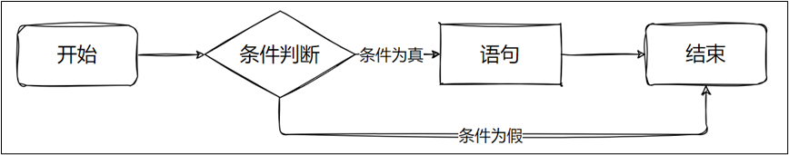
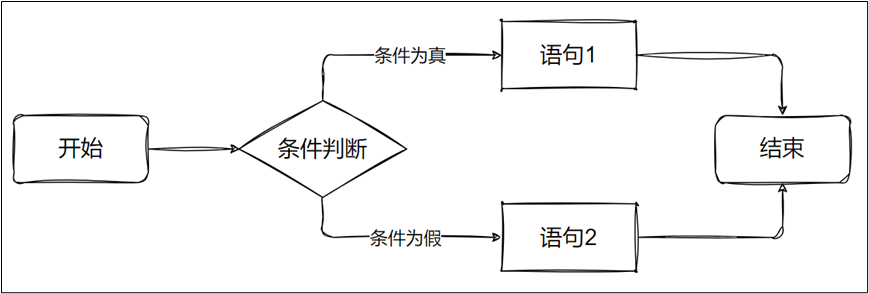
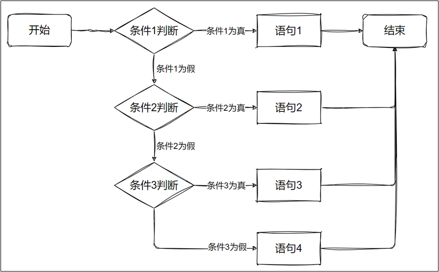
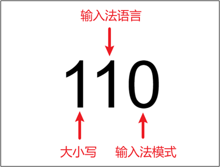
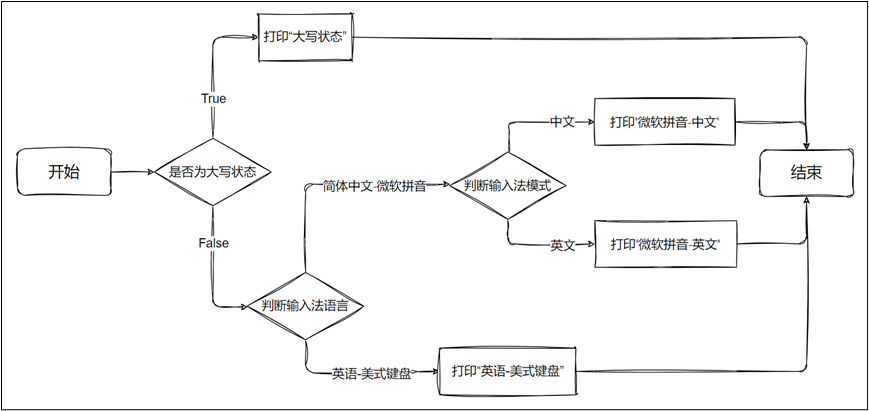
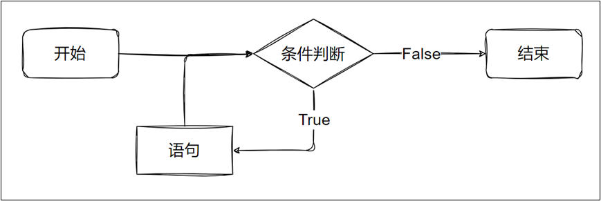
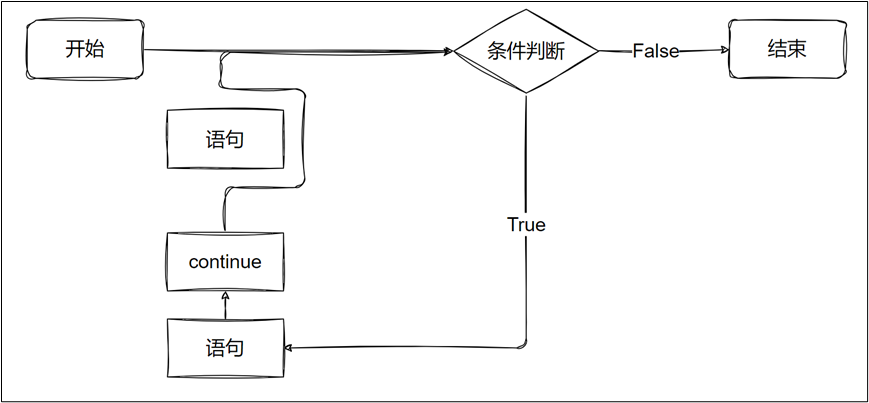
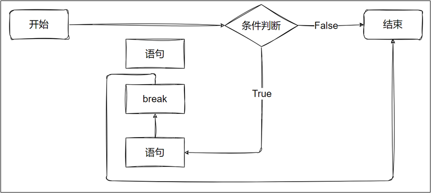

# 第4章 流程控制语句结构

## 4.1 顺序结构

按照程序正常的执行顺序，依次执行每条语句。



## 4.2 输入和输出语句

如果接收用户在键盘上输入一些字符，Python提供了一个input()函数，可以让用户输入字符串，并存放到一个字符串变量里。

```python
字符串变量 = input("提示信息：")
```

```python
# -----------输入语句----------
username = input("请输入用户名：")
print("用户名是：", username)

age = int(input("请输入年龄："))
print("年龄是：", age)
```

## 4.3 输出语句

### 4.3.1 普通输出

- 使用 print() 可将内容打印。
- 多个内容之间可以使用逗号隔开。
- 可以使用 sep = 来指定输出多个内容时，多个内容之间的分隔符，默认是空格。可以使用 end= 来控制 print() 以什么结尾，默认是`\n`。

```python
# ------------普通输出--------------
print("hello world") # 输出单个值

a = 1
b = 2
print("a = ", a, "，b = ", b) # 输出多个参数值，用逗号分隔

#  可以指定参数的分隔符和结尾符
print("hello", "world", "python", sep="-", end=".")

# 格式化输出
print("a = %d, b = %d" % (a, b))
```

### 4.3.2 格式化输出

#### 1、字符串中使用 % 占位

| **格式符号** | **说明**                          |
| ------------ | --------------------------------- |
| **%d**       | 十进制整数                        |
| **%f**       | 浮点数，%.nf可指定显示小数点后n位 |
| **%s**       | 字符串                            |
| **%o**       | 八进制整数                        |
| **%x**       | 十六进制整数                      |
| **%e**       | 科学计数法                        |

```python
# -----------------%占位符-----------------
a = 1
b = 2.5
print("a = %d, b = %f" % (a, b))
```


#### 2、字符串.format()

```python
# -----------------字符串.format()-----------------
x = 1
y = 2
# 方式1：不设置指定位置，按默认顺序
print("x = {}, y = {}".format(x, y))

# 方式2：设置指定位置
print("如果想要得到 x = {1}, y = {0},就需要将x = {0}, y = {1}变量的值交换".format(x, y))

# 方式3：设置指定名称
num = 10
flag = True
print("整数：{intValue}, 布尔：{boolValue}".format(intValue=num, boolValue=flag))
```

#### 3、f字符串

- 字符串前加上一个 f ，字符串中的{}内写入变量名。
- {}内变量名后可以加上 = ，打印时会在变量值前加上 变量名=。

```python
# -----------------f字符串-----------------
name = "Irene"
age = 18
print(f"我的名字是{name}, 我的年龄是{age}")
print(f"我的个人信息：{name=}, {age=}")
```

{}外再套一层{}，即{{}}，会转义，即此时{}中的变量名只是普通字符而已。

```python
# -----------------嵌套{{}}转义-----------------
pi = 3.14
print(f"圆周率{{pi}},{pi=}")
```

#### 4、字符串.format() 或 f"字符串"+数字格式化

: 后可以添加多个参数对数字格式化：

- 填充字符：例如以 * 填充空白，不写则默认以空格填充。
- 对齐方式：可选 < 、 ^ 、 > ，分别是左对齐、居中、右对齐。
- 数字长度：例如指定数字宽度为20，数字长度不足20则进行填充。
- 数字分隔符：可选 , 和 _ ，每3位进行分隔。
- 精度：例如.2f表示小数点后保留2位。



```python
"""
    说明： f"字符串" 与 字符串.format() 是类似的
    （1）不加格式控制
        f"文本{变量1}文本{变量2}"
        "文本{}文本{}".format(变量1,变量2)
        "文本{位置编号}文本{位置编号}".format(变量1,变量2)
        "文本{变量别名1}文本{变量别名2}".format(变量别名1=变量1,变量别名2=变量2)
    （2）加格式控制
        f"文本{变量1:格式控制}文本{变量2:格式控制}"
        "文本{:格式控制}文本{:格式控制}".format(变量1,变量2)
        "文本{位置编号:格式控制}文本{位置编号:格式控制}".format(变量1,变量2)
        "文本{变量别名1:格式控制}文本{变量别名2:格式控制}".format(变量别名1=变量1,变量别名2=变量2)
"""
name = "柴林燕"
age = 18
weight = 40.5
marry = True
#====================不加格式控制====================
print(f"姓名：{name}，年龄：{age}，体重：{weight}，婚否：{marry}")
print("姓名：{n}，年龄：{a}，体重：{w}，婚否：{m}".format(n=name,a=age,w=weight,m=marry))
print("姓名：{}，年龄：{}，体重：{}，婚否：{}".format(name,age,weight,marry))
print("姓名：{0}，年龄：{1}，体重：{2}，婚否：{3}".format(name,age,weight,marry))

#====================加格式控制====================
print("姓名：{:<10s}年龄：{:<10d}体重：{:<10.2f}".format(name,age,weight))
print("姓名：{0:<10s}年龄：{1:<10d}体重：{2:<10.2f}".format(name,age,weight))
print(f"姓名：{name:<10s}年龄：{age:<10d}体重：{weight:<10.2f}")

```


## 4.4 分支语句

### 4.4.1 单分支



```python
if 条件表达式:
    语句块1
```

- Python程序语言指定任何非0和非空（null）值为true，0 或者 null为false。
- if条件表达式后面必须加:
- 如果条件成立执行语句块1，否则不执行。语句块1必须有缩进，可以多行语句，以缩进来区分表示同一范围，缩进取消后，就不在分支范围了。

```python
num = 5
if num % 2 == 0:
    print(f"{num}是偶数")
    print(f"{num}是双数")
    print(f"{num}是可以被2整除的数")
```

### 4.4.2 双分支



```py
if 表达式:
    语句块1
else:
    语句块2
```

- if条件表达式后面和else后面都必须加:
- 如果条件成立执行语句块1，否则执行语句块2。语句块1和2必须有缩进，可以多行语句，以缩进来区分表示同一范围，缩进取消后，就不在分支范围了。

```py
num = 5
if num % 2 == 0:
    print(f"{num}是偶数")
    print(f"{num}是双数")
    print(f"{num}是可以被2整除的数")
else:
    print(f"{num}是奇数")
    print(f"{num}是单数")
    print(f"{num}是不可以被2整除的数")
```

### 4.4.3 多分支



```python
if 条件1:
    语句块1
elif 条件2:
    语句块2
elif 条件3:
    语句块3
else: # 可选
    语句块n+1
```

- if、elif、else后面别忘了加:
- 条件从上往下依次判断，上面的条件成立了，下面的条件就不看了

```py
from random import randint

# 定义年龄并打印
print("此人年龄为", age := randint(0, 100))
if age < 2:
    # 如果年龄<2
    print("这是个婴儿")
elif age < 4:
    # 如果2<=年龄<4
    print("这是个幼儿")
elif age < 13:
    # 如果4<=年龄<13
    print("这是个儿童")
elif age < 20:
    # 如果13<=年龄<20
    print("这是个青少年")
elif age < 65:
    # 如果20<=年龄<65
    print("这是个成年人")
else:
    # 如果65<=年龄
    print("这是个老人")
```


### 4.4.4 match-case语句

Python3.10新增了match case的条件判断方式，match后的对象会依次与case后的内容匹配，匹配成功则执行相应语句，否则跳过。其中_可以匹配一切。

```python
match x:
    case a:
        语句1
    case b:
        语句2
    case _:
        语句3
```

案例需求：输入星期值，如果星期值是1-5，则输出工作日，如果星期值是6-7，则输出休息日，如果输入的是其他值，就提示输入有误！

```python
week = int(input("请输入星期值："))

match week:
    case 1 | 2 | 3 | 4 | 5:
        print("工作日")
    case 6 | 7:
        print("休息日")
    case _:
        print("输入的星期值有误")
```

### 4.4.5 嵌套

#### 案例1

给定一个三位的状态码，左边第一位标识大小写状态（1-大写，0-小写），第二位标识输入法语言（1-简体中文，0-英语），第三位标识输入法模式（1-中文，0-英文）。



判断输入法的状态：

- 如果是大写状态，打印“大写状态”。
- 如果不是大写状态，判断输入法语言是“简体中文-微软拼音”还是“英语-美式键盘”。
- 如果是“简体中文-微软拼音”，判断是中文模式还是英文模式，并打印。
- 如果是“英语-美式键盘”，打印“英语-美式键盘”。



```python
state = 0b011
# 判断是否为大写状态
if state & 0b100 == 0b100:
    # 是大写状态
    print("大写状态")
else:
    print("非大写状态")
    # 不是大写状态
    # 判断是否为“简体中文-微软拼音”
    if state & 0b010 == 0b010:
        # 是“简体中文-微软拼音”
        # 判断是否为“微软拼音-中文”
        if state & 0b001 == 0b001:
            # 是“微软拼音-中文”
            print("微软拼音-中文")
        else:
            # 不是“微软拼音-中文”
            print("微软拼音-英文")
    else:
        # 不是“简体中文-微软拼音”
        print("英语-美式键盘")
```


#### 案例2

输入年月，输出该月总天数有几天

```python
year = int(input("请输入年："))
month = int(input("请输入月："))

if year>0 and 0 < month < 13:
    print("输入的日期合法")
    if month in [1,3,5,7,8,10,12]:
        print(f"{year}年{month}月有31天")
    elif month in [4,6,9,11]:
        print(f"{year}年{month}月有30天")
    elif month == 2:
        if year % 4 == 0 and year % 100 != 0 or year % 400 == 0:
            print(f"{year}是闰年，{month}月29天")
        else:
            print(f"{year}是平年，{month}月28天")
else:
    print("输入的日期不合法")
```

或

```python
year = int(input("请输入年："))
month = int(input("请输入月："))

if year>0 and 0 < month < 13:
    print("输入的日期合法")
    match month:
        case 4 | 6 | 9 | 11:
            print(f"{year}年{month}月有30天")
        case 2:
            if year % 4 == 0 and year % 100 != 0 or year % 400 == 0:
                print(f"{year}是闰年，{month}月29天")
            else:
                print(f"{year}是平年，{month}月28天")
        case _:
            print(f"{year}年{month}月有31天")
else:
    print("输入的日期不合法")
```

## 4.5 循环结构

在满足某个条件下，重复的执行某段代码。



### 4.5.1 for循环

Python 的 `for` 循环确实是语法糖，底层使用迭代器协议（关于迭代器后面章节会讲），可以用来遍历所有可迭代对象，如列表或字符串。

1、基本语法格式：

```python
for 临时变量 in 可迭代对象:
    语句块1
```

- for是关键字，in是关键字，
- 临时变量是自己定义的，用来存储遍历出来元素的变量名字
- 可迭代对象是要遍历的容器对象
- 首先判断是否有下一个元素可以获取，如果有，则将元素取出，赋值给临时变量，执行语句块1。
- 继续判断是否有下一个元素可以进行取出，直到将所有元素都取出，循环结束

2、for-else语法格式：

for 循环后也可以加上 else，循环条件不成立（容器中没有元素可迭代时）后会执行 else 中语句。

```python
for 临时变量 in 可迭代对象:
    语句1
else:
    语句2
```

#### 案例1：遍历字符串

```python
# -----------------遍历字符串---------------------
for s in "hello":
    print(s)
```

#### 案例2：遍历列表

```python
# -----------------遍历列表---------------------
for num in [2, 3, 5, 7, 11, 13, 17, 19]:
    print(num)
```

#### 案例3：range函数

作用：函数可以生成等差数列，它返回一个可迭代对象。

语法：`range([start,] stop[, step])`

- start: 生成序列的起始值（包含）， 默认0

- stop:生成序列的结束值（不包含）

- step:生成序列的步长 默认为1

  - 如果为正数：生成的序列是递增的，要求起始值 < 结束值

  - 如果为负数：生成的序列是递减的，要求起始值 > 结束值

  - 如果stop小于或等于 start且step为正数，或者stop大于或等于start且step为负数，range() 函数将生成一个空序列。

```python
# -------------range(10)产生0-9的数列---------------
for num in range(10):
    print(num)

print("-" * 10)

# -------------range(1,10，2)产生1-10的奇数数列---------------
for num in range(1, 10, 2):
    print(num)

print("-" * 10)

# -------------range(10, 1, -2)产生10-1的偶数数列---------------
for num in range(10, 1, -2):
    print(num)

# -------------打印乘法表---------------
for i in range(1, 10):
    for j in range(1, i + 1):
        print(f"{i} × {j} = {i * j}", end="\t")
    print()
```


### 4.5.2 while循环

1、基本语法格式：

```python
while ①表达式:
    ②循环体语句
```

判断条件可以是任何表达式，任何非零、或非空（null）的值均为true。如果条件表达式一直成立，那称之为无限循环，也叫死循环。

执行过程：①成立->②->①成立->②->①成立->②->①成立->②->①不成立结束。

2、while-else语法格式：

while 后可以加上 else，当 while 表达式结果为 False 时会执行 else 中的语句。

```python
while ①表达式:
    ②循环体语句
else:
    ③语句;
```

执行过程：①成立->②->①成立->②->①成立->②->①成立->②->①不成立->③结束。

#### 案例1

```python
# ------------输出5次我爱尚硅谷------------------
count = 1
while count <= 5:
    print("我爱尚硅谷")
    count += 1
```

#### 案例2

```python
# ------------输出1-100的偶数------------------
num = 2
while num <= 100:
    print(num)
    num += 2
```

#### 案例3

```python
# ------------模拟输出进度条------------------
import time
num = 1
while num < 100:
    print("=", end="")
    num += 1
    time.sleep(0.05)
```

#### 案例4

```python
# ------------while-else------------------
count = 1
while count <= 5:
    print("我爱尚硅谷")
    count += 1
else:
    print(f"程序结束{count=}")
```


### 4.5.3 continue

跳过当前循环块中的剩余语句，继续进行下一轮循环。一般写在if判断中。



```python
# -------------打印0-9，跳过偶数------------------
for i in range(10):
    if i % 2 == 0:
        continue
    print(i)
```


### 4.5.4 break

跳出当前for或while的循环体，一般写在if判断中。

如果for 或while循环通过break终止，循环对应的else 将不执行。



```python
# -------------打印0-9，遇到5结束------------------
for i in range(10):
    if i == 5:
        break
    print(i)
else:
    print("循环正常结束")
```

### 4.5.5 pass

pass是空语句，是为了保持程序结构的完整性。pass不做任何事情，一般用做占位语句。

例如：在一个循环中，如果循环体为空，语法会提示报错，这个时候我们就可以使用pass占位

```python
for i in range(10):
   pass
```


