# Coze 工作流实战：商家客服初级

> 本课件通过一个完整的"商家客服"工作流案例，带你掌握 Coze 工作流的核心节点类型及其搭建思路。

---

## 一、项目简介

本工作流是一个**商家电商客服机器人**，能自动接待用户、识别用户意图，分别处理售前咨询和售后问题，并在无法匹配时切换为陪聊模式。

**核心功能：**

- 🎉 欢迎用户，发起开场问候
- 🧠 自动识别用户意图（售前 / 售后）
- 🛒 售前：支持商品查询、优惠咨询
- 🔄 售后：支持退换货、退款申请
- 💬 兜底：陪聊大模型，维持对话体验
- 🔍 商品名称合法性校验（循环节点）

---

## 二、工作流整体流程图

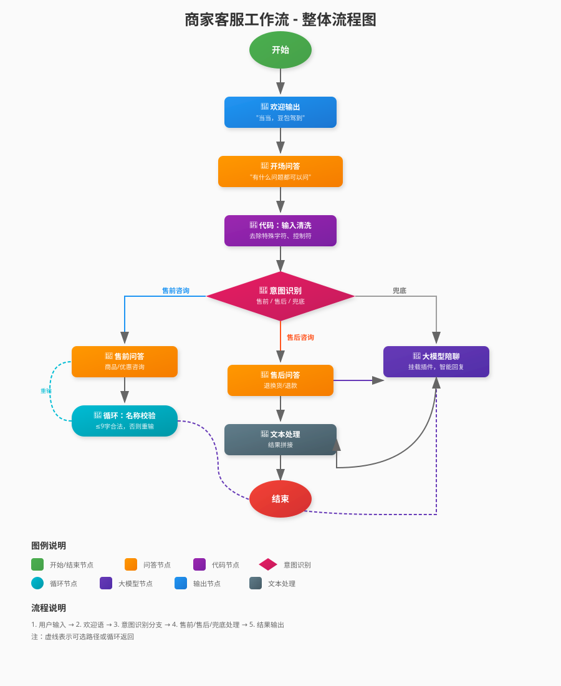

**流程简述：**
1. **开始** → 欢迎输出 → 开场问答
2. **代码节点**：清洗用户输入（去除特殊字符）
3. **意图识别**：三分支判断（售前/售后/兜底）
4. **售前分支**：商品查询（含循环校验）、优惠咨询
5. **售后分支**：退换货、退款处理
6. **兜底分支**：大模型陪聊（挂载插件）
7. **文本处理**：拼接结果 → 结束输出

---

## 三、节点详解

### 3.1 开始节点

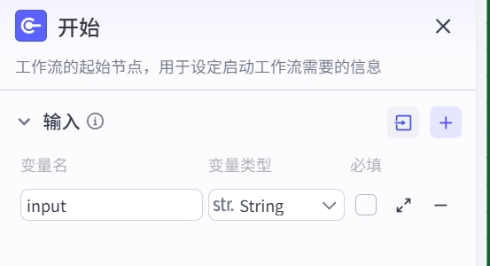

| 属性 | 内容 |
|------|------|
| 节点类型 | 开始（Start） |
| 作用 | 工作流入口，定义输入参数 |
| 输入参数 | `input`（string，用户输入） |

**说明：** 工作流的第一个节点，所有流程从这里启动。

---

### 3.2 输出节点 — 欢迎语

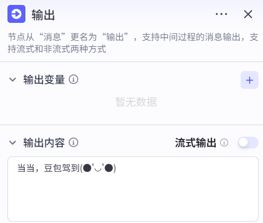

| 属性 | 内容 |
|------|------|
| 节点类型 | 输出（Output） |
| 节点名称 | 输出 |
| 输出内容 | `当当，豆包驾到(●'◡'●)` |
| 流式输出 | 否 |

**作用：** 在对话开始时立即向用户发送欢迎消息，建立良好的交互体验。

---

### 3.3 问答节点 — 开放式问答

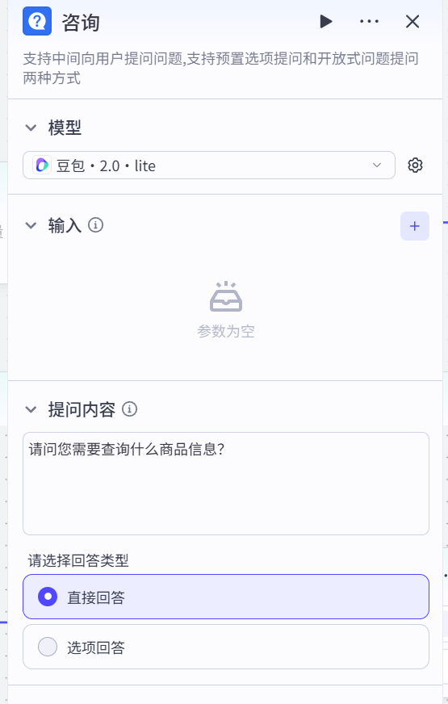

| 属性 | 内容 |
|------|------|
| 节点类型 | 问答（Question） |
| 节点名称 | 问答 |
| 提问内容 | `您好，有什么问题都可以问本豆包哦~~~///(^v^)\~~~` |
| 问答类型 | 开放式（text） |
| 最大问答轮次 | 3 |
| 输出变量 | `USER_RESPONSE`（用户回答）、`QUESTION_DATA`（问题列表） |

**作用：** 向用户发起开放式提问，收集用户的问题输入，传递给后续节点处理。

> 💡 **问答节点说明：** Coze 中的「问答」节点支持两种提问模式：
> - **开放式（text）**：用户自由输入文本
> - **选项式（option）**：用户从预设选项中选择

---

### 3.4 代码节点 — 输入清洗

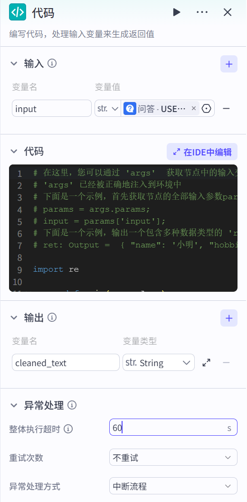

| 属性 | 内容 |
|------|------|
| 节点类型 | 代码（Code） |
| 节点名称 | 代码 |
| 编程语言 | Python |
| 输入变量 | `input`（来自问答节点的 `USER_RESPONSE`） |
| 输出变量 | `cleaned_text`（清洗后的文本） |

**清洗规则：**

1. 去除控制字符（`\n`、`\r`、`\t` 等 ASCII 控制符）
2. 去除特殊符号（只保留中英文、数字、常用标点）
3. 合并多余空格，去除首尾空格
4. 若清洗后为空，返回 `[无效输入]`

**核心代码：**

```python
import re

async def main(args: Args):
    raw_text = args.params.get("input", "")
    
    if not raw_text:
        return {"cleaned_text": ""}
    
    # 1. 去除控制字符
    text = re.sub(r'[\x00-\x1f\x7f]', '', raw_text)
    
    # 2. 去除特殊符号，只保留中英文、数字、常用标点
    allowed_pattern = r'[^\u4e00-\u9fffA-Za-z0-9\s\。\，\！\？\；\：\"\"\'\'...]'
    text = re.sub(allowed_pattern, '', text)
    
    # 3. 合并多余空格
    text = re.sub(r'\s+', ' ', text).strip()
    
    if not text:
        text = "[无效输入]"
    
    return {"cleaned_text": text}
```

> 💡 **为什么要清洗输入？** 用户输入可能包含复制粘贴带来的控制字符、特殊符号等，会干扰下游意图识别节点的判断。清洗后再传给意图识别，可以提升识别准确率。

---

### 3.5 意图识别节点

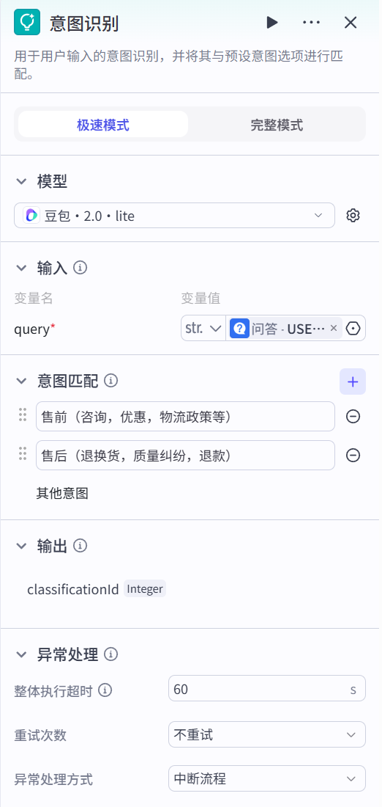

| 属性 | 内容 |
|------|------|
| 节点类型 | 意图识别（Intent） |
| 节点名称 | 意图识别 |
| 使用模型 | 豆包·2.0·lite |
| 输入 | `query`（来自代码节点的 `cleaned_text`） |
| 输出 | `classificationId`（意图分类编号） |

**预设意图：**

| 意图 ID | 意图名称 | 触发场景 |
|--------|---------|---------|
| branch_0 | 售前（咨询，优惠，物流政策等） | 用户询问商品、活动、发货等 |
| branch_1 | 售后（退换货，质量纠纷，退款） | 用户反馈问题、申请退款等 |
| default | 兜底 | 无法匹配以上意图 |

**说明：** 意图识别节点是工作流的"路由枢纽"，根据识别结果将流程分发到不同分支。

---

### 3.6 售前咨询分支

#### 3.6.1 问答节点 — 售前咨询

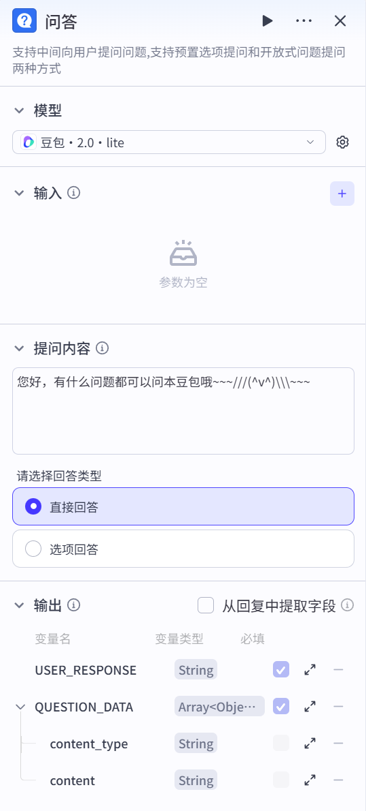

| 属性 | 内容 |
|------|------|
| 节点类型 | 问答（Question） |
| 节点名称 | 售前咨询 |
| 提问内容 | `请问具体是以下哪个问题？` |
| 问答类型 | 选项式（option） |
| 预设选项 | ① 查询商品信息　② 优惠 |
| 输出变量 | `optionId`（选项ID）、`optionContent`（选项内容） |

---

#### 3.6.2 循环节点 — 商品名称校验

当用户选择「查询商品信息」时，进入此循环，确保用户输入的商品名称符合规范。

| 属性 | 内容 |
|------|------|
| 节点类型 | 循环（Loop） |
| 节点名称 | 商品名称校验 |
| 循环类型 | 无限循环（最多 10 次） |

**循环内部流程：**

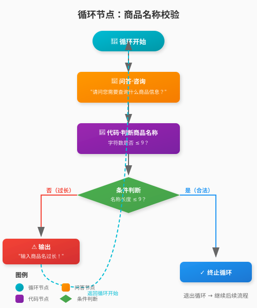

**流程说明：**
1. **循环开始** → 问答节点询问商品信息
2. **代码节点** 判断输入字符数是否 ≤ 9
3. **条件分支**：
   - ✅ 名称合法（≤9字）→ 终止循环，退出继续后续流程
   - ❌ 名称过长（>9字）→ 输出提示"输入商品名过长！" → 返回循环开始重新询问

**校验代码：**

```python
async def main(args: Args):
    user_input = args.params
    # 判断字符数是否不超过 9
    is_valid = len(user_input) <= 9
    return {'result': is_valid}
```

> 💡 **循环节点的作用：** 当用户输入不合法时，可以反复提示用户重新输入，直到输入合法为止，防止无效数据流向后续节点。

**循环结束后：** 进入"咨询回复"节点。

---

#### 3.6.3 输出节点 — 咨询回复

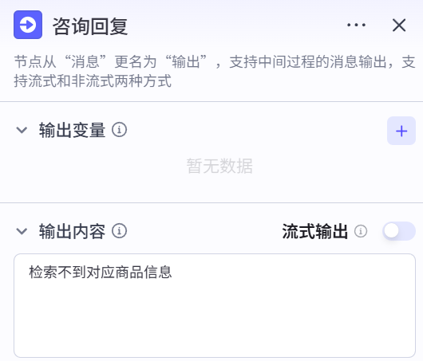

| 属性 | 内容 |
|------|------|
| 节点类型 | 输出（Output） |
| 节点名称 | 咨询回复 |
| 输出内容 | `检索不到对应商品信息` |
| 流式输出 | 否 |

**作用：** 当用户完成商品名称校验（循环结束）后，向用户返回查询结果。当前版本暂时返回固定提示，实际项目中可接入知识库或数据库查询，实现真实商品信息检索。

---

#### 3.6.4 输出节点 — 通用回复

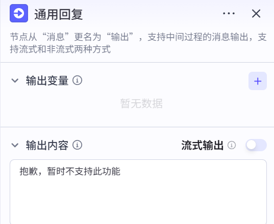

| 属性 | 内容 |
|------|------|
| 节点类型 | 输出（Output） |
| 节点名称 | 通用回复 |
| 输出内容 | `抱歉，暂时不支持此功能` |
| 流式输出 | 否 |

**触发场景：**
- 售前咨询中用户选择「优惠」选项
- 售后咨询中用户选择「退换货」选项

**作用：** 向用户说明当前功能暂未开放，作为售前和售后分支中暂未实现功能的统一兜底回复。

---

#### 3.6.5 循环节点内部子节点详解

循环节点内部包含 5 个子节点，协同完成商品名称的校验逻辑：

##### ① 问答节点 — 咨询


| 属性 | 内容 |
|------|------|
| 节点类型 | 问答（Question） |
| 节点名称 | 咨询 |
| 提问内容 | `请问您需要查询什么商品信息？` |
| 问答类型 | 开放式（text） |
| 最大问答轮次 | 3 |
| 输出变量 | `USER_RESPONSE`（用户回答） |

**作用：** 在循环体内向用户发起提问，收集用户输入的商品名称。

##### ② 代码节点 — 判断商品名称是否过长

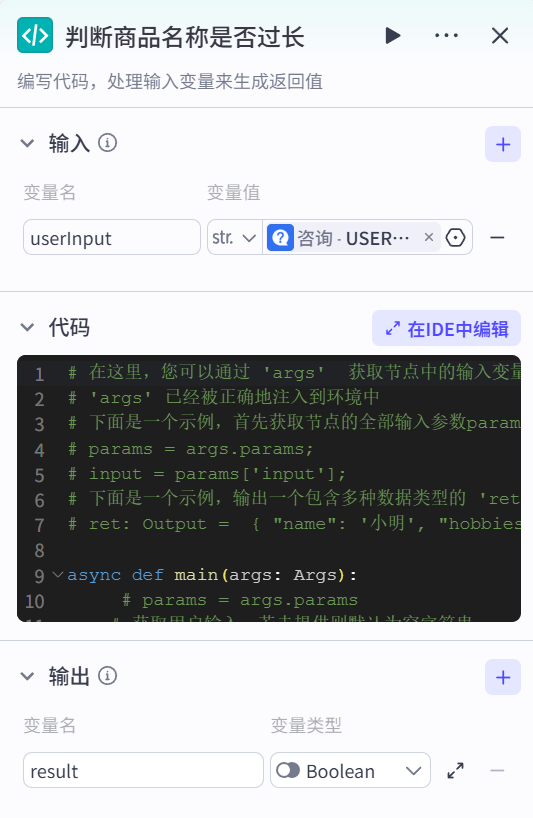

| 属性 | 内容 |
|------|------|
| 节点类型 | 代码（Code） |
| 节点名称 | 判断商品名称是否过长 |
| 编程语言 | Python |
| 输入变量 | `userInput`（来自问答节点的 `USER_RESPONSE`） |
| 输出变量 | `result`（布尔值，True=合法，False=过长） |

**核心代码：**

```python
async def main(args: Args):
    # 获取用户输入
    user_input = args.params
    
    # 判断字符数是否不超过 9
    is_valid = len(user_input) <= 9
    
    # 返回结果，后续节点可通过 result 获取
    return {'result': is_valid}
```

**作用：** 校验用户输入的商品名称长度，判断是否 ≤ 9 个字符。

##### ③ 选择器节点

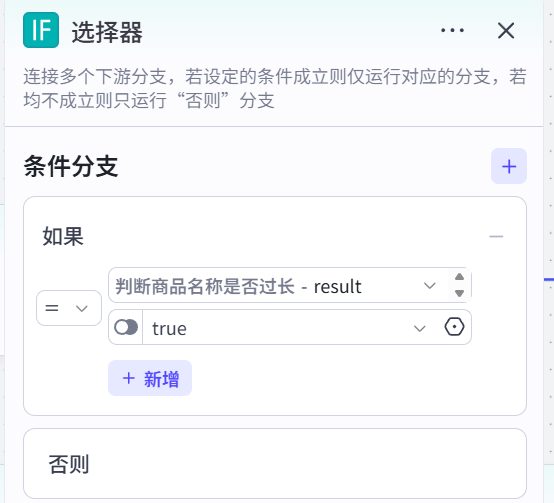

| 属性 | 内容 |
|------|------|
| 节点类型 | 选择器（Condition） |
| 节点名称 | 选择器 |
| 判断条件 | `result == true`（代码节点输出） |
| 分支逻辑 | 条件成立 → 终止循环；条件不成立 → 提示重新输入 |

**作用：** 根据代码节点的校验结果进行分支路由。

##### ④ 终止循环节点

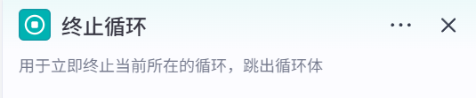

| 属性 | 内容 |
|------|------|
| 节点类型 | 终止循环（Break） |
| 节点名称 | 终止循环 |
| 触发条件 | 选择器的"条件成立"分支 |

**作用：** 立即终止当前循环，跳出循环体，继续执行循环外的后续节点。

##### ⑤ 输出节点 — 重新输入提示

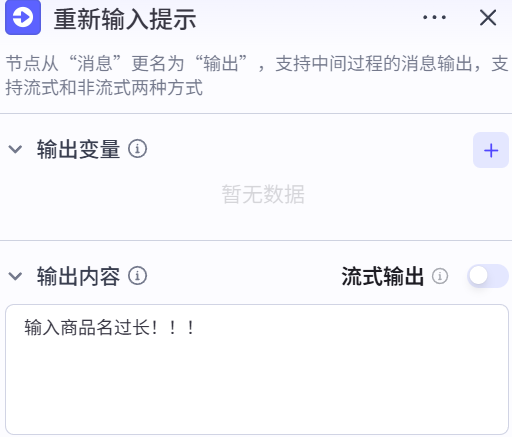

| 属性 | 内容 |
|------|------|
| 节点类型 | 输出（Output） |
| 节点名称 | 重新输入提示 |
| 输出内容 | `输入商品名过长！！！` |
| 流式输出 | 否 |

**作用：** 当商品名称过长时，向用户输出提示信息，然后返回循环开始重新询问。

**节点连接关系：**

```
循环开始
  ↓
[问答·咨询] → 用户输入商品名称
  ↓
[代码·判断商品名称是否过长] → 输出 result（布尔值）
  ↓
[选择器]
  ├─ result == true（名称合法）→ [终止循环] → 退出循环
  └─ result == false（名称过长）→ [输出·重新输入提示] → 返回循环开始
```

> 💡 **循环节点的工作原理：**
> - 循环节点是一个"容器"，内部可以嵌套多个子节点
> - 通过"终止循环"节点主动退出循环
> - 通过将输出节点连接回循环入口实现循环迭代
> - 最大循环次数为 10 次，防止无限循环

---

#### 3.6.6 售前兜底 — 暂不支持

当用户选择「优惠」或无法匹配选项时，进入通用回复节点，输出：`抱歉，暂时不支持此功能`

---

### 3.7 售后咨询分支

#### 3.7.1 问答节点 — 售后咨询

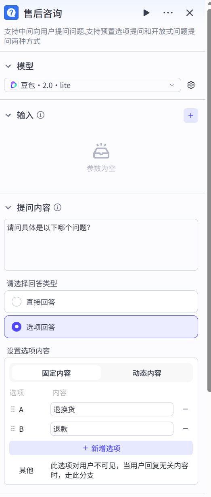

| 属性 | 内容 |
|------|------|
| 节点类型 | 问答（Question） |
| 节点名称 | 售后咨询 |
| 提问内容 | `请问具体是以下哪个问题？` |
| 问答类型 | 选项式（option） |
| 预设选项 | ① 退换货　② 退款 |

**分支处理：**

| 用户选择 | 处理逻辑 | 输出内容 |
|---------|---------|---------|
| 退换货 | 通用回复节点 | `抱歉，暂时不支持此功能` |
| 退款 | 退款结果节点 | `退款成功` |
| 兜底 | 陪聊大模型 | 由大模型生成回复 |

---

#### 3.7.2 输出节点 — 退款结果

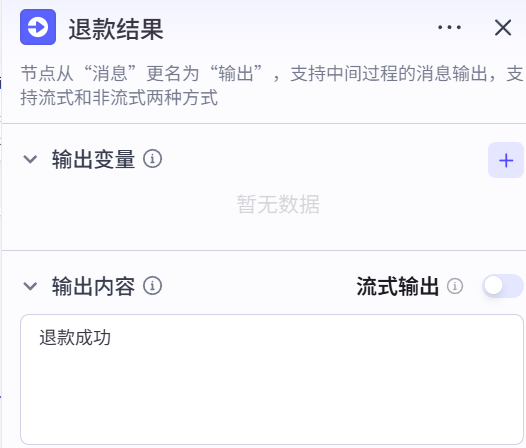

| 属性 | 内容 |
|------|------|
| 节点类型 | 输出（Output） |
| 节点名称 | 退款结果 |
| 输出内容 | `退款成功` |
| 流式输出 | 否 |

**触发场景：** 售后咨询中用户选择「退款」选项

**作用：** 向用户返回退款处理结果。当前版本为简化演示，直接返回固定成功提示。实际项目中可接入订单系统和支付接口，实现真实退款流程：
1. 校验订单状态（是否已完成、是否在退款期限内）
2. 调用支付渠道退款接口
3. 更新订单状态为"退款中"或"已退款"
4. 返回详细退款信息（退款金额、到账时间等）

---

### 3.8 大模型节点 — 陪聊

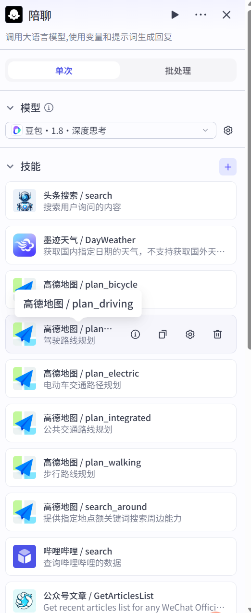

| 属性 | 内容 |
|------|------|
| 节点类型 | 大模型（LLM） |
| 节点名称 | 陪聊 |
| 使用模型 | 豆包·1.8·深度思考 |
| 输入变量 | `memory`（用户输入，来自问答节点） |
| 输出变量 | `output`（大模型回复内容） |

**已挂载插件：**

| 插件名称 | 用途 |
|---------|-----|
| 头条搜索 | 搜索网络信息 |
| 墨迹天气 | 查询天气 |
| 高德地图 | 路线规划、周边搜索 |
| 哔哩哔哩 | 搜索B站内容 |
| 公众号文章 | 获取微信公众号文章 |

**系统提示词（角色设定）：**

> 你是一个亲切温暖的闲聊助手，像朋友一样陪伴用户聊天，能用轻松自然的语气回应各种话题，擅长捕捉用户的情绪和兴趣点，用幽默有趣的方式延续对话，让聊天充满温暖和轻松的氛围。

**核心技能：**
- 技能1：轻松回应日常话题（共情 + 趣味语言）
- 技能2：主动延续与拓展话题
- 技能3：分享轻松趣味内容（冷知识/小笑话）
- 技能4：陪伴式情绪支持

**触发场景：** 当意图识别无法匹配售前/售后意图时，或在各分支的兜底逻辑中，均会转入陪聊模式。

---

### 3.9 文本处理节点

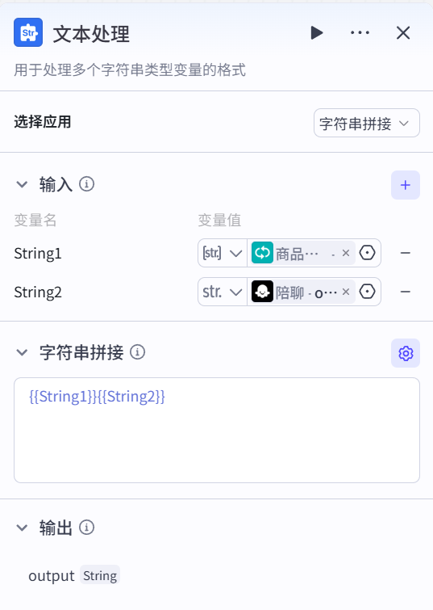

| 属性 | 内容 |
|------|------|
| 节点类型 | 文本处理（StrConcat） |
| 方法 | concat（字符串拼接） |
| 输入1 | 循环节点输出（商品查询列表） |
| 输入2 | 陪聊大模型的回复 |
| 拼接符 | `，`（中文逗号） |
| 输出 | `output` |

**作用：** 将商品查询结果与大模型陪聊回复拼接成最终输出，传递给结束节点。

---

### 3.10 结束节点

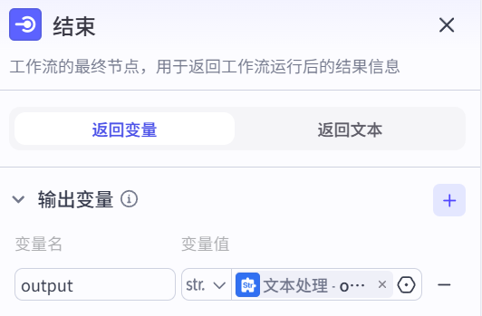

| 属性 | 内容 |
|------|------|
| 节点类型 | 结束（End） |
| 终止计划 | 返回变量（returnVariables） |
| 输出变量 | `output`（来自文本处理节点） |

---

## 四、核心节点类型汇总

| 节点类型 | 图标颜色 | 核心作用 |
|---------|---------|---------|
| 开始 / 结束 | 🔵 蓝色 | 工作流入口与出口 |
| 输出 | 🔵 蓝色 | 中间过程向用户发送消息 |
| 问答 | 🔷 深蓝 | 向用户提问并等待回复 |
| 意图识别 | 🟢 青色 | 分析用户意图并路由 |
| 大模型（LLM） | 🔵 蓝色 | 调用大模型生成回复 |
| 代码 | 🟢 青色 | 自定义逻辑处理（Python/JS） |
| 选择器 | 🟢 青色 | 条件分支路由 |
| 循环 | 🟢 青色 | 重复执行节点直到满足条件 |
| 文本处理 | 🔷 深蓝 | 字符串拼接与格式化 |

---

## 五、工作流设计要点

### 5.1 输入清洗的必要性

用户输入往往不规范，直接送入意图识别可能影响准确率。在意图识别**前**增加代码节点做清洗，是实际项目中的最佳实践。

### 5.2 循环节点的使用场景

循环节点适合以下场景：
- **输入校验**：用户输入不合法时反复提示
- **重试机制**：某个操作失败时自动重试
- **多轮确认**：需要用户多次确认才能执行

> ⚠️ 注意：循环节点需要设置最大循环次数（本例为 10 次），防止无限循环消耗资源。

### 5.3 兜底逻辑的设计

好的工作流必须有完善的兜底逻辑：
- 意图识别设置 `default` 分支
- 选项问答设置 `default` 分支
- 兜底时调用陪聊大模型，维持用户体验

### 5.4 大模型与插件的组合

陪聊大模型挂载了多个插件（天气、地图、搜索等），可以让大模型在回复时**主动调用工具**，扩展服务能力，不只是单纯聊天。

---

## 六、课后练习

1. **基础**：在"售前咨询"的"查询商品信息"分支中，将"检索不到对应商品信息"的固定输出替换为知识库查询节点，实现真实商品信息检索。

2. **进阶**：在"售后咨询"的"退换货"分支中，增加一个问答节点，收集用户的订单号，并使用代码节点校验订单号格式是否正确（如：纯数字、长度为 18 位）。

3. **挑战**：将整个工作流改造为支持**多轮对话**（在处理完一次问题后，询问用户"还有其他问题吗？"，若有则重新进入意图识别，若无则结束流程）。

---

