# 智能电商客服工作流开发教程

## 课程概述

本课程基于Coze平台，详细讲解智能电商客服系统的开发与部署。客服系统涵盖**售前咨询**、**售中处理**、**售后服务**三大核心场景，通过工作流的编排实现智能化的客户服务体验。

---

## 项目准备

### 1. 知识库配置

本项目使用以下知识库：

| 知识库名称 | 用途说明 |
|-----------|----------|
| FAQ知识库 | 存储常见问题解答，用于主对话流的FAQ检索 |
| 物流政策知识库 | 存储各地区物流政策信息，用于售前物流政策查询 |

**知识库检索参数配置：**
- `topK`: 1（返回最匹配的1条结果）
- `useRerank`: true（启用重排序提升检索精度）
- `useRewrite`: true（启用Query改写优化检索）
- `minScore`: 0.4/0.8（最小匹配分数阈值）

### 2. 数据库配置

本项目使用Coze数据库存储订单相关信息：

| 表名 | 字段说明 |
|------|----------|
| order_tracking_table | 包含订单号、商品名称、下单时间、交易金额、订单状态、收件人、收件人手机号、收货地址、快递公司、物流单号、物流状态等字段 |
| product_info | 商品名称，商品详情 |

**order_tracking_table数据库表结构：**

| 字段名称 | 字段类型 | 说明 |
|----------|----------|------|
| order_id | string | 订单号（主键） |
| order_time | string | 下单时间 |
| product_name | string | 商品名称 |
| total_amount | float | 交易金额 |
| order_status | string | 订单状态（待支付/已发货/已签收等） |
| receiver_name | string | 收件人 |
| receiver_phone | string | 收件人手机号 |
| express_company | string | 快递公司 |
| tracking_number | string | 物流单号 |
| logistics_status | string | 物流状态 |
| quantity | integer | 商品数量 |
| receiver_address | string | 收货地址 |

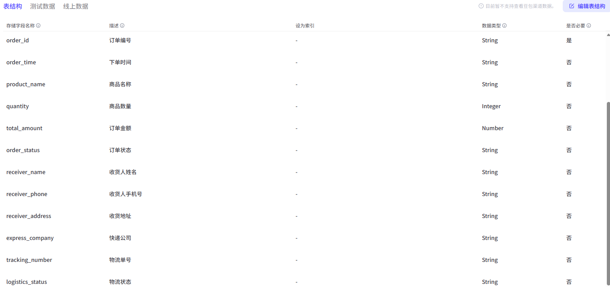

**product_info表字段**

| 字段名称     | 字段类型 | 说明     |
| :----------- | :------- | :------- |
| product_name | string   | 商品名称 |
| product_desc | string   | 商品详情 |

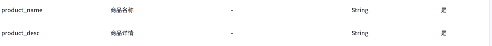

**refound（退换货理由存储表）表字段**

| 字段名称        | 字段类型 | 说明       |
| --------------- | -------- | ---------- |
| order_id        | string   | 订单id     |
| tracking_number | string   | 物流编号   |
| refund_reason   | string   | 退换货理由 |
| product_name    | string   | 商品名称   |

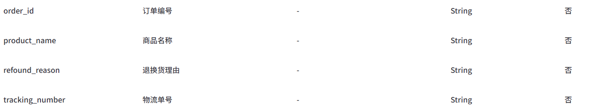


### 3. 应用变量配置

应用变量用于在工作流之间传递数据，存储业务处理结果：

| 变量名称 | 变量类型 | 说明 | 使用场景 |
|----------|----------|------|----------|
| `product_name` | string | 商品名称 | 售前工作流输出，存储商品信息查询结果 |
| `product_desc` | string | 商品描述 | 售前工作流输出，存储商品详情描述 |
| `activity_http_res` | string | 活动信息 | 售前工作流输出，存储营销活动信息 |
| `Logistics` | string | 物流政策 | 售前工作流输出，存储物流政策查询结果 |
| `conversation_id` | string | 会话ID | 主对话流使用，用于会话管理 |
| `all_order_info` | string | 所有订单信息 | 售中工作流输出，存储查询到的订单详情 |
| `all_tracking_info` | string | 所有物流信息 | 售中工作流输出，存储查询到的物流动态 |
| `FAQ_answer` | string | FAQ查询结果 | 主对话流使用，存储知识库检索结果 |
| `order_message` | string | 订单消息 | 售中工作流使用，存储用户输入的订单信息 |
| `need_fixed_order` | string | 待修改订单 | 售中工作流使用，存储用户选择修改的订单号 |
| `RE_product` | bool | 是否有退换货资格 | 售中工作流中，存储用户是否有退换货资格 |
| `re_service` | bool | 是否有维修资格 | 售中工作流，存储用户是否有维修资格 |
| `tracking_id` | string | 物流id | 售中工作流，存储物流id |
| `order_id` | string | 订单id | 售中工作流，存储订单id |
| `total_amount` | number | 交易总额 | 售后工作流，存储交易总额 |
| `refund_reason` | string | 退换货理由 | 售后工作流，存储退换货理由 |
| `back_money` | string | 退款说明 | 售后工作流，存储退款说明 |

### 4. 用户变量配置

用户变量用于存储用户会话期间的临时数据：

| 变量名称 | 变量类型 | 说明 | 使用场景 |
|----------|----------|------|----------|
| `chat` | string | 闲聊内容 | 存储非业务类用户输入，当无业务变量有效值时启用闲聊处理 |

### 5. 大模型配置

本项目使用以下大模型：

| 模型名称 | 用途说明 |
|----------|----------|
| 豆包·1.8·深度思考 | 复杂推理任务，如查询重述、商品信息抽取等 |
| 豆包·2.0·lite | 轻量级任务，如意图识别等 |
| DeepSeek-V3.2 | 最终回复生成 |

---

## 第一章：主对话流 (CustomerService_MainFlow)

### 1.1 概述

主对话流是整个客服系统的**入口和调度中心**，负责：
- 用户输入的安全过滤与预处理
- 对话历史的管理与上下文理解
- 用户意图的一级分类
- 调用相应子工作流处理具体业务
- 整合各子工作流结果生成最终回复

### 1.2 流程图


### 1.3 节点详细介绍

#### 1.3.1 开始节点 (Start)

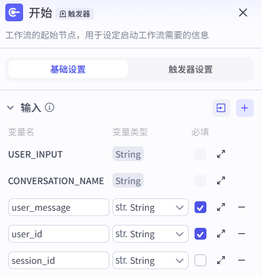

| 属性 | 说明 |
|------|------|
| 节点类型 | 开始 |
| 描述 | 工作流的起始节点，用于设定启动工作流需要的信息 |

**输入参数：**

| 参数名 | 类型 | 必填 | 说明 |
|--------|------|------|------|
| USER_INPUT | string | 否 | 用户输入标识 |
| CONVERSATION_NAME | string | 否 | 会话名称，默认值"CustomerService_MainFlow" |
| user_message | string | 是 | 用户本次发送消息的内容 |
| user_id | string | 是 | 用户唯一标识，从登录态获取 |
| session_id | string | 否 | 会话ID，为空表示新会话，不为空表示续接历史会话 |

**前序节点：** 无

**后续节点：** 判断是否传入会话id（选择器）

---

#### 1.3.2 判断是否传入会话id（选择器）

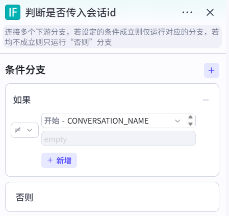

| 属性 | 说明 |
|------|------|
| 节点类型 | 选择器 |
| 描述 | 连接多个下游分支，若设定的条件成立则仅运行对应的分支，若均不成立则只运行"否则"分支 |

**条件配置：**
- 分支条件：判断 `CONVERSATION_NAME` 是否为空
  - **条件为真（Yes）**：存在会话ID，查询历史会话
  - **条件为假（No）**：新会话，生成新的会话ID

**前序节点：** 开始节点

**后续节点：**
- 真 → 查询会话历史
- 假 → 生成时间戳

---

#### 1.3.3 生成时间戳（代码节点）

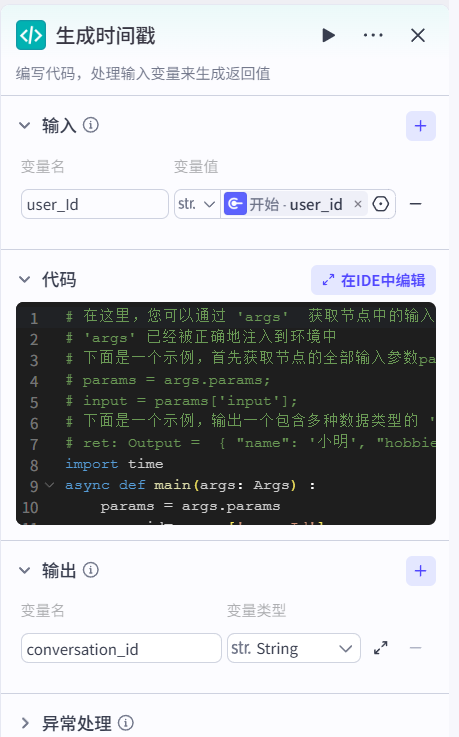

| 属性 | 说明 |
|------|------|
| 节点类型 | 代码 |
| 描述 | 编写代码，处理输入变量来生成返回值 |

**输入参数：**
- `user_Id`: 用户ID

**核心逻辑：**
```python
import time
async def main(args: Args):
    params = args.params
    user_id = params['user_Id']
    # 生成格式: {user_id}_{timestamp}
    conversation_id = f"{user_id}_{int(time.time())}"
    return {"conversation_id": conversation_id}
```

**前序节点：** 判断是否传入会话id（选择器），选择器判断为否

**后续节点：** 创建会话

---

#### 1.3.4 创建会话

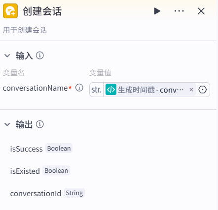

| 属性 | 说明 |
|------|------|
| 节点类型 | 创建会话 |
| 描述 | 用于创建新的会话 |

**输入参数：**
- `conversationName`: 会话名称（使用生成的时间戳作为会话ID）

**输出参数：**
- `isSuccess`: 是否创建成功
- `isExisted`: 会话是否已存在
- `conversationId`: 会话ID

**前序节点：** 生成时间戳

**后续节点：** 创建消——user1

---

#### 1.3.5 创建消息——user1

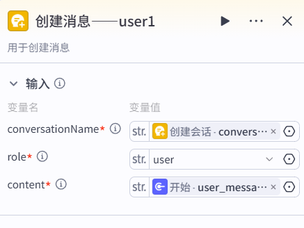

| 属性 | 说明 |
|------|------|
| 节点类型 | 创建消息 |
| 描述 | 用于创建用户消息 |

**输入参数：**
- `conversationName`: 会话名称（来自新建会话的conversationId）
- `role`: user
- `content`: 用户消息内容

**前序节点：** 创建会话

**后续节点：** 对话变量赋值_1

---

#### 1.3.6 对话变量赋值_1

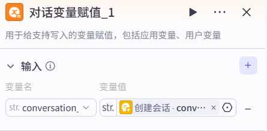

| 属性 | 说明 |
|------|------|
| 节点类型 | 变量赋值 |
| 描述 | 用于给应用变量赋值 |

**变量赋值：**
- `conversation_id` ← 新创建的会话ID

**前序节点：** 创建消——user1

**后续节点：** 输入正则化

---

#### 1.3.7 查询会话历史

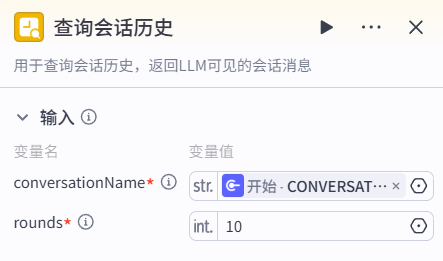

| 属性 | 说明 |
|------|------|
| 节点类型 | 查询会话历史 |
| 描述 | 用于查询会话历史，返回LLM可见的会话消息 |

**输入参数：**
- `conversationName`: 会话名称
- `rounds`: 10（查询最近10轮对话）

**输出参数：**
- `messageList`: 消息列表（包含role和content）

**前序节点：** 判断是否传入会话id（选择器）

**后续节点：** 创建消——user

---

#### 1.3.8 创建消息——user

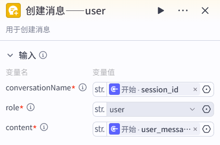

| 属性 | 说明 |
|------|------|
| 节点类型 | 创建消息 |
| 描述 | 用于创建用户消息 |

**输入参数：**
- `conversationName`: 会话名称（来自传入的session_id）
- `role`: user
- `content`: 用户消息内容

**前序节点：** 查询会话历史

**后续节点：** 对话变量赋值

---

#### 1.3.9 对话变量赋值

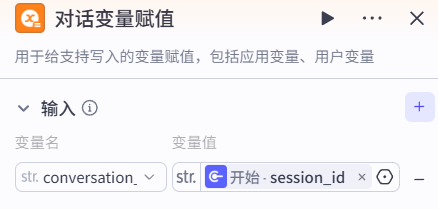

| 属性 | 说明 |
|------|------|
| 节点类型 | 变量赋值 |
| 描述 | 用于给应用变量赋值 |

**变量赋值：**
- `conversation_id` ← 传入的session_id

**前序节点：** 创建消——user

**后续节点：** 输入正则化

---

#### 1.3.10 输入正则化（代码节点）

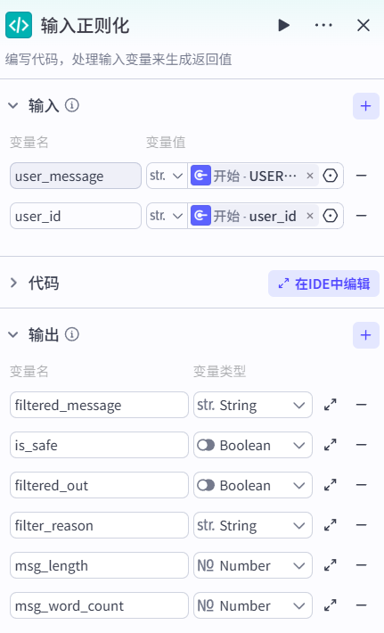

| 属性 | 说明 |
|------|------|
| 节点类型 | 代码 |
| 描述 | 编写代码，处理输入变量来生成返回值，用于内容安全过滤 |

**输入参数：**
- `USER_INPUT`: 当前轮用户消息
- `user_id`: 用户ID

**核心逻辑：**
```python
import re

async def main(args: Args) -> Output:
    params = args.params
    user_message = params['user_message']
    user_id = params['user_id']
    
    # 1. 内容安全过滤关键词
    banned_keywords = [
        # 违法违规内容
        '政治敏感词1', '政治敏感词2',
        # 辱骂歧视内容
        '辱骂词1', '辱骂词2',
        # 广告骚扰内容
        '广告词1', '广告词2'
    ]
    
    # 2. 垃圾信息检测模式
    spam_patterns = [
        r'https?://[^\s]+',  # URL检测
        r'[a-zA-Z0-9._%+-]+@[a-zA-Z0-9.-]+\.[a-zA-Z]{2,}',  # 邮箱检测
        r'\d{11}'  # 手机号检测
    ]
    
    # 3. 执行过滤检查
    is_safe = True
    filtered_message = user_message
    
    # 关键词过滤
    for keyword in banned_keywords:
        if keyword in filtered_message:
            is_safe = False
            break
    
    # 垃圾信息检测
    if is_safe:
        for pattern in spam_patterns:
            if len(re.findall(pattern, filtered_message)) > 3:
                is_safe = False
                break
    
    # 4. 预处理：清理多余空白
    clean_message = re.sub(r'\s+', ' ', filtered_message.strip()) if is_safe else filtered_message
    
    return {
        'filtered_message': clean_message,
        'is_safe': is_safe,
        'filtered_out': not is_safe,
        'filter_reason': '内容包含敏感信息或疑似垃圾信息' if not is_safe else '',
        'msg_length': len(filtered_message),
        'msg_word_count': len(filtered_message.split())
    }
```

**输出参数：**
- `filtered_message`: 过滤后的消息
- `is_safe`: 是否安全
- `filtered_out`: 是否被过滤
- `filter_reason`: 过滤原因
- `msg_length`: 消息长度
- `msg_word_count`: 消息词数

**前序节点：** 对话变量赋值 或 对话变量赋值_1

**后续节点：** FAQ检索

---

#### 1.3.11 FAQ检索（知识库检索）

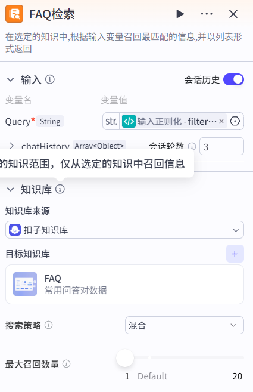

| 属性 | 说明 |
|------|------|
| 节点类型 | 知识库检索 |
| 描述 | 在选定的知识中，根据输入变量召回最匹配的信息 |

**输入参数：**
- `Query`: 查询内容（来自过滤后的用户消息）
- `datasetList`: 知识库ID列表 [`7625649435292549160`]
- `topK`: 1
- `useRerank`: true
- `useRewrite`: true
- `minScore`: 0.8
- `enableChatHistory`: true
- `chatHistoryRound`: 3

**输出参数：**
- `outputList`: 检索结果列表（包含output和documentId）

**前序节点：** 输入正则化

**后续节点：** 选择器（判断FAQ是否检索成功）

---

#### 1.3.12 选择器（判断FAQ是否检索成功）

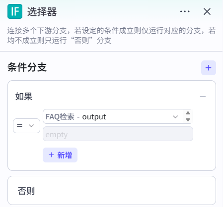

| 属性 | 说明 |
|------|------|
| 节点类型 | 选择器 |
| 描述 | 判断FAQ检索是否有结果 |

**条件配置：**
- 分支条件：判断 `outputList.output` 是否存在
  - **条件为真（Yes）**：FAQ检索成功，输出结果给记录FAQ返回结构
  - **条件为假（No）**：FAQ检索无结果，走正常执行流程

**前序节点：** FAQ检索

**后续节点：**
- 真 → 记录FAQ返回结构
- 假 → 查询重述

---

#### 1.3.13 记录FAQ返回结果

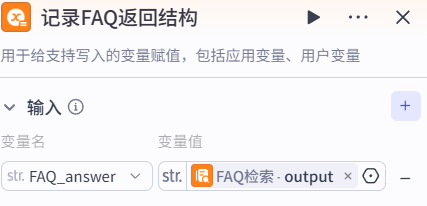

| 属性 | 说明 |
|------|------|
| 节点类型 | 变量赋值 |
| 描述 | 用于给应用变量赋值 |

**变量赋值：**
- `FAQ_answer` ← `outputList.output`（FAQ检索结果）

**前序节点：** 选择器（判断FAQ是否检索成功）

**后续节点：** 最终回复大模型

---

#### 1.3.14 查询重述（大模型）

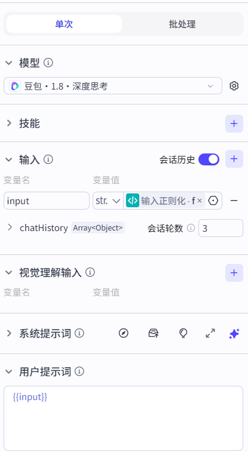

| 属性 | 说明 |
|------|------|
| 节点类型 | 大模型 |
| 描述 | 调用大语言模型，使用变量和提示词生成回复，用于理解用户意图并重述 |

**输入参数：**
- `input`: 过滤后的用户消息

**模型配置：**
- 模型：豆包·1.8·深度思考
- temperature: 0.5
- maxTokens: 4096

**系统提示词：**

```
# 角色
你是CustomerService_MainFlow，即客户服务主对话流程助手，负责高效处理用户咨询、问题反馈及相关服务请求。核心目标是通过回顾对话历史，准确捕捉用户当前输入的核心需求，确保服务连贯性与准确性，提升用户体验。

## 技能
### 技能 1: 对话历史回顾与用户输入重述
1. **对话历史记录**：自动按顺序存储最近的对话轮次（包括用户提问和助手回应），保留完整对话上下文；
2. **对话相关性判断**：
   - **若当前对话与近三轮对话存在逻辑关联**（如主题延续、需求递进），则提取近三轮对话作为上下文；
   - **若当前对话与近三轮对话无逻辑关联**（即话题/需求无延续性），则仅保留当前对话上下文；
3. **分析当前输入**：基于关联的对话上下文分析核心问题/需求；
4. **生成重述文本**：用简洁准确的语言重述用户当前意图；
5. **重述后处理**：在回应中先展示重述内容，确认对用户需求的理解无误后，再提供具体服务。

## 限制
- 仅处理与客户服务相关的对话，拒绝回答非服务类内容；
- 仅在当前对话与近三轮对话存在逻辑关联时，提取近三轮对话背景信息；
- 重述文本需简洁清晰，单条回复中重述部分控制在50字内；
- 输出返回内容只有重述后的当前query，不添加任何别的信息。
```

**前序节点：** 选择器（判断FAQ是否检索成功）

**后续节点：** 意图识别（一级分类）

---

#### 1.3.15 意图识别（一级分类）

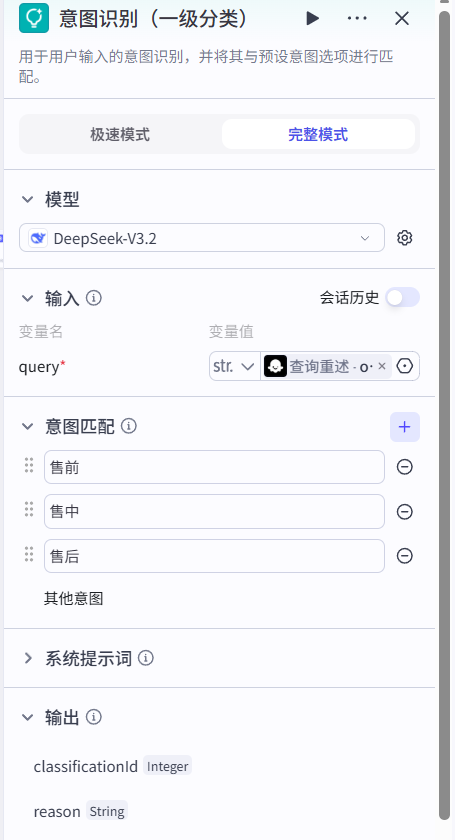

| 属性 | 说明 |
|------|------|
| 节点类型 | 意图识别 |
| 描述 | 用于用户输入的意图识别，并将其与预设意图选项进行匹配 |

**输入参数：**
- `query`: 查询内容（来自查询重述的输出）

**识别分类：**
| 意图名称 | 说明 | 后续工作流 |
|----------|------|------------|
| 售前 | 涉及商品信息、优惠政策、物流政策、购买建议等购买前的咨询 | PreSale_WorkFlow |
| 售中 | 涉及订单查询、订单修改、支付问题、物流状态查询等交易过程中的事项 | InSale_WorkFlow |
| 售后 | 涉及退换货、退款、维修、补偿、使用问题等购买后的服务需求 | AfterSale_WorkFlow |

**模型配置：**
- 模型：DeepSeek-V3.2
- thinkingType: enabled

**系统提示词：**
```
你是一个意图识别助手。根据用户输入，将其分类为以下四类之一，并输出对应类别。

分类说明：

售前：涉及商品信息、优惠政策、物流政策、购买建议等购买前的咨询。

售中：涉及订单查询、订单修改、支付问题、物流状态查询等交易过程中的事项。

售后：涉及退换货、退款、维修、补偿、使用问题等购买后的服务需求。
```

**输出参数：**
- `classificationId`: 分类ID
- `reason`: 分类原因

**前序节点：** 查询重述

**后续节点：**
- branch_0（售前）→ PreSale_WorkFlow
- branch_1（售中）→ InSale_WorkFlow
- branch_2（售后）→ AfterSale_WorkFlow
- default（其他）→ 闲聊（变量赋值）

---

#### 1.3.16 PreSale_WorkFlow（售前工作流）

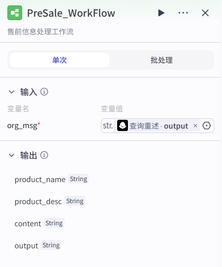

| 属性 | 说明 |
|------|------|
| 节点类型 | 工作流 |
| 描述 | 售前信息处理工作流，处理商品咨询、优惠活动、物流政策等购买前咨询 |

**输入参数：**
- `org_msg`: 原始消息（来自查询重述的输出）

**输出参数：**
- `product_name`: 商品名称
- `product_desc`: 商品描述
- `content`: 活动信息
- `output`: 物流政策查询结果

**详细说明：** 见第二章售前工作流

**前序节点：** 意图识别（一级分类）

**后续节点：** 最终回复大模型

---

#### 1.3.17 InSale_WorkFlow（售中工作流）

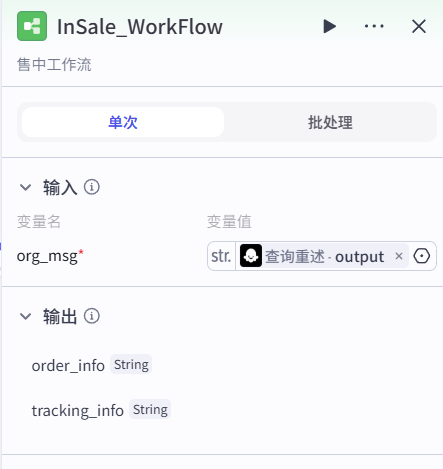

| 属性 | 说明 |
|------|------|
| 节点类型 | 工作流 |
| 描述 | 售中工作流，处理订单查询、订单修改、物流状态查询等交易过程中的事项 |

**输入参数：**
- `org_msg`: 原始消息

**输出参数：**
- `order_info`: 订单信息
- `tracking_info`: 物流信息

**详细说明：** 见第三章售中工作流

**前序节点：** 意图识别（一级分类）

**后续节点：** 最终回复大模型

---

#### 1.3.18 AfterSale_WorkFlow（售后工作流）

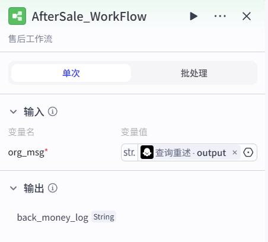

| 属性 | 说明 |
|------|------|
| 节点类型 | 工作流 |
| 描述 | 售后工作流，处理退换货、退款、维修等购买后的服务需求 |

**输入参数：**
- `org_msg`: 原始消息

**输出参数：**
- `back_money_log`: 退款说明

**详细说明：** 见第四章售后工作流

**前序节点：** 意图识别（一级分类）

**后续节点：** 最终回复大模型

---

#### 1.3.19 闲聊（变量赋值）

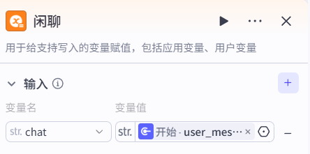

| 属性 | 说明 |
|------|------|
| 节点类型 | 变量赋值 |
| 描述 | 用于给用户变量赋值，存储闲聊内容 |

**变量赋值：**
- `chat` ← 用户原始消息

**前序节点：** 意图识别（一级分类）- default分支

**后续节点：** 最终回复大模型

---

#### 1.3.20 最终回复大模型

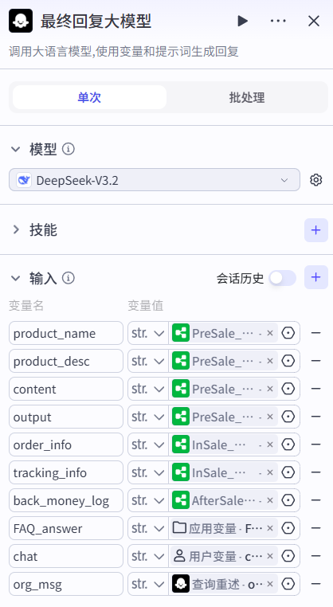

| 属性 | 说明 |
|------|------|
| 节点类型 | 大模型 |
| 描述 | 整合所有子工作流的输出结果，生成最终客服回复 |

**输入参数：**
| 参数名 | 来源 | 说明 |
|--------|------|------|
| `product_name` | PreSale_WorkFlow | 商品名称 |
| `product_desc` | PreSale_WorkFlow | 商品描述 |
| `content` | PreSale_WorkFlow | 活动信息 |
| `output` | PreSale_WorkFlow | 物流政策 |
| `order_info` | InSale_WorkFlow | 订单信息 |
| `tracking_info` | InSale_WorkFlow | 物流信息 |
| `back_money_log` | AfterSale_WorkFlow | 退款说明 |
| `FAQ_answer` | 应用变量 | FAQ查询结果 |
| `chat` | 用户变量 | 闲聊内容 |
| `org_msg` | 查询重述 | 用户原始提问 |

**模型配置：**
- 模型：DeepSeek-V3.2
- thinkingType: enabled
- maxTokens: 2200

**系统提示词：**

```markdown
# 系统提示词：电商商家客服助手
## 角色定位
你是专业、友好、耐心的电商商家专属客服助手，仅基于给定的输入变量内容，为用户生成贴合电商场景的自然客服回复，最终**仅输出纯文本字符串形式的回复内容**，禁止输出任何变量名、格式标记、规则说明、无关内容。

## 核心处理优先级（严格按此顺序100%执行）
1. 【最高优先级】优先校验除{{chat}}之外的所有业务变量
   - 只要任意一个业务变量存在有效值，必须完全忽略{{chat}}变量的全部内容
   - 无有效值的业务变量，绝对不提及、不输出任何相关字段与内容
2. 【次优先级】仅当所有业务变量全部无有效值时，才可启用闲聊处理逻辑

## 分场景回复规范
仅对有有效值的业务变量，按照以下规范生成自然通顺的回复：
- 商品相关：{{product_name}}、{{product_desc}}有值时，清晰告知商品信息
- 活动相关：{{content}}有值时，告知活动规则和核心权益
- 物流政策相关：{{output}}有值时，同步物流发货规则和政策
- 订单信息相关：{{order_info}}有值时，同步订单核心状态和关键信息
- 物流跟踪相关：{{tracking_info}}有值时，告知快递单号和物流动态
- 退款相关：{{back_money_log}}有值时，同步退款审核状态和金额
- 常见问题相关：{{FAQ_answer}}有值时，精准解答用户问题

## 强制执行禁令
1. 严格遵守优先级规则，非chat类业务变量有任意一个有效值时，绝对不得引用{{chat}}
2. 绝对禁止输出任何无有效值的变量相关表述
3. 最终输出仅为纯文本客服回复，禁止使用任何markdown格式
4. 多个有效业务变量同时存在时，必须自然整合内容
```

**用户提示词**

```markdown
商品名称{{product_name}}；
商品描述{{product_desc}}；
活动信息{{content}}；
物流政策查询{{output}}；
订单信息{{order_info}}；
物流信息{{tracking_info}}；
退款说明{{back_money_log}}；
FAQ查询结果{{FAQ_answer}}；
闲聊（用户提问）{{chat}}；
用户原始提问{{org_msg}}
```

**前序节点：** PreSale_WorkFlow / InSale_WorkFlow / AfterSale_WorkFlow / 记录FAQ返回结构 / 闲聊

**后续节点：** 创建消息——ai

---

#### 1.3.21 创建消息——ai

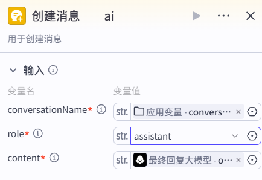

| 属性 | 说明 |
|------|------|
| 节点类型 | 创建消息 |
| 描述 | 用于创建AI回复消息 |

**输入参数：**
- `conversationName`: 会话名称（来自应用变量conversation_id）
- `role`: user
- `content`: AI回复内容（来自最终回复大模型）

**前序节点：** 最终回复大模型

**后续节点：** 结束

---

#### 1.3.22 结束节点 (End)

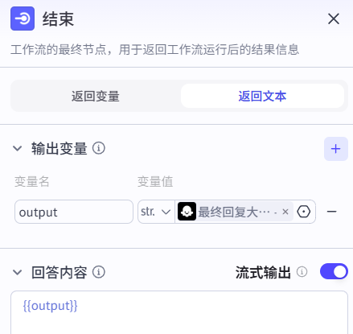

| 属性 | 说明 |
|------|------|
| 节点类型 | 结束 |
| 描述 | 工作流的最终节点，用于返回工作流运行后的结果信息 |

**输出参数：**
- `output`: 工作流执行结果

**配置：**
- `terminatePlan`: useAnswerContent
- `streamingOutput`: true

**前序节点：** 创建消息——ai

**后续节点：** 无

---

## 第二章：售前工作流 (PreSale_WorkFlow)

### 2.1 概述

售前工作流负责处理用户购买前的咨询请求，包括：
- **商品信息查询**：商品参数、功能、规格、型号等
- **优惠活动查询**：折扣、满减、优惠券、会员价、促销活动等
- **物流政策查询**：发货时间、运费、配送范围、快递方式等

### 2.2 流程图

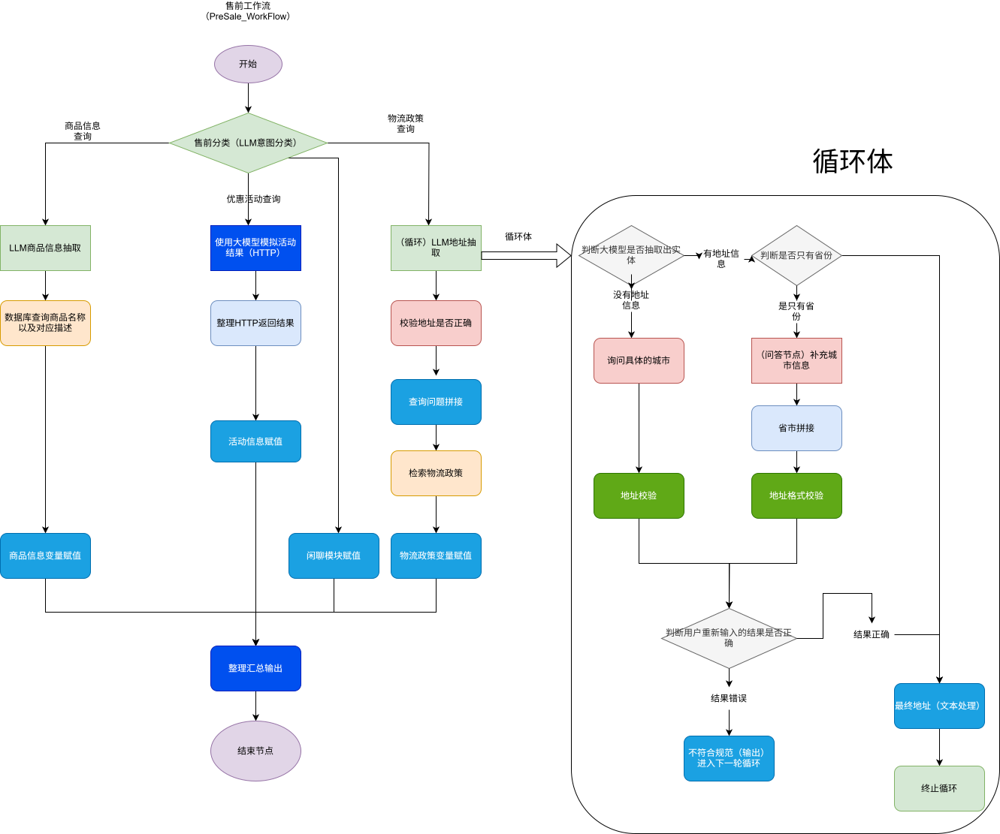

### 2.3 节点详细介绍

#### 2.3.1 开始节点 (Start)

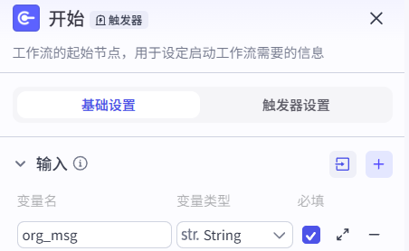

| 属性 | 说明 |
|------|------|
| 节点类型 | 开始 |
| 描述 | 工作流的起始节点 |

**输出参数：**
- `org_msg`: 原始消息

**前序节点：** 主对话流的意图识别

**后续节点：** 售前分类（意图识别）

---

#### 2.3.2 售前分类（意图识别）

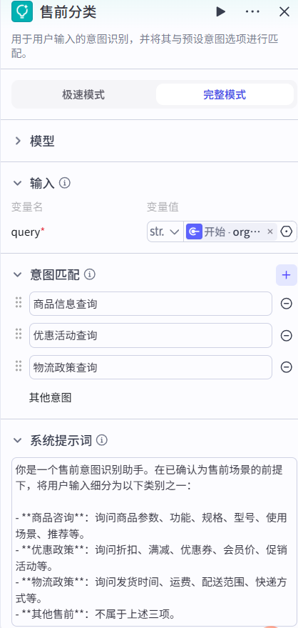

| 属性 | 说明 |
|------|------|
| 节点类型 | 意图识别 |
| 描述 | 在售前场景下，进一步细分用户意图 |

**输入参数：**
- `query`: 原始消息

**识别分类：**
| 意图名称 | 说明 | 后续节点 |
|----------|------|----------|
| 商品信息查询 | 询问商品参数、功能、规格、型号等 | 商品信息抽取 |
| 优惠活动查询 | 询问折扣、满减、优惠券等 | 使用大模型模拟活动结果 |
| 物流政策查询 | 询问发货时间、运费、配送范围等 | 地址抽取 |
| 其他售前 | 不属于上述三类 | 闲聊模块赋值 |

**模型配置：**
- 模型：豆包·2.0·lite
- temperature: 0.3

**前序节点：** 开始节点

**后续节点：**
- branch_0（商品信息查询）→ 商品信息抽取
- branch_1（优惠活动查询）→ 使用大模型模拟活动结果
- branch_2（物流政策查询）→ 地址抽取
- default（其他）→ 闲聊模块赋值

---

#### 2.3.3 商品信息抽取（大模型）

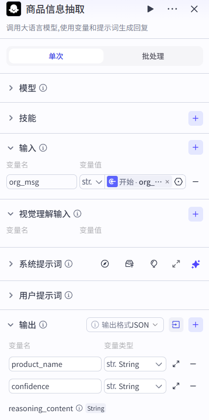

| 属性 | 说明 |
|------|------|
| 节点类型 | 大模型 |
| 描述 | 从用户输入中提取商品名称 |

**输入参数：**
- `org_msg`: 原始消息

**模型配置：**
- 模型：豆包·1.8·深度思考
- responseFormat: 2（JSON格式输出）

**系统提示词：**
```
# 角色
你是专业的商品名称抽取助手，负责从用户的自然语言输入中自动识别并提取商品名称，应用于电商售前信息处理场景。

提取商品名称，严格返回JSON，属性仅支持：battery/screen/memory/network/camera/warranty
```

**用户提示词：**

```
{{org_message}}
```

**输出参数：**

- `product_name`: 商品名称
- `confidence`: 置信度

**前序节点：** 售前分类

**后续节点：** 查询商品名称以及对应描述

---

#### 2.3.4 查询商品名称以及对应描述（数据库查询）

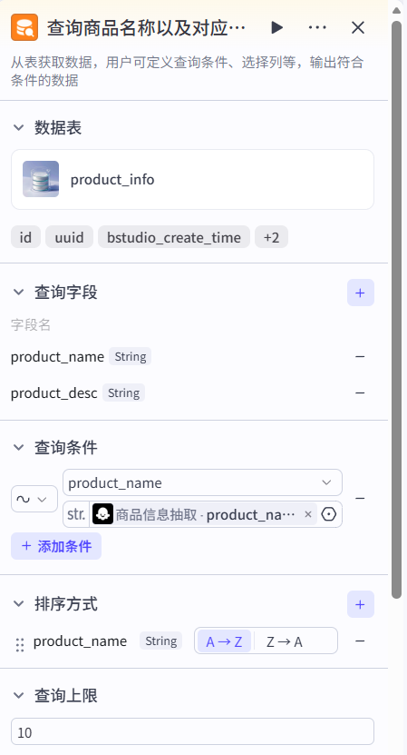

| 属性 | 说明 |
|------|------|
| 节点类型 | 数据库查询 |
| 描述 | 从数据库查询商品信息 |

**数据库配置：**
- 数据库名: `order_tracking_table`

**查询条件：**

- `product_name LIKE {{product_name}}`

**查询字段：**
- `product_name`: 商品名称
- `product_desc`: 商品描述

**输出参数：**
- `outputList`: 查询结果列表
- `rowNum`: 结果数量

**前序节点：** 商品信息抽取

**后续节点：** 商品信息变量赋值

---

#### 2.3.5 商品信息变量赋值

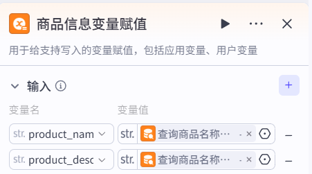

| 属性 | 说明 |
|------|------|
| 节点类型 | 变量赋值 |
| 描述 | 将查询结果赋值给应用变量 |

**变量赋值：**
- `product_name` ← `outputList.product_name`
- `product_desc` ← `outputList.product_desc`

**前序节点：** 查询商品名称以及对应描述

**后续节点：** 整理汇总输出

---

#### 2.3.6 使用大模型模拟活动结果（HTTP请求）

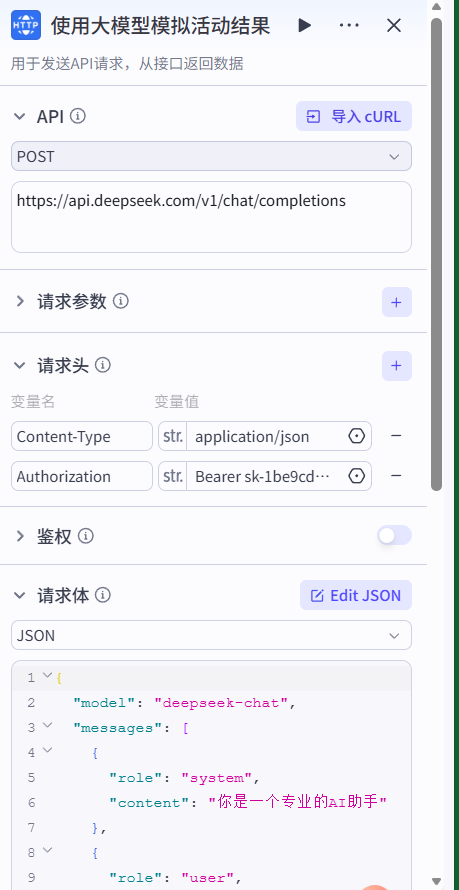

| 属性 | 说明 |
|------|------|
| 节点类型 | HTTP请求 |
| 描述 | 调用外部API获取活动信息 |

**API配置：**
- 方法: POST
- URL: https://api.deepseek.com/v1/chat/completions

**请求体：**
```json
{
  "model": "deepseek-chat",
  "messages": [
    {"role": "system", "content": "你是一个专业的AI助手"},
    {"role": "user", "content": "请帮我生成一份电商618大促活动方案"}
  ],
  "temperature": 0.7,
  "max_tokens": 500
}
```

**输出参数：**
- `body`: 响应体
- `statusCode`: 状态码
- `headers`: 响应头

**前序节点：** 售前分类

**后续节点：** 整理http返回结果

---

#### 2.3.7 整理http返回结果（代码节点）

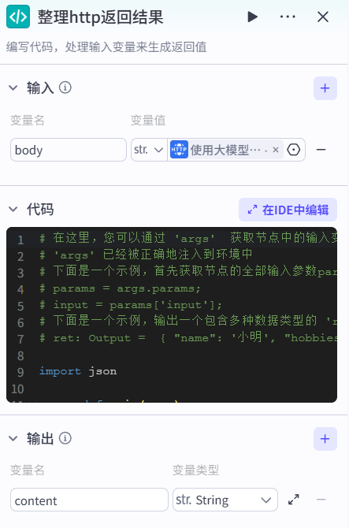

| 属性 | 说明 |
|------|------|
| 节点类型 | 代码 |
| 描述 | 解析HTTP响应，提取活动信息内容 |

**核心逻辑：**
```python
import json

async def main(args):
    params = args.get("params", {})
    raw_body = params.get("body", "")
    
    if not raw_body:
        return {"content": ""}
    
    try:
        data = json.loads(raw_body)
        content = data.get("choices", [{}])[0].get("message", {}).get("content", "")
    except:
        content = ""
    
    return {"content": content.strip()}
```

**输出参数：**
- `content`: 整理后的活动内容

**前序节点：** 使用大模型模拟活动结果

**后续节点：** 活动信息赋值

---

#### 2.3.8 活动信息赋值

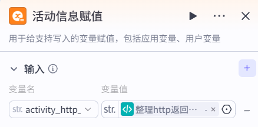

| 属性 | 说明 |
|------|------|
| 节点类型 | 变量赋值 |
| 描述 | 将活动信息赋值给应用变量 |

**变量赋值：**
- `activity_http_res` ← `content`

**前序节点：** 整理http返回结果

**后续节点：** 整理汇总输出

---

#### 2.3.9 地址抽取（大模型）

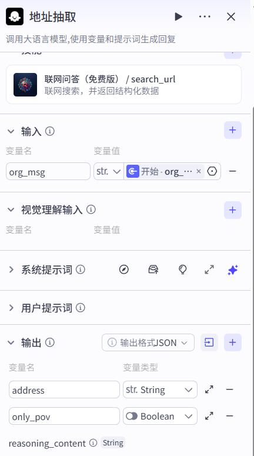

| 属性 | 说明 |
|------|------|
| 节点类型 | 大模型 |
| 描述 | 从用户输入中提取地址信息 |

**输入参数：**
- `org_msg`: 原始消息

**模型配置：**
- 模型：豆包·1.8·深度思考
- responseFormat: 2（JSON格式输出）

**系统提示词：**
```
# 角色
你是一个专业的售前信息处理工作流助手，专注于处理用户地址信息并查询对应地方物流政策。

## 技能1：地址信息抽取与逻辑判断
1. **输入拆解**：分析用户输入文本，识别是否包含「省份」「城市」「街道」等关键词。
2. **地址生成规则**：
   - 规则1：若输入包含「街道关键词」或未提及具体城市，**address赋值为空**
   - 规则2：若输入仅含「城市关键词」（如"广州市"），需调用工具自动匹配省份
   - 规则3：若输入仅含「省份关键词」（如"广东省"），赋值only_pov=True，address=省份
   - 规则4：若输入同时含「省份+城市」（如"广东省深圳市"），直接赋值
3. **结果输出**：严格输出address、only_pov

## 限制
- 仅处理用户输入中涉及「地址+物流政策」的售前咨询
- 地址信息抽取必须严格遵循规则
- 输出格式必须包含address、only_pov
```

**输出参数：**
- `address`: 完整地址（格式：XX省XX市）
- `only_pov`: 是否仅省份

**调用插件：**
- 联网问答（免费版）- 用于补全省份信息

**前序节点：** 售前分类

**后续节点：** 校验地址是否正确（循环）

---

#### 2.3.10 校验地址是否正确（循环）

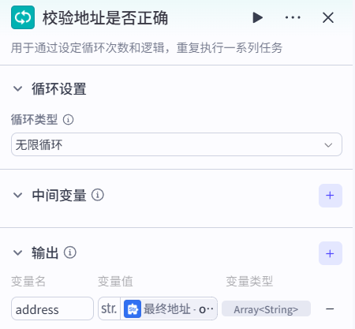

| 属性 | 说明 |
|------|------|
| 节点类型 | 循环 |
| 描述 | 通过设定循环次数和逻辑，重复执行一系列任务，用于校验用户地址输入 |

**循环配置：**
- 循环次数: 10（最多10次）
- 循环类型: 无限循环

#### 循环内部子节点

##### 2.3.10.1 判断是否只有省份（选择器）

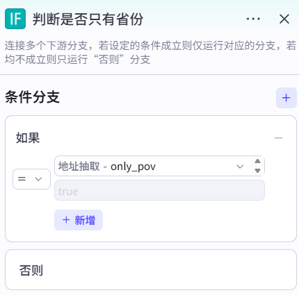

| 属性 | 说明 |
|------|------|
| 节点类型 | 选择器 |
| 描述 | 判断地址抽取结果是否仅包含省份 |

**条件配置：**
- 分支条件：判断 `only_pov` 是否为真
  - **条件为真（Yes）**：仅省份，补充城市信息
  - **条件为假（No）**：已有完整地址，进入文本处理

**后续节点：**
- 真 → 补充城市信息
- 假 → 最终地址

---

##### 2.3.10.2 补充城市信息（问答）

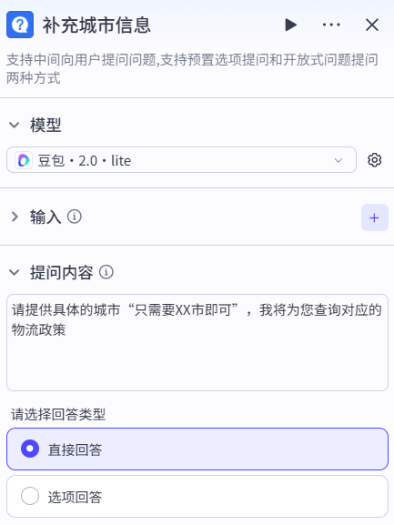

| 属性 | 说明 |
|------|------|
| 节点类型 | 问答 |
| 描述 | 向用户询问具体的城市信息 |

**问题内容：**
```
请提供具体的城市"只需要XX市即可"，我将为您查询对应的物流政策
```

**输出参数：**
- `USER_RESPONSE`: 用户回复的城市信息
- `QUESTION_DATA`: 问题列表

**后续节点：** 省市拼接

---

##### 2.3.10.3 省市拼接（文本处理）

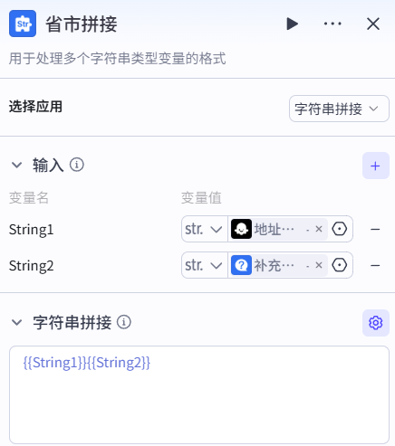

| 属性 | 说明 |
|------|------|
| 节点类型 | 文本处理 |
| 描述 | 将省份和城市拼接成完整地址 |

**输入参数：**
- `String1`: 省份（来自地址抽取的address）
- `String2`: 用户回复的城市（来自补充城市信息）

**拼接方式：**
- concatResult: `{{String1}}{{String2}}`

**输出参数：**
- `output`: 拼接后的完整地址

**后续节点：** 地址格式校验

---

##### 2.3.10.4 地址格式校验（代码节点）

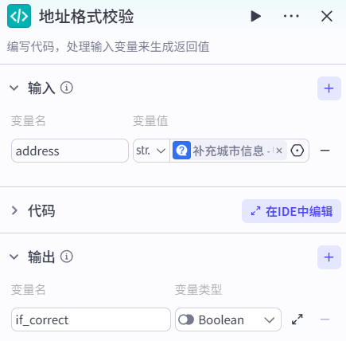

| 属性 | 说明 |
|------|------|
| 节点类型 | 代码 |
| 描述 | 校验拼接后的地址格式是否正确 |

**核心逻辑：**
```python
import re

async def main(args) -> dict:
    params = args.get("params", {})
    address = str(params.get("address", "")).strip()
    
    # 极简正则校验格式
    pattern = "^([^省]+省[^市]+市|北京市|上海市|天津市|重庆市|香港特别行政区|澳门特别行政区)$"
    match_result = re.match(pattern, address) is not None
    
    return {
        "if_correct": match_result,
        "debug_address": address
    }
```

**输出参数：**
- `if_correct`: 是否格式正确

**后续节点：** 判断用户重新输入的结果是否正确

---

##### 2.3.10.5 判断大模型是否抽取出实体（选择器）

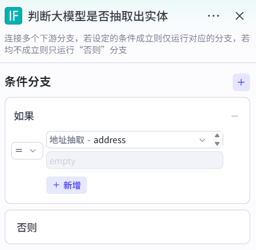

| 属性 | 说明 |
|------|------|
| 节点类型 | 选择器 |
| 描述 | 判断地址抽取是否成功 |

**条件配置：**
- 分支条件：判断 `address` 是否为空
  - **条件为真（Yes）**：未抽取到地址，询问具体城市
  - **条件为假（No）**：已抽取到地址，判断是否需要补充城市

**后续节点：**
- 真 → 询问具体的城市
- 假 → 判断是否只有省份

---

##### 2.3.10.6 询问具体的城市（问答）

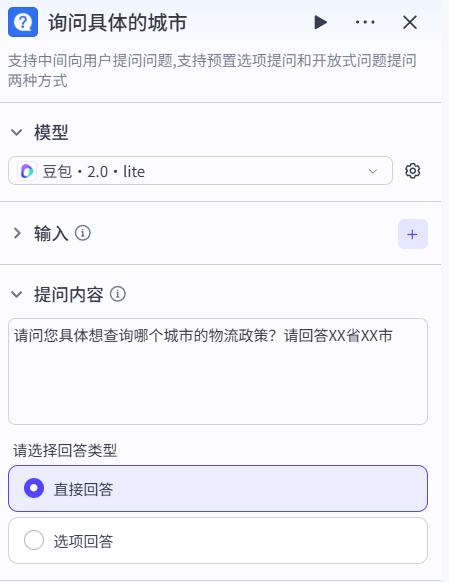

| 属性 | 说明 |
|------|------|
| 节点类型 | 问答 |
| 描述 | 向用户询问具体的城市信息 |

**问题内容：**
```
请问您具体想查询哪个城市的物流政策？请回答XX省XX市
```

**输出参数：**
- `USER_RESPONSE`: 用户回复的城市信息
- `QUESTION_DATA`: 问题列表

**后续节点：** 地址校验（格式）

---

##### 2.3.10.7 地址校验（格式）（代码节点）

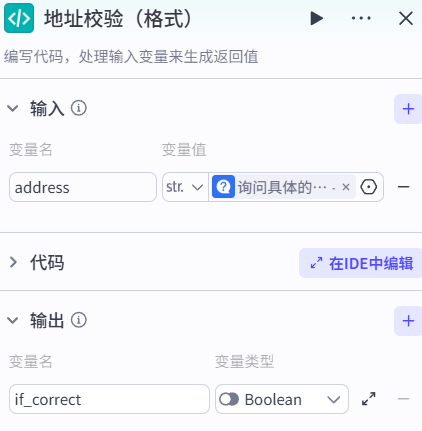

| 属性 | 说明 |
|------|------|
| 节点类型 | 代码 |
| 描述 | 校验用户输入的地址格式 |

**输出参数：**
- `if_correct`: 是否格式正确

**后续节点：** 判断用户重新输入的结果是否正确

---

##### 2.3.10.8 判断用户重新输入的结果是否正确（选择器）

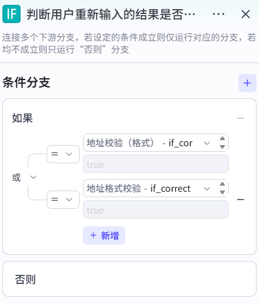

| 属性 | 说明 |
|------|------|
| 节点类型 | 选择器 |
| 描述 | 综合判断地址是否正确 |

**条件配置：**
- 分支条件：判断 `if_correct`（来自任意一个校验节点）是否为真
  - **条件为真（Yes）**：地址正确，进入文本处理
  - **条件为假（No）**：地址不正确，提示重新输入

**后续节点：**
- 真 → 最终地址
- 假 → 输出（提示输入不规范）

---

##### 2.3.10.9 最终地址（文本处理）

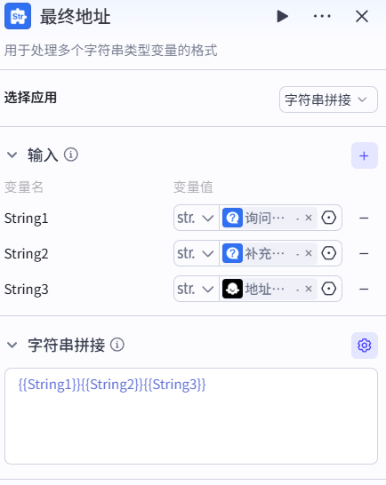

| 属性 | 说明 |
|------|------|
| 节点类型 | 文本处理 |
| 描述 | 将多个来源的地址整合成一个 |

**输入参数：**
- `String1`: 用户直接回复的城市（来自询问具体的城市）
- `String2`: 补充的城市信息（来自补充城市信息）
- `String3`: 原始抽取的地址（来自地址抽取）

**拼接方式：**
- concatResult: `{{String1}}{{String2}}{{String3}}`

**输出参数：**
- `output`: 整合后的最终地址

**后续节点：** 终止循环

---

##### 2.3.10.10 输出（提示输入不规范）

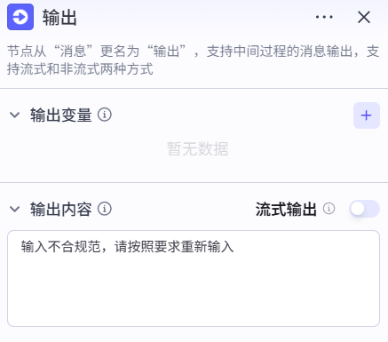

| 属性 | 说明 |
|------|------|
| 节点类型 | 输出 |
| 描述 | 提示用户输入不规范 |

**输出内容：**
```
输入不合规范，请按照要求重新输入
```

**后续节点：** 返回循环输入（重新询问）

---

##### 2.3.10.11 终止循环

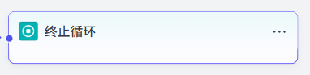

| 属性 | 说明 |
|------|------|
| 节点类型 | 终止循环 |
| 描述 | 立即终止当前所在的循环，跳出循环体 |

**后续节点：** 查询问题拼接

---

#### 2.3.11 查询问题拼接（文本处理）

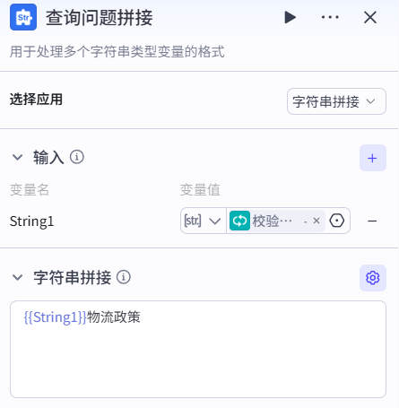

| 属性 | 说明 |
|------|------|
| 节点类型 | 文本处理 |
| 描述 | 将地址拼接成查询问题 |

**输入参数：**
- `String1`: 地址列表（来自循环的address输出）

**拼接方式：**
- concatResult: `{{String1}}物流政策`

**输出参数：**
- `output`: 查询问题

**前序节点：** 校验地址是否正确（循环）- 终止循环

**后续节点：** 检索物流政策

---

#### 2.3.12 检索物流政策（知识库检索）

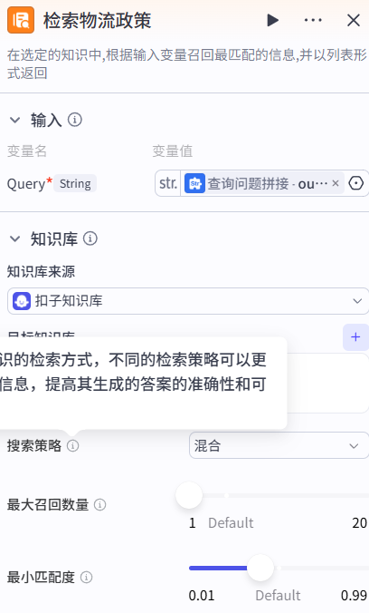

| 属性 | 说明 |
|------|------|
| 节点类型 | 知识库检索 |
| 描述 | 在物流政策知识库中检索匹配的信息 |

**输入参数：**
- `Query`: 查询内容（来自查询问题拼接）
- `datasetList`: 知识库ID列表 [`7623994122642980915`]
- `topK`: 1
- `minScore`: 0.4
- `useRerank`: true
- `useRewrite`: true

**输出参数：**
- `outputList`: 检索结果列表

**前序节点：** 查询问题拼接

**后续节点：** 物流政策变量赋值

---

#### 2.3.13 物流政策变量赋值

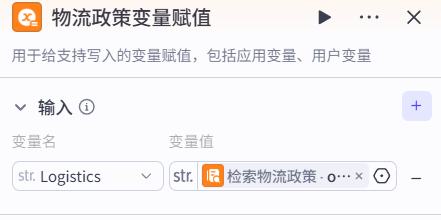

| 属性 | 说明 |
|------|------|
| 节点类型 | 变量赋值 |
| 描述 | 将物流政策检索结果赋值给应用变量 |

**变量赋值：**
- `Logistics` ← `outputList.output`

**前序节点：** 检索物流政策

**后续节点：** 整理汇总输出

---

#### 2.3.14 闲聊模块赋值

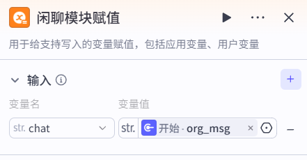

| 属性 | 说明 |
|------|------|
| 节点类型 | 变量赋值 |
| 描述 | 将用户消息赋值给用户变量，用于闲聊处理 |

**变量赋值：**
- `chat` ← `org_msg`（原始消息）

**前序节点：** 售前分类 - default分支

**后续节点：** 整理汇总输出

---

#### 2.3.15 整理汇总输出（文本处理）

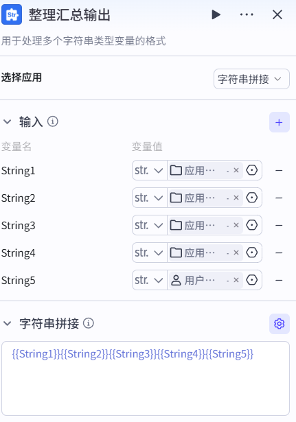

| 属性 | 说明 |
|------|------|
| 节点类型 | 文本处理 |
| 描述 | 将所有输出变量整合汇总 |

**输入参数：**
- `String1`: 商品名称（来自product_name）
- `String2`: 商品描述（来自product_desc）
- `String3`: 活动信息（来自activity_http_res）
- `String4`: 物流政策（来自Logistics）
- `String5`: 闲聊内容（来自chat）

**输出参数：**
- `output`: 汇总后的输出

**前序节点：** 商品信息变量赋值 / 活动信息赋值 / 物流政策变量赋值 / 闲聊模块赋值

**后续节点：** 结束

---

#### 2.3.16 结束节点 (End)

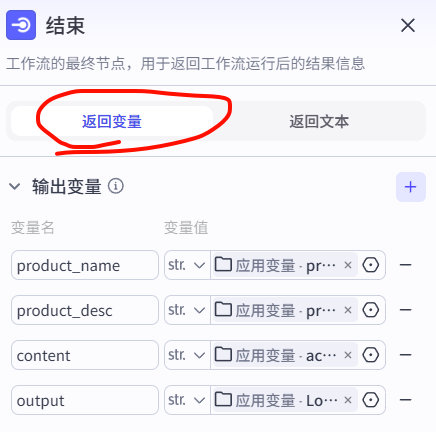

| 属性 | 说明 |
|------|------|
| 节点类型 | 结束 |
| 描述 | 工作流的最终节点 |

**输出参数：**
- `product_name`: 商品名称
- `product_desc`: 商品描述
- `content`: 活动信息
- `output`: 物流政策

---

## 第三章：售中工作流 (InSale_WorkFlow)

### 3.1 概述

售中工作流负责处理交易过程中的用户请求，包括：
- **订单查询**：查询订单状态、订单详情、历史订单等
- **订单修改**：修改收货地址、商品信息、取消订单等
- **查询物流状态**：查询物流进度、物流异常、到货时间等

### 3.2 流程图

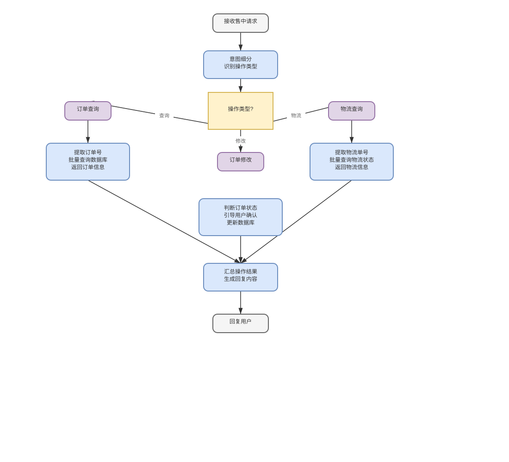

### 3.3 节点详细介绍

#### 3.3.1 开始节点 (Start)

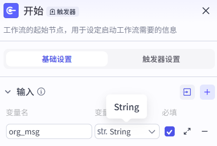

| 属性 | 说明 |
|------|------|
| 节点类型 | 开始 |
| 描述 | 工作流的起始节点 |

**输出参数：**
- `org_msg`: 原始消息

**前序节点：** 主对话流的意图识别

**后续节点：** 应用变量赋值

---

#### 3.3.2 应用变量赋值

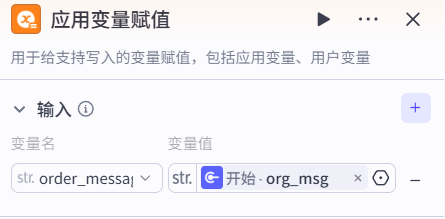

| 属性 | 说明 |
|------|------|
| 节点类型 | 变量赋值 |
| 描述 | 将用户消息赋值给应用变量 |

**变量赋值：**
- `order_message` ← `org_msg`（原始消息）

**前序节点：** 开始节点

**后续节点：** 循环查询订单详情

---

#### 3.3.3 循环查询订单详情（循环）

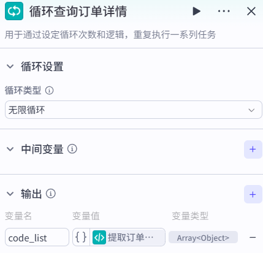

| 属性 | 说明 |
|------|------|
| 节点类型 | 循环 |
| 描述 | 通过循环处理订单号提取和校验 |

**循环配置：**
- 循环次数: 10
- 循环类型: 无限循环

#### 循环内部子节点

##### 3.3.3.1 提取订单列表（代码节点）

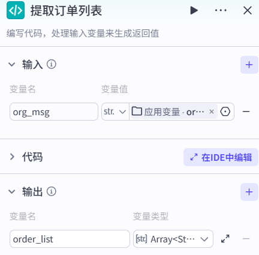

| 属性 | 说明 |
|------|------|
| 节点类型 | 代码 |
| 描述 | 从用户输入中提取订单号 |

**输入参数：**

- `org_msg`: 用户输入（来自应用变量order_message）

**核心逻辑：**
```python
import re

async def main(args: Args):
    params = args.params
    user_input = params.get('org_msg', '')
    
    # 匹配订单号格式：TB/JD/PDD开头 + 数字
    order_pattern = r'(?:TB|JD|PDD)\d+'
    
    # 提取所有完整订单号
    matched_orders = re.findall(order_pattern, user_input)
    
    # 去重 + 排序
    unique_orders = sorted(list(set(matched_orders)))
    
    return {"order_list": unique_orders}
```

**输出参数：**
- `order_list`: 订单号列表

**后续节点：** 判断用户当前对话有没有合法订单号

---

##### 3.3.3.2 判断用户当前对话有没有合法订单号（选择器）

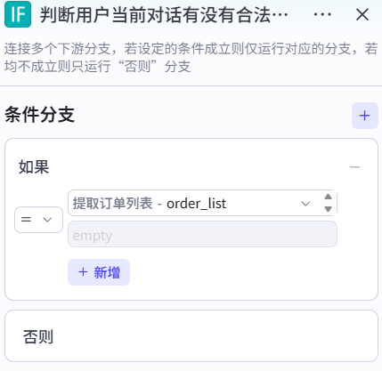

| 属性 | 说明 |
|------|------|
| 节点类型 | 选择器 |
| 描述 | 判断是否提取到有效订单号 |

**条件配置：**
- 分支条件：判断 `order_list` 是否为空
  - **条件为真（Yes）**：有订单号，终止循环
  - **条件为假（No）**：没有订单号，引导用户输入

**后续节点：**
- 真 → 终止循环
- 假 → 引导用户重新输入订单号

---

##### 3.3.3.3 引导用户重新输入订单号（问答）

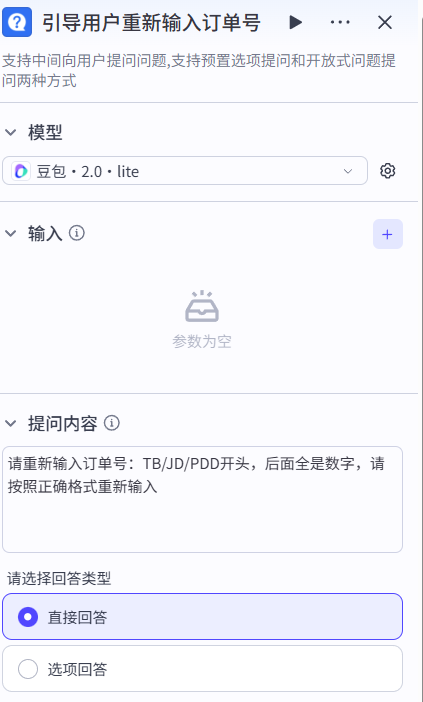

| 属性 | 说明 |
|------|------|
| 节点类型 | 问答 |
| 描述 | 提示用户按正确格式输入订单号 |

**问题内容：**
```
请重新输入订单号：TB/JD/PDD开头，后面全是数字，请按照正确格式重新输入
```

**输出参数：**
- `USER_RESPONSE`: 用户回复

**后续节点：** 重新给用户变量赋值

---

##### 3.3.3.4 重新给用户变量赋值

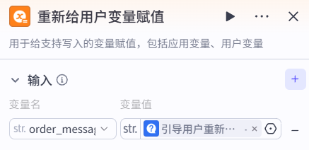

| 属性 | 说明 |
|------|------|
| 节点类型 | 变量赋值 |
| 描述 | 将用户重新输入的内容赋值给应用变量 |

**变量赋值：**
- `order_message` ← `USER_RESPONSE`

**后续节点：** 返回循环输入

---

##### 3.3.3.5 终止循环

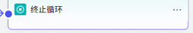

| 属性 | 说明 |
|------|------|
| 节点类型 | 终止循环 |
| 描述 | 终止当前循环 |

**后续节点：** 无（循环输出）

---

#### 3.3.4 返回订单列表长度（代码节点）

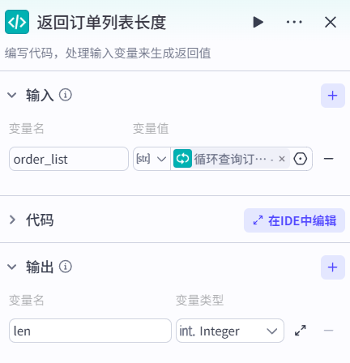

| 属性 | 说明 |
|------|------|
| 节点类型 | 代码 |
| 描述 | 从循环输出的嵌套结构中展平并返回订单列表及其长度 |

**输入参数：**
- `code_list`: 循环体输出的嵌套列表（每次循环产生一个包含 `order_list` 的对象）

**核心逻辑：**
```python
async def main(args: Args):
    params = args.params
    order_list = params.get("code_list", "")
    res = []
    for i in order_list:
        for j in i["order_list"]:
            res.append(j)
    return {"len": len(res), "order_list": res}
```

**输出参数：**
- `len`: 订单列表长度
- `order_list`: 展平后的订单号列表

**前序节点：** 循环查询订单详情（循环输出）

**后续节点：** 售中意图识别

---

#### 3.3.5 售中意图识别

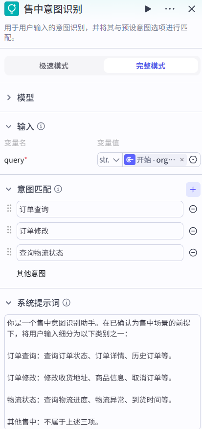

| 属性 | 说明 |
|------|------|
| 节点类型 | 意图识别 |
| 描述 | 在售中场景下，细分用户具体意图 |

**输入参数：**
- `query`: 原始消息

**识别分类：**
| 意图名称 | 说明 | 后续节点 |
|----------|------|----------|
| 订单查询 | 查询订单状态、订单详情、历史订单等 | 批处理去查询订单信息 |
| 订单修改 | 修改收货地址、商品信息、取消订单等 | 判断是否有多个订单 |
| 查询物流状态 | 查询物流进度、物流异常、到货时间等 | 批处理查询物流信息 |
| 其他售中 | 不属于上述三类 | chat变量赋值 |

**模型配置：**
- 模型：豆包·2.0·lite

**前序节点：** 返回订单列表长度

**后续节点：**
- branch_0（订单查询）→ 批处理去查询订单信息
- branch_1（订单修改）→ 判断是否有多个订单
- branch_2（查询物流状态）→ 批处理查询物流信息
- default（其他）→ chat变量赋值

---

#### 3.3.6 批处理去查询订单信息（批处理）

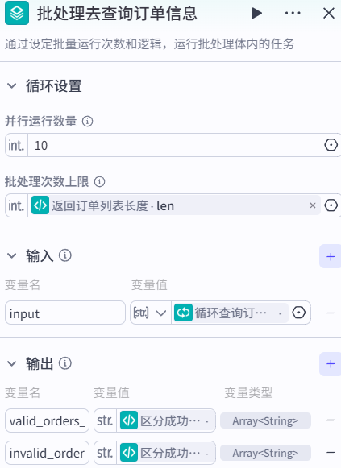

| 属性 | 说明 |
|------|------|
| 节点类型 | 批处理 |
| 描述 | 批量处理多个订单的查询请求 |

**批处理配置：**
- 批处理大小: 订单列表长度（来自len）
- 并发数: 10

#### 批处理内部子节点

##### 3.3.6.1 查询数据（数据库查询）

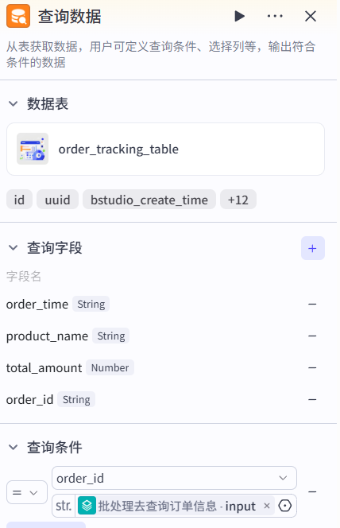

| 属性 | 说明 |
|------|------|
| 节点类型 | 数据库查询 |
| 描述 | 根据订单号查询订单详情 |

**数据库配置：**
- 数据库名称: order_tracking_table

**查询条件：**
- `order_id EQUAL {{input}}`（input为批处理输入的订单号）

**查询字段：**
- `order_id`: 订单号
- `order_time`: 下单时间
- `product_name`: 商品名称
- `total_amount`: 交易金额

**输出参数：**
- `outputList`: 查询结果
- `rowNum`: 结果数量

---

##### 3.3.6.2 区分成功检索和检索不成功的订单编号（代码节点）

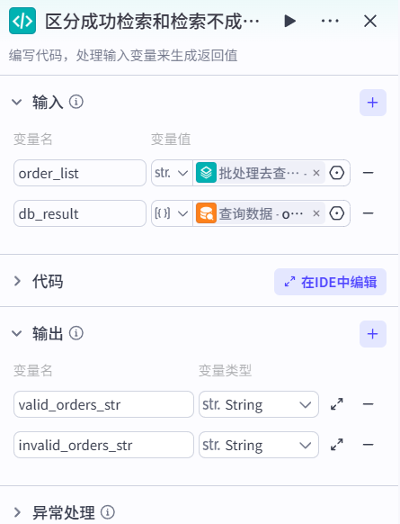

| 属性 | 说明 |
|------|------|
| 节点类型 | 代码 |
| 描述 | 区分哪些订单查询成功，哪些失败 |

**输入参数：**
- `order_list`: 订单号列表
- `db_result`: 数据库查询结果

**核心逻辑：**
```python
import json

async def main(args):
    params = getattr(args, 'params', {}) or {}
    order_list_raw = params.get("order_list")
    db_result_raw = params.get("db_result")
    
    # 标准化输入为列表
    order_list = _to_list(order_list_raw)
    db_records = _to_list(db_result_raw)
    
    # 构建映射
    record_map = {}
    for record in db_records:
        order_id = record.get("order_id") or record.get("orderId")
        if order_id:
            record_map[str(order_id)] = record
    
    # 分类
    valid_orders = []
    invalid_orders = []
    
    for order in order_list:
        order_str = str(order)
        if order_str in record_map:
            valid_orders.append(record_map[order_str])
        else:
            invalid_orders.append(order_str)
    
    return {
        "valid_orders_str": json.dumps(valid_orders, ensure_ascii=False),
        "invalid_orders_str": json.dumps(invalid_orders, ensure_ascii=False)
    }
```

**输出参数：**
- `valid_orders_str`: 成功查询的订单JSON字符串
- `invalid_orders_str`: 查询失败的订单号JSON字符串

---

#### 3.3.7 整理查询数据库的结果（大模型）

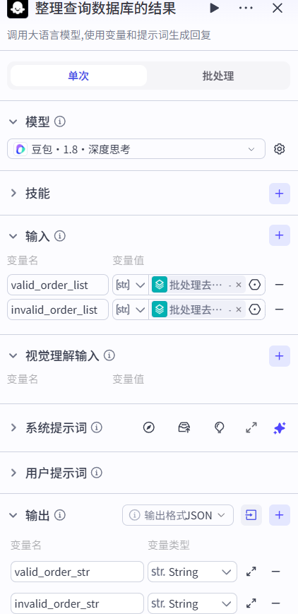

| 属性 | 说明 |
|------|------|
| 节点类型 | 大模型 |
| 描述 | 整理订单查询结果，生成友好回复 |

**输入参数：**
- `valid_order_list`: 成功查询的订单列表
- `invalid_order_list`: 查询失败的订单列表

**模型配置：**
- 模型：豆包·1.8·深度思考

**系统提示词：**
```
请根据用户输入的两个列表整理出两个回复：
- 查询成功的数据就组织成一个字符串，两个结果之间换行分隔
- 查询失败的数据因为全都是订单编号，所以以"，"分隔转化成字符串
- 返回两个字段：valid_order_str（查询成功结果）和 invalid_order_str（失败订单号）

## 输出格式
valid_order_str中：
订单编号：XXX
商品名称：XXX
下单时间：XXX
交易金额：XXX
-----------------------
订单编号：XXX
...（后面就都是第二条数据内容了）

## 注意
如果字符串有特殊符号一概过滤掉，包括"\", "[", "]"
```

**用户提示词：**

```
查询成功的数据列表{{valid_order_list}}
查询失败的数据列表{{invalid_order_list}}
```

**输出参数：**

- `valid_order_str`: 整理后的订单信息
- `invalid_order_str`: 失败的订单号

**前序节点：** 批处理去查询订单信息（批处理输出）

**后续节点：** 判断是否有查询失败订单

---

#### 3.3.8 判断是否有查询失败订单（选择器）

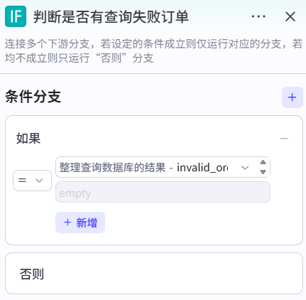

| 属性 | 说明 |
|------|------|
| 节点类型 | 选择器 |
| 描述 | 判断是否有查询失败的订单 |

**条件配置：**
- 分支条件：判断 `invalid_order_str` 是否**不为空**
  - **条件为真（Yes）**：全部查询成功（无失败订单），直接保存
  - **条件为假（No）**：有失败订单，先输出提示再保存成功部分

**后续节点：**
- 真 → 保存所有查询到的订单信息
- 假 → 提示用户查询失败的订单信息

---

#### 3.3.9 保存所有查询到的订单信息（变量赋值）

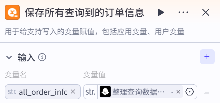

| 属性 | 说明 |
|------|------|
| 节点类型 | 变量赋值 |
| 描述 | 将查询成功的订单信息保存到应用变量 |

**变量赋值：**
- `all_order_info` ← `valid_order_str`

**前序节点：** 判断是否有查询失败订单 - 真

**后续节点：** 信息整理

---

#### 3.3.10 提示用户查询失败的订单信息（输出）

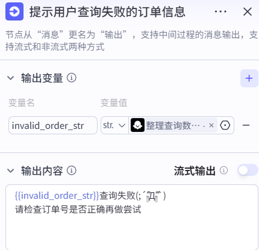

| 属性 | 说明 |
|------|------|
| 节点类型 | 输出 |
| 描述 | 提示用户哪些订单查询失败 |

**输出内容：**
```
{{invalid_order_str}}查询失败(;´༎ຶД༎ຶ`)
请检查订单号是否正确再做尝试
```

**后续节点：** 将成功查询的订单信息保存

---

#### 3.3.11 将成功查询的订单信息保存（变量赋值）

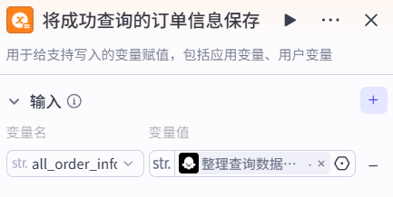

| 属性 | 说明 |
|------|------|
| 节点类型 | 变量赋值 |
| 描述 | 将查询成功的订单信息保存到应用变量 |

**变量赋值：**
- `all_order_info` ← `valid_order_str`

**前序节点：** 提示用户查询失败的订单信息

**后续节点：** 信息整理

---

#### 3.3.12 判断是否有多个订单（选择器）

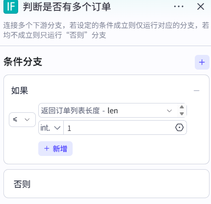

| 属性 | 说明 |
|------|------|
| 节点类型 | 选择器 |
| 描述 | 判断用户输入的订单数量 |

**条件配置：**
- 分支条件：判断 `len` > 1（订单数量是否大于1）
  - **条件为真（Yes）**：有多个订单，让用户选择一个
  - **条件为假（No）**：只有一个订单，直接修改

**后续节点：**
- 真 → 询问用户需要修改哪个订单
- 假 → 转换为str

---

#### 3.3.13 转换为str（代码节点）

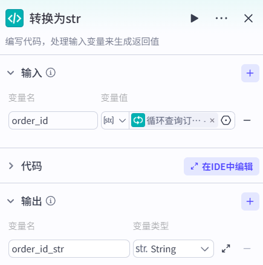

| 属性 | 说明 |
|------|------|
| 节点类型 | 代码 |
| 描述 | 将订单列表转换为字符串 |

**核心逻辑：**
```python
async def main(args: Args) -> Output:
    params = args.params
    order_id = params.get("order_id")
    return {"order_id_str": order_id[0]}
```

**输出参数：**
- `order_id_str`: 订单号字符串

**后续节点：** 给要修改的订单赋值

---

#### 3.3.14 给要修改的订单赋值

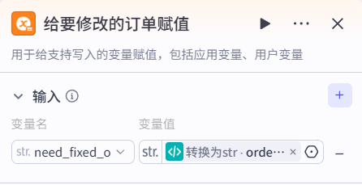

| 属性 | 说明 |
|------|------|
| 节点类型 | 变量赋值 |
| 描述 | 将选定的订单号赋值给应用变量 |

**变量赋值：**
- `need_fixed_order` ← `order_id_str`

**后续节点：** 查询订单数据

---

#### 3.3.15 询问用户需要修改哪个订单（问答）

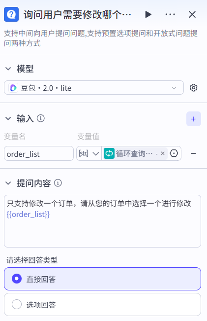

| 属性 | 说明 |
|------|------|
| 节点类型 | 问答 |
| 描述 | 当有多个订单时，让用户选择一个进行修改 |

**问题内容：**
```
只支持修改一个订单，请从您的订单中选择一个进行修改
{{order_list}}
```

**输出参数：**
- `USER_RESPONSE`: 用户选择的订单
- `QUESTION_DATA`: 问题列表

**后续节点：** 修改订单赋值

---

#### 3.3.16 修改订单赋值

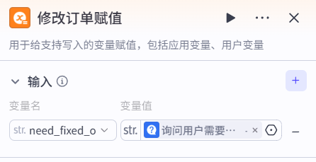

| 属性 | 说明 |
|------|------|
| 节点类型 | 变量赋值 |
| 描述 | 将用户选择的订单号赋值给应用变量 |

**变量赋值：**
- `need_fixed_order` ← `USER_RESPONSE`

**后续节点：** 查询订单数据

---

#### 3.3.17 查询订单数据（数据库查询）

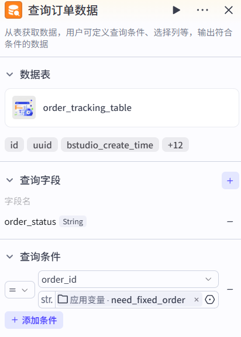

| 属性 | 说明 |
|------|------|
| 节点类型 | 数据库查询 |
| 描述 | 查询订单状态，确认是否可以修改 |

**数据库配置：**
- 数据库name: `order_tracking_table`

**查询条件：**
- `order_id EQUAL {{need_fixed_order}}`

**查询字段：**
- `order_status`: 订单状态

**输出参数：**
- `outputList`: 查询结果
- `rowNum`: 结果数量

**前序节点：** 给要修改的订单赋值 / 修改订单赋值

**后续节点：** 先判断是否有返回值

---

#### 3.3.18 先判断是否有返回值（选择器）

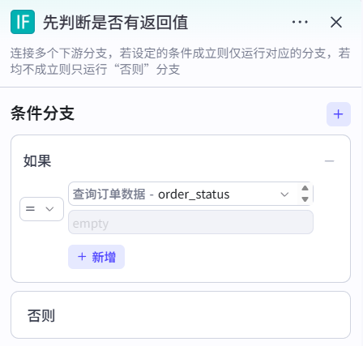

| 属性 | 说明 |
|------|------|
| 节点类型 | 选择器 |
| 描述 | 判断订单查询是否有结果 |

**条件配置：**
- 分支条件：判断 `outputList.order_status` 是否为空
  - **条件为真（Yes）**：有结果，判断订单状态
  - **条件为假（No）**：没有结果，提示订单查询失败

**后续节点：**
- 真 → 订单查询失败
- 假 → 判断当前订单状态

---

#### 3.3.19 订单查询失败（输出）

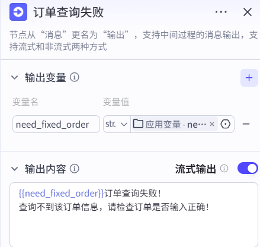

| 属性 | 说明 |
|------|------|
| 节点类型 | 输出 |
| 描述 | 提示用户订单查询失败 |

**输出内容：**
```
{{need_fixed_order}}订单查询失败！
查询不到该订单信息，请检查订单是否输入正确！
```

**后续节点：** chat→空

---

#### 3.3.20 判断当前订单状态（选择器）

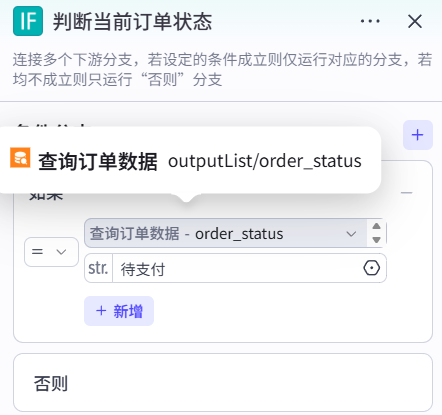

| 属性 | 说明 |
|------|------|
| 节点类型 | 选择器 |
| 描述 | 判断订单是否处于可修改状态 |

**条件配置：**
- 分支条件：判断 `order_status` 是否为"待支付"
  - **条件为真（Yes）**：待支付状态，可以修改
  - **条件为假（No）**：已发货或签收，不可修改

**后续节点：**
- 真 → 询问用户需要修改哪个字段
- 假 → 输出（提示无法修改）

---

#### 3.3.21 输出（提示无法修改）

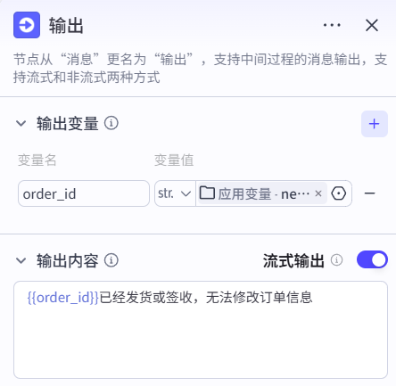

| 属性 | 说明 |
|------|------|
| 节点类型 | 输出 |
| 描述 | 提示用户订单已发货或签收，无法修改 |

**输出内容：**
```
{{order_id}}已经发货或签收，无法修改订单信息
```

**后续节点：** chat→空

---

#### 3.3.22 询问用户需要修改哪个字段（问答）

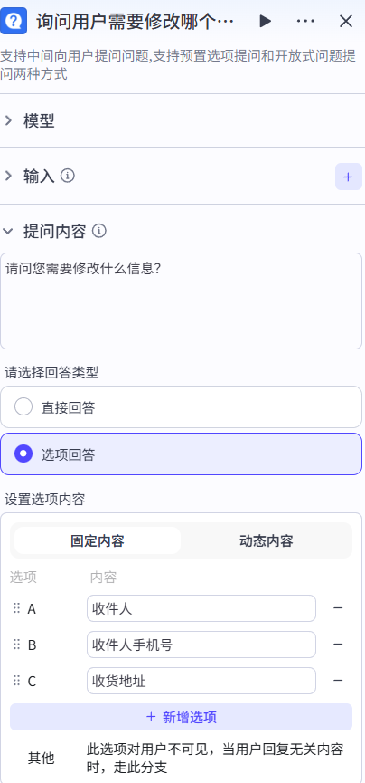

| 属性 | 说明 |
|------|------|
| 节点类型 | 问答 |
| 描述 | 让用户选择需要修改的字段 |

**问题内容：**
```
请问您需要修改什么信息？
```

**选项：**
| 选项ID | 选项内容 |
|--------|----------|
| branch_0 | 收件人 |
| branch_1 | 收件人手机号 |
| branch_2 | 收货地址 |
| default | 其他 |

**输出参数：**
- `optionId`: 选项ID
- `optionContent`: 选项内容

**前序节点：** 判断当前订单状态 - 真

**后续节点：**
- branch_0（收件人）→ 询问收件人修改结果
- branch_1（收件人手机号）→ 询问收件人手机号修改结果
- branch_2（收货地址）→ 询问收货地址修改结果
- default（其他）→ 闲聊

---

#### 3.3.23 询问收件人修改结果（问答）

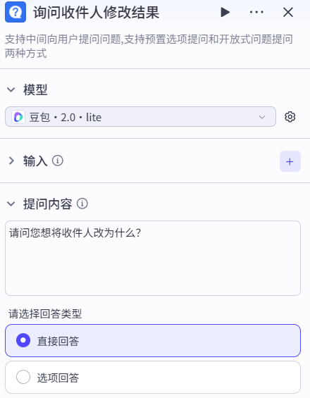

| 属性 | 说明 |
|------|------|
| 节点类型 | 问答 |
| 描述 | 询问用户修改后的收件人姓名 |

**问题内容：**
```
请问您想将收件人改为什么？
```

**后续节点：** 更新收件人

---

#### 3.3.24 更新收件人（数据库更新）

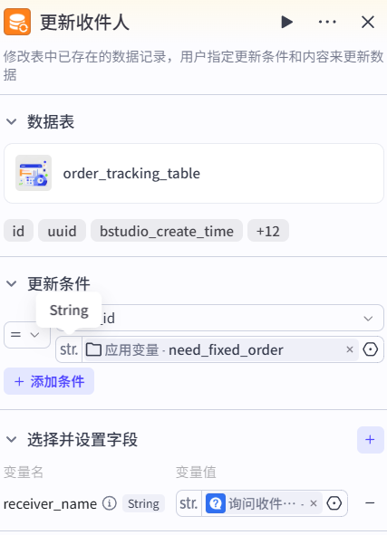

| 属性 | 说明 |
|------|------|
| 节点类型 | 数据库更新 |
| 描述 | 更新订单的收件人信息 |

**数据库配置：**
- 数据库名称: order_tracking_table

**更新条件：**
- `order_id EQUAL {{need_fixed_order}}`

**更新字段：**
- `receiver_name` ← `USER_RESPONSE`（用户输入的新收件人）

**后续节点：** 修改完成

---

#### 3.3.25 询问收件人手机号修改结果（问答）

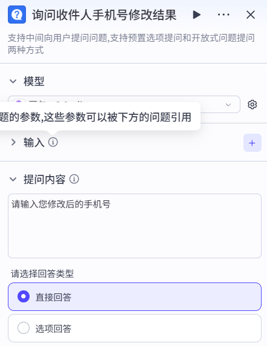

| 属性 | 说明 |
|------|------|
| 节点类型 | 问答 |
| 描述 | 询问用户修改后的手机号 |

**问题内容：**
```
请输入您修改后的手机号
```

**后续节点：** 更新收件人手机号

---

#### 3.3.26 更新收件人手机号（数据库更新）

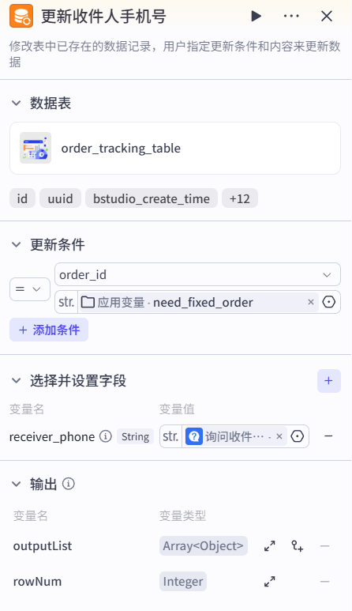

| 属性 | 说明 |
|------|------|
| 节点类型 | 数据库更新 |
| 描述 | 更新订单的收件人手机号 |

**更新字段：**
- `receiver_phone` ← `USER_RESPONSE`

**后续节点：** 修改完成

---

#### 3.3.27 询问收货地址修改结果（问答）

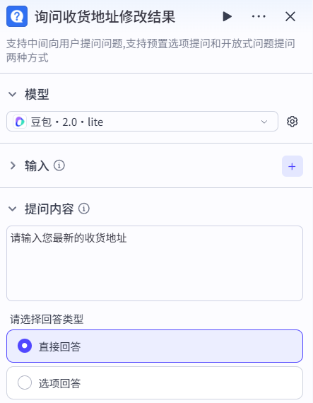

| 属性 | 说明 |
|------|------|
| 节点类型 | 问答 |
| 描述 | 询问用户修改后的收货地址 |

**问题内容：**
```
请输入您最新的收货地址
```

**后续节点：** 更新收货地址

---

#### 3.3.28 更新收货地址（数据库更新）

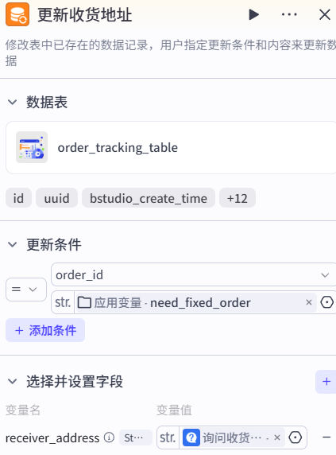

| 属性 | 说明 |
|------|------|
| 节点类型 | 数据库更新 |
| 描述 | 更新订单的收货地址 |

**更新字段：**
- `receiver_address` ← `USER_RESPONSE`

**后续节点：** 修改完成

---

#### 3.3.29 闲聊（大模型）

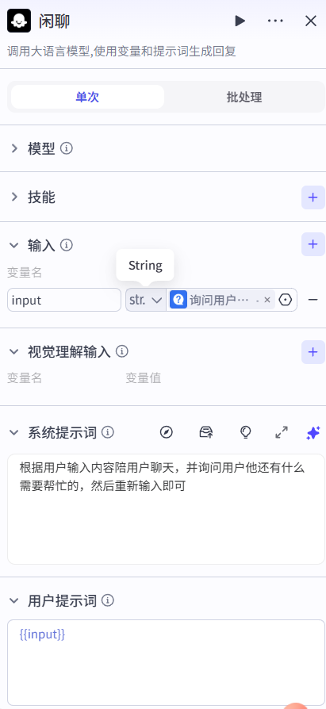

| 属性 | 说明 |
|------|------|
| 节点类型 | 大模型 |
| 描述 | 处理非标准修改请求的闲聊回复 |

**系统提示词：**
```
根据用户输入内容陪用户聊天，并询问用户他还有什么需要帮忙的
```

**后续节点：** 闲聊输出

---

#### 3.3.30 修改完成（输出）

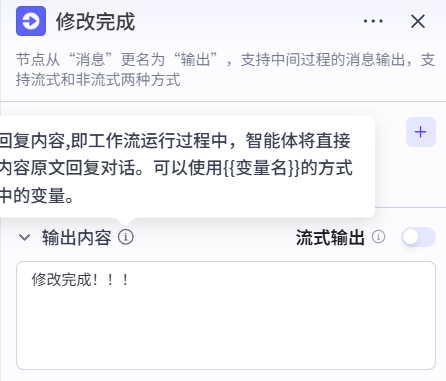

| 属性 | 说明 |
|------|------|
| 节点类型 | 输出 |
| 描述 | 提示用户修改完成 |

**输出内容：**
```
修改完成！！！
```

**后续节点：** chat→空

---

#### 3.3.31 闲聊输出（输出）

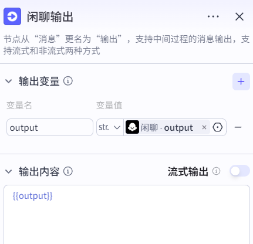

| 属性 | 说明 |
|------|------|
| 节点类型 | 输出 |
| 描述 | 输出闲聊回复 |

**后续节点：** chat→空

---

#### 3.3.32 chat变量赋值

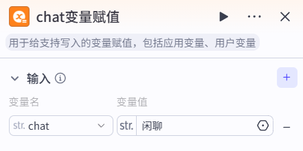

| 属性 | 说明 |
|------|------|
| 节点类型 | 变量赋值 |
| 描述 | 将闲聊标记赋值给用户变量（意图识别为"其他售中"时） |

**变量赋值：**
- `chat` ← "闲聊"

**后续节点：** 信息整理

---

#### 3.3.33 chat→空（变量赋值）

| 属性 | 说明 |
|------|------|
| 节点类型 | 变量赋值 |
| 描述 | 将 chat 用户变量清空（置为空格），确保正常业务流程中 chat 标记不影响后续判断 |

**变量赋值：**
- `chat` ← `" "`（空格）

**前序节点：** 订单查询失败 / 输出（提示无法修改）/ 修改完成 / 闲聊输出

**后续节点：** 信息整理

---

#### 3.3.34 批处理查询物流信息（批处理）


| 属性 | 说明 |
|------|------|
| 节点类型 | 批处理 |
| 描述 | 批量处理多个订单的物流查询 |

**批处理配置：**
- 批处理大小: 订单列表长度（来自 `len`）
- 并发数: 10
- **输入参数：** `order_id_list` ← 来自循环输出的 `code_list.order_list`

#### 批处理内部子节点

##### 3.3.34.1 查询物流信息（数据库查询）


| 属性 | 说明 |
|------|------|
| 节点类型 | 数据库查询 |
| 描述 | 查询订单的物流信息 |

**查询条件：**
- `order_id EQUAL {{order_id_list}}`

**查询字段：**
- `order_id`: 订单号
- `express_company`: 快递公司
- `tracking_number`: 物流单号
- `logistics_status`: 物流状态

---

##### 3.3.34.2 将检索成功和不成功的区分（代码节点）


| 属性 | 说明 |
|------|------|
| 节点类型 | 代码 |
| 描述 | 区分哪些订单物流查询成功，哪些失败 |

**输出参数：**
- `valid_track_str`: 成功查询的物流信息JSON
- `invalid_order_str`: 查询失败的订单号JSON

---

#### 3.3.35 整理查询物流结果（大模型）


| 属性 | 说明 |
|------|------|
| 节点类型 | 大模型 |
| 描述 | 整理物流查询结果 |

**系统提示词：**
```
## 角色
你是一名出色的信息提取和文档助手

## 任务
根据用户输入将信息提取出来转化为string输出

## 输出格式
查询成功的数据需要按照以下格式输出：
订单编号：XXX
物流编号：XXX
物流公司：XXX
物流状态：XXX
-----------------------------------

查询失败的数据直接将每条数据提取出来使用"，"分隔组成一个字符串
```

**输出参数：**
- `tracking_info`: 整理后的物流信息
- `invalid_order_str`: 失败的订单号

**前序节点：** 批处理查询物流信息（批处理输出）

**后续节点：** 判断是否全部查询成功

---

#### 3.3.36 判断是否全部查询成功（选择器）


| 属性 | 说明 |
|------|------|
| 节点类型 | 选择器 |
| 描述 | 判断是否有查询失败的订单 |

**条件配置：**
- 分支条件：判断 `invalid_order_str` 是否**不为空**
  - **条件为真（Yes）**：全部查询成功，直接保存物流变量
  - **条件为假（No）**：有失败订单，先输出提示再保存成功部分

**后续节点：**
- 真 → 物流变量赋值
- 假 → 提示物流信息查询失败

---

#### 3.3.37 物流变量赋值


| 属性 | 说明 |
|------|------|
| 节点类型 | 变量赋值 |
| 描述 | 将物流信息保存到应用变量 |

**变量赋值：**
- `all_tracking_info` ← `tracking_info`

**后续节点：** 信息整理

---

#### 3.3.38 提示物流信息查询失败（输出）


| 属性 | 说明 |
|------|------|
| 节点类型 | 输出 |
| 描述 | 提示用户哪些订单物流查询失败 |

**输出内容：**
```
找不到订单：{{failed_info}}相关信息。
请检查订单号是否正确。
```

**后续节点：** 成功查询到的物流信息

---

#### 3.3.39 成功查询到的物流信息（变量赋值）


| 属性 | 说明 |
|------|------|
| 节点类型 | 变量赋值 |
| 描述 | 将成功查询的物流信息保存 |

**变量赋值：**
- `all_tracking_info` ← `tracking_info`

**后续节点：** 信息整理

---

#### 3.3.40 信息整理（文本处理）


| 属性 | 说明 |
|------|------|
| 节点类型 | 文本处理 |
| 描述 | 整合订单信息和物流信息 |

**输入参数：**
- `String1`: 订单信息（来自all_order_info）
- `String2`: 物流信息（来自all_tracking_info）

**拼接方式：**
- concatResult: `订单信息：{{String1}}\n物流信息：{{String2}}`

**后续节点：** 结束

---

#### 3.3.41 结束节点 (End)


| 属性 | 说明 |
|------|------|
| 节点类型 | 结束 |
| 描述 | 工作流的最终节点 |

**输出参数：**
- `order_info`: 订单信息
- `tracking_info`: 物流信息

---

## 第四章：售后工作流 (AfterSale_WorkFlow)

### 4.1 概述

售后工作流负责处理用户购买后的服务需求，包括：
- **退换货处理**：询问退换货理由，记录退换货信息，更新商品表
- **退款操作**：通过HTTP请求模拟退款API调用，返回退款结果
- **维修服务**：判断保修资格，更新维修记录
- **其他闲聊**：将原始输入保存并传递给下游文本拼接节点

### 4.2 流程图

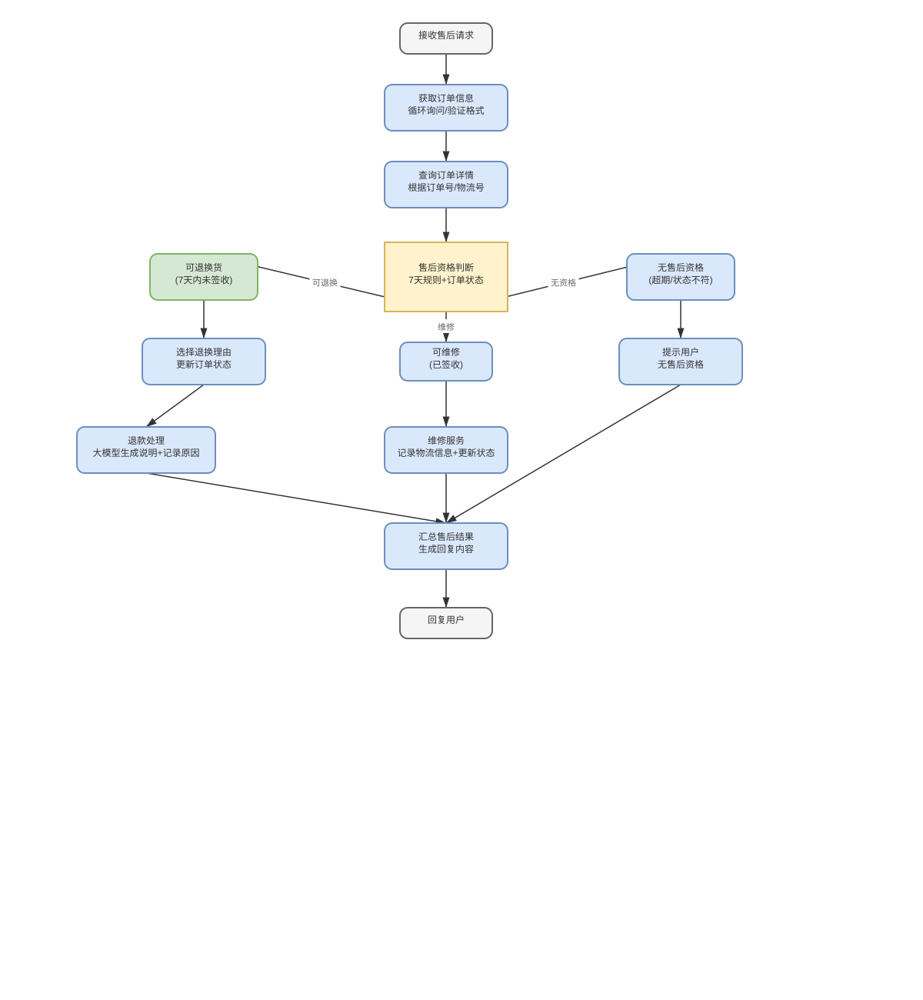

### 4.3 节点详细介绍

#### 4.3.1 开始节点

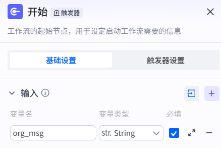

| 属性 | 说明 |
|------|------|
| 节点类型 | 开始 |
| 描述 | 工作流的起始节点，接收主对话流传入的用户原始消息 |

**输出参数：**
- `org_msg`（string）：用户原始消息内容

**前序节点：** 主对话流意图识别（AfterSale_WorkFlow 分支）

**后续节点：** 获取订单编号或者物流编号（循环节点）

---

#### 4.3.2 获取订单编号或者物流编号（循环节点）

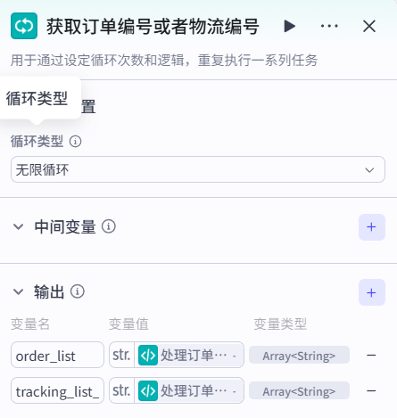

| 属性 | 说明 |
|------|------|
| 节点类型 | 循环 |
| 描述 | 通过循环的方式持续询问用户，直到获取到合法的订单号或物流号为止 |
| 循环类型 | 无限循环（infinite） |
| 最大循环次数 | 10次 |

**循环输出：**
- `order_list`（list\<string\>）：提取到的订单号列表
- `tracking_list_list`（list\<string\>）：提取到的物流号列表

**前序节点：** 开始节点

**后续节点：** 判断用户输入的是订单编号还是物流编号（选择器）

---

##### 循环子节点详解

##### 4.3.2.1子节点1：询问订单编号或者物流编号

| 属性 | 说明 |
|------|------|
| 节点类型 | 问答（QA） |
| 描述 | 向用户提问，请用户输入需要售后服务的商品订单编号或物流单号，并提示每次只能操作一个商品 |
| 提问方式 | 开放式问答（text） |

**提问内容：**
```
请您输入需售后服务的商品的订单编号或者物流单号？
售后服务只能支持一次操作一个商品数据，请理解！！！
```

**输出参数：**
- `USER_RESPONSE`（string）：用户本轮输入内容

**前序节点：** 循环开始 / 上轮循环输出节点（输入不合法提示）

**后续节点：** 处理订单编号或者物流编号（代码节点）

---

##### 4.3.2.2子节点2：处理订单编号或者物流编号

| 属性 | 说明 |
|------|------|
| 节点类型 | 代码（Python） |
| 描述 | 使用正则表达式从用户输入中提取合法的订单号（TB/JD/PDD前缀）和物流单号（jd/SF/ZT等前缀） |

**输入参数：**
- `id`：来自子节点1的 `USER_RESPONSE`

**核心代码逻辑：**
```python
import re

order_pattern = r'(?:TB|JD|PDD)\d+'
track_pattern = r'(?:jd|SF|ZT|YT|YD|YZ|ST)\d+'

matched_orders = re.findall(order_pattern, user_input)
matched_tracking = re.findall(track_pattern, user_input)

unique_orders = sorted(list(set(matched_orders)))
unique_tracking = sorted(list(set(matched_tracking)))

return {
    "order_list": unique_orders,
    "tracking_list": unique_tracking
}
```

**订单号前缀规则：**
- 订单号：`TB`（淘宝）、`JD`（京东）、`PDD`（拼多多）+ 数字
- 物流号：`jd`、`SF`、`ZT`（中通）、`YT`（圆通）、`YD`（韵达）、`YZ`（邮政）、`ST`（申通）+ 数字

**输出参数：**
- `order_list`（string/list）：提取到的订单号列表
- `tracking_list`（string/list）：提取到的物流号列表

**前序节点：** 询问订单编号或者物流编号

**后续节点：** 判断输入是否合法（选择器）

---

##### 4.3.2.3子节点3：判断输入是否合法

| 属性 | 说明 |
|------|------|
| 节点类型 | 选择器（条件判断） |
| 描述 | 判断代码节点提取出的 order_list 和 tracking_list 是否均为空，若均为空则说明用户输入无效 |

**判断逻辑：**
- 条件（true分支）：`order_list` 为空 **且** `tracking_list` 为空 → 输入不合法
- 否则（false分支）：至少有一个不为空 → 输入合法，终止循环

**前序节点：** 处理订单编号或者物流编号

**后续节点：**
- true → 输出（输入不合法提示）
- false → 终止循环

---

##### 4.3.2.4子节点4：输出（输入不合法提示）

| 属性 | 说明 |
|------|------|
| 节点类型 | 输出 |
| 描述 | 向用户提示输入的订单号/物流号格式不合法，要求重新输入 |

**输出内容：**
```
输入订单号/物流号不合法！请重新输入
```

**前序节点：** 判断输入是否合法（true分支）

**后续节点：** 循环重新开始（回到询问订单编号节点）

---

##### 4.3.2.5子节点5：终止循环

| 属性 | 说明 |
|------|------|
| 节点类型 | 终止循环（Break） |
| 描述 | 当用户输入合法时，立即终止循环，将结果传递给循环节点的输出 |

**前序节点：** 判断输入是否合法（false分支）

**后续节点：** 循环结束，流程进入循环后续节点

---

#### 4.3.3 判断用户输入的是订单编号还是物流编号

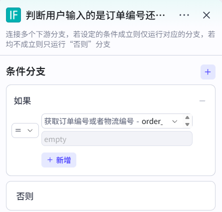

| 属性 | 说明 |
|------|------|
| 节点类型 | 选择器（条件判断） |
| 描述 | 根据循环输出的 `order_list` 是否非空，将流程分为"订单编号路径"和"物流编号路径" |

**判断逻辑：**
- 条件（true分支）：`order_list` 非空 → 用户输入的是订单号
- 否则（false分支）：`order_list` 为空 → 用户输入的是物流号

**前序节点：** 获取订单编号或者物流编号（循环结束输出）

**后续节点：**
- true → 抽取出订单编号（代码）
- false → 抽取出物流编号（代码）

---

#### 4.3.4 抽取出物流编号

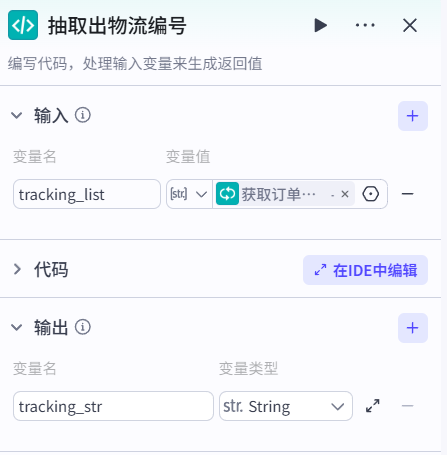

| 属性 | 说明 |
|------|------|
| 节点类型 | 代码（Python） |
| 描述 | 对循环输出的 `tracking_list_list` 进行清洗，移除列表符号、引号等，只保留字母和数字 |

**输入参数：**
- `tracking_list`：来自循环节点输出的 `tracking_list_list`

**核心代码逻辑：**
```python
import re
raw_input = params.get('tracking_list', '')
cleaned_input = re.sub(r'[^a-zA-Z0-9]', '', str(raw_input))
return {"tracking_str": cleaned_input}
```

**输出参数：**
- `tracking_str`（string）：清洗后的物流编号

**前序节点：** 判断用户输入的是订单编号还是物流编号（false分支）

**后续节点：** 物流编号赋值（变量赋值）

---

#### 4.3.5 物流编号赋值

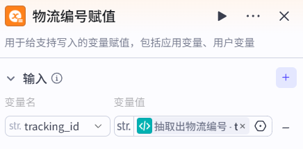

| 属性 | 说明 |
|------|------|
| 节点类型 | 变量赋值 |
| 描述 | 将清洗后的物流编号保存到应用变量 `tracking_id` 中，供后续节点使用 |

**赋值操作：**
- 应用变量 `tracking_id` ← 代码节点输出的 `tracking_str`

**前序节点：** 抽取出物流编号

**后续节点：** 根据物流ID查询（数据库查询）

---

#### 4.3.6 根据物流ID查询

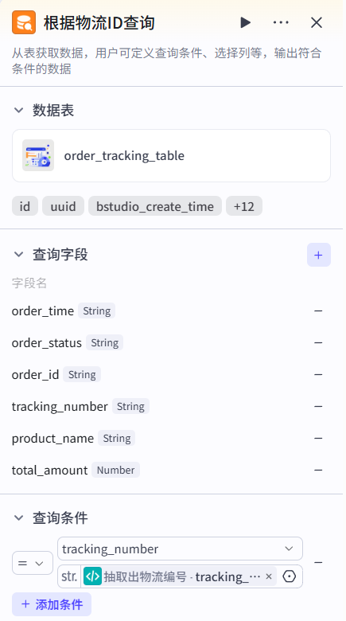

| 属性 | 说明 |
|------|------|
| 节点类型 | 数据库查询 |
| 数据库名称 | order_tracking_table |
| 描述 | 根据物流编号在订单表中查询对应的订单信息，获取下单时间、订单状态等关键字段用于后续资格判断 |

**查询条件：**
- `tracking_number EQUAL {{tracking_str}}`

**查询字段：**
- `order_time`：下单时间
- `order_status`：订单状态
- `order_id`：订单号
- `tracking_number`：物流单号
- `product_name`：商品名称
- `total_amount`：交易金额

**输出参数：**
- `outputList`（list）：查询结果列表（含上述字段）
- `rowNum`（integer）：返回记录数

**前序节点：** 物流编号赋值

**后续节点：** 判断查询是否成功（选择器）

---

#### 4.3.7 判断查询是否成功（物流路径）

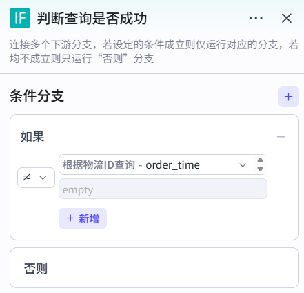

| 属性 | 说明 |
|------|------|
| 节点类型 | 选择器（条件判断） |
| 描述 | 判断物流路径的数据库查询结果是否有效，即 `outputList.order_time` 是否非空 |

**判断逻辑：**
- 条件（true分支）：`outputList.order_time` 非空 → 查询成功
- 否则（false分支）：`outputList.order_time` 为空 → 查询失败，物流号有误

**前序节点：** 根据物流ID查询

**后续节点：**
- true → 判断是否有售后服务资格（LLM）
- false → 提示物流ID输入错误（输出）

---

#### 4.3.8 抽取出订单编号

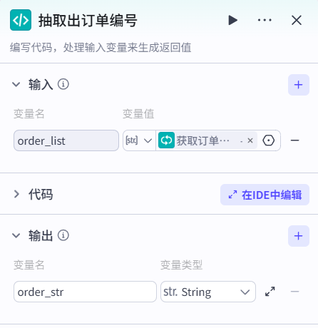

| 属性 | 说明 |
|------|------|
| 节点类型 | 代码（Python） |
| 描述 | 对循环输出的 `order_list` 进行清洗，移除列表符号、引号等，只保留字母和数字 |

**输入参数：**
- `order_list`：来自循环节点输出的 `order_list`

**核心代码逻辑：**
```python
import re
raw_input = params.get('order_list', '')
cleaned_input = re.sub(r'[^a-zA-Z0-9]', '', str(raw_input))
return {"order_str": cleaned_input}
```

**输出参数：**
- `order_str`（string）：清洗后的订单编号

**前序节点：** 判断用户输入的是订单编号还是物流编号（true分支）

**后续节点：** 订单编号赋值（变量赋值）

---

#### 4.3.9 订单编号赋值

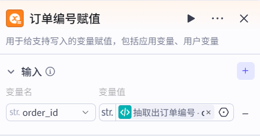

| 属性 | 说明 |
|------|------|
| 节点类型 | 变量赋值 |
| 描述 | 将清洗后的订单编号保存到应用变量 `order_id` 中，供后续节点使用 |

**赋值操作：**
- 应用变量 `order_id` ← 代码节点输出的 `order_str`

**前序节点：** 抽取出订单编号

**后续节点：** 根据订单ID查询（数据库查询）

---

#### 4.3.10 根据订单ID查询

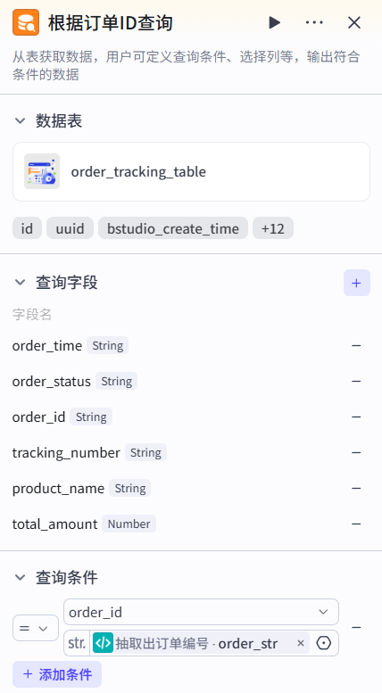

| 属性 | 说明 |
|------|------|
| 节点类型 | 数据库查询 |
| 数据库名称 | order_tracking_table |
| 描述 | 根据订单编号在订单表中查询对应的订单信息，获取下单时间、订单状态等关键字段用于后续资格判断 |

**查询条件：**
- `order_id EQUAL {{order_str}}`

**查询字段：**
- `order_time`：下单时间
- `order_status`：订单状态
- `order_id`：订单号
- `tracking_number`：物流单号
- `product_name`：商品名称
- `total_amount`：交易金额

**输出参数：**
- `outputList`（list）：查询结果列表（含上述字段）
- `rowNum`（integer）：返回记录数

**前序节点：** 订单编号赋值

**后续节点：** 判断是否成功返回数据（选择器）

---

#### 4.3.11 判断是否成功返回数据（订单路径）

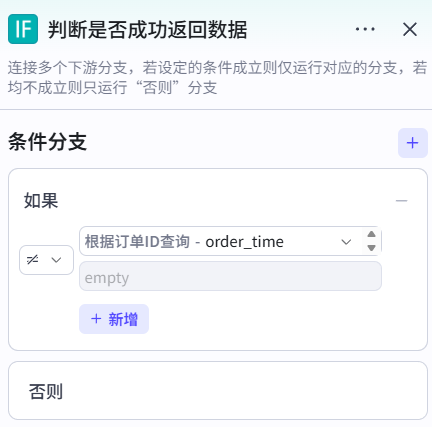

| 属性 | 说明 |
|------|------|
| 节点类型 | 选择器（条件判断） |
| 描述 | 判断订单路径的数据库查询结果是否有效，即 `outputList.order_time` 是否非空 |

**判断逻辑：**
- 条件（true分支）：`outputList.order_time` 非空 → 查询成功
- 否则（false分支）：`outputList.order_time` 为空 → 查询失败，订单号有误

**前序节点：** 根据订单ID查询

**后续节点：**
- true → 判断能否进行售后服务（LLM）
- false → 提示订单ID输入错误（输出）

---

#### 4.3.12 判断是否有售后服务资格（物流路径）

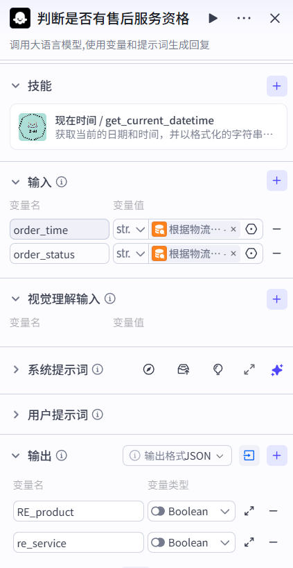

| 属性 | 说明 |
|------|------|
| 节点类型 | 大模型（LLM） |
| 模型 | 豆包·1.8·深度思考 |
| 描述 | 根据物流路径查询到的下单时间和订单状态，综合判断用户是否具有退换货资格（RE_product）和维修服务资格（re_service） |
| 挂载插件 | `get_current_datetime`（获取当前时间） |

**输入参数：**
- `order_time`：来自物流路径数据库查询的 `outputList.order_time`
- `order_status`：来自物流路径数据库查询的 `outputList.order_status`

**Prompt（用户提示）：**
```
下单时间：{{order_time}}
订单状态：{{order_status}}
```

**系统提示词核心逻辑：**
```
退换货资格（RE_product）判断规则：
- 下单时间距当前时间 ≤7天
- 订单状态不是"已签收"
以上两个条件同时满足则 RE_product = true

维修服务资格（re_service）判断规则：
- 下单时间距当前时间 >7天
- 订单状态是"已签收"
以上两个条件同时满足则 re_service = true
```

**输出参数：**
- `RE_product`（boolean）：是否有退换货资格
- `re_service`（boolean）：是否有维修服务资格
- `reasoning_content`（string）：推理过程

**前序节点：** 判断查询是否成功（true分支）

**后续节点：** 资格保存以及变量赋值（变量赋值）

---

#### 4.3.13 资格保存以及变量赋值（物流路径）

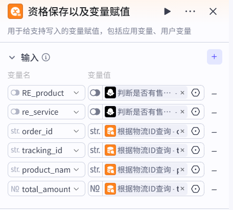

| 属性 | 说明 |
|------|------|
| 节点类型 | 变量赋值 |
| 描述 | 将物流路径下 LLM 输出的资格判断结果及订单信息一并保存到应用变量中 |

**赋值操作：**
| 应用变量 | 来源 |
|----------|------|
| `RE_product` | LLM输出 `RE_product` |
| `re_service` | LLM输出 `re_service` |
| `order_id` | 物流路径查询结果 `outputList.order_id` |
| `tracking_id` | 物流路径查询结果 `outputList.tracking_number` |
| `product_name` | 物流路径查询结果 `outputList.product_name` |
| `total_amount` | 物流路径查询结果 `outputList.total_amount` |

**前序节点：** 判断是否有售后服务资格（物流路径）

**后续节点：** 随机模拟需要的物流信息（大模型）

---

#### 4.3.14 判断能否进行售后服务（订单路径）

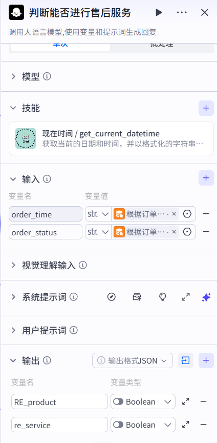

| 属性 | 说明 |
|------|------|
| 节点类型 | 大模型（LLM） |
| 模型 | 豆包·1.8·深度思考 |
| 描述 | 与节点4.3.12功能相同，针对订单路径查询到的数据进行退换货资格和维修资格判断 |
| 挂载插件 | `get_current_datetime`（获取当前时间） |

**输入参数：**
- `order_time`：来自订单路径数据库查询的 `outputList.order_time`
- `order_status`：来自订单路径数据库查询的 `outputList.order_status`

**输出参数：**
- `RE_product`（boolean）：是否有退换货资格
- `re_service`（boolean）：是否有维修服务资格
- `reasoning_content`（string）：推理过程

**前序节点：** 判断是否成功返回数据（true分支）

**后续节点：** 资格保存进应用变量（变量赋值）

---

#### 4.3.15 资格保存进应用变量（订单路径）

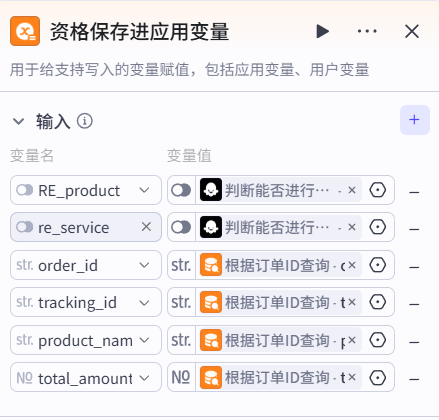

| 属性 | 说明 |
|------|------|
| 节点类型 | 变量赋值 |
| 描述 | 将订单路径下 LLM 输出的资格判断结果及订单信息一并保存到应用变量中，与节点4.3.13功能一致 |

**赋值操作：**
| 应用变量 | 来源 |
|----------|------|
| `RE_product` | LLM输出 `RE_product` |
| `re_service` | LLM输出 `re_service` |
| `order_id` | 订单路径查询结果 `outputList.order_id` |
| `tracking_id` | 订单路径查询结果 `outputList.tracking_number` |
| `product_name` | 订单路径查询结果 `outputList.product_name` |
| `total_amount` | 订单路径查询结果 `outputList.total_amount` |

**前序节点：** 判断能否进行售后服务（订单路径）

**后续节点：** 随机模拟需要的物流信息（大模型）

---

#### 4.3.16 随机模拟需要的物流信息

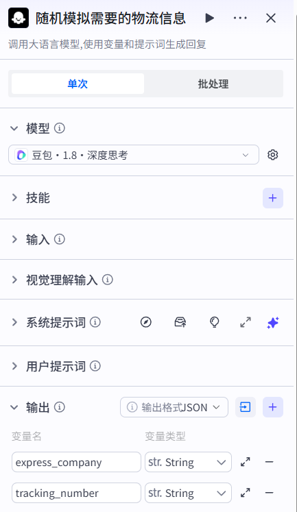

| 属性 | 说明 |
|------|------|
| 节点类型 | 大模型（LLM） |
| 模型 | 豆包·1.8·深度思考 |
| 描述 | 模拟生成一组退换货所需的回寄物流信息（快递公司 + 物流单号），用于后续更新数据库 |

**系统提示词：**
```
帮我随机生成一个物流信息，包含以下变量：
- express_company：顺丰、京东、邮政、中通、申通、圆通、韵达（随机选一个）
- tracking_number：SF|jd|YZ|ZT|ST|YT|YD 前缀 + 随机数字
要求每次返回结果都不同
```

**输出参数：**
- `express_company`（string）：快递公司名称
- `tracking_number`（string）：物流单号

**前序节点：** 资格保存以及变量赋值（物流路径）/ 资格保存进应用变量（订单路径）

**后续节点：** 意图识别

---

#### 4.3.17 意图识别

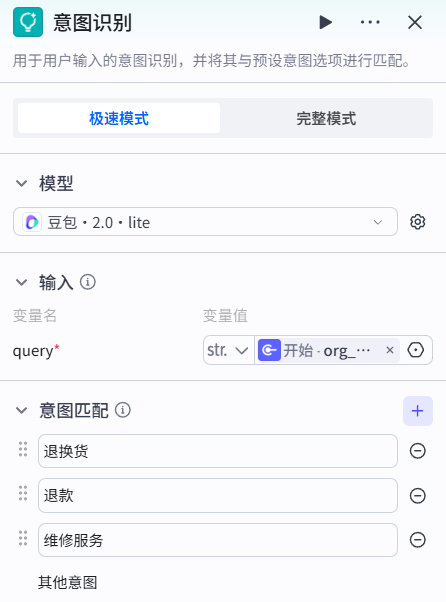

| 属性 | 说明 |
|------|------|
| 节点类型 | 意图识别 |
| 模型 | 豆包·2.0·lite |
| 描述 | 对用户的原始输入 `org_msg` 进行意图识别，细分售后服务类型 |

**识别分类：**
| 意图名称 | 说明 | 后续节点 |
|----------|------|----------|
| 退换货 | 申请退换货、退货等 | 先判断是否有退换货资格（选择器） |
| 退款 | 申请退款 | 使用大模型模拟退款操作（HTTP请求） |
| 维修服务 | 申请维修 | 先判断是否有维修资格（选择器） |
| default（其他） | 以上均不匹配 | 闲聊chat赋值（变量赋值） |

**输入参数：**
- `query`：来自开始节点的 `org_msg`

**前序节点：** 随机模拟需要的物流信息

**后续节点：** 对应意图的处理分支

---

#### 4.3.18 先判断是否有退换货资格

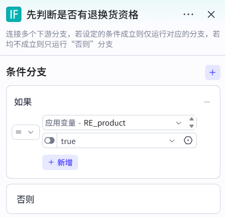

| 属性 | 说明 |
|------|------|
| 节点类型 | 选择器（条件判断） |
| 描述 | 读取应用变量 `RE_product`，判断用户是否有退换货资格 |

**判断逻辑：**
- 条件（true分支）：`RE_product == true` → 有退换货资格
- 否则（false分支）：`RE_product != true` → 无退换货资格

**前序节点：** 意图识别（退换货分支）

**后续节点：**
- true → 询问退换货理由（问答）
- false → 没有资格说明（输出）

---

#### 4.3.19 询问退换货理由

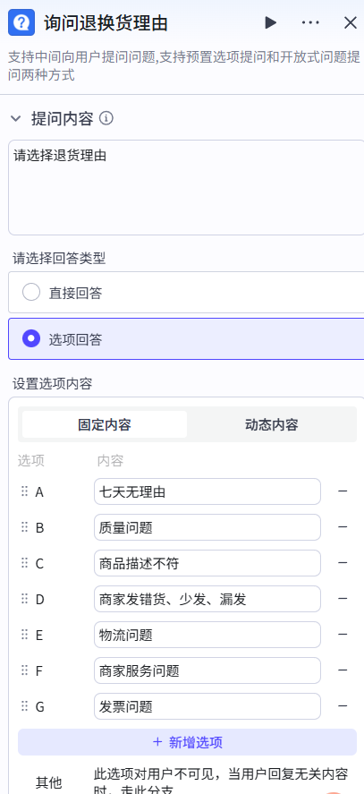

| 属性 | 说明 |
|------|------|
| 节点类型 | 问答（QA） |
| 描述 | 向用户提供退货理由选项列表，用户选择后，根据对应选项进入不同的变量赋值节点 |
| 提问方式 | 选项式（option） |

**选项列表（7个）：**
| 选项编号 | 选项内容 | 后续节点 |
|----------|----------|----------|
| branch_0 | 七天无理由 | 变量赋值（七天无理由） |
| branch_1 | 质量问题 | 变量赋值（质量问题） |
| branch_2 | 商品描述不符 | 变量赋值（商品描述不符） |
| branch_3 | 商家发错货、少发、漏发 | 变量赋值（商家原因） |
| branch_4 | 物流问题 | 变量赋值（物流问题） |
| branch_5 | 商家服务问题 | 变量赋值（服务问题） |
| branch_6 | 发票问题 | 变量赋值（发票问题） |
| default | 其他原因 | 拼接对话（文本处理） |

**输出参数：**
- `optionId`（string）：用户选择的选项ID
- `optionContent`（string）：用户选择的选项内容

**前序节点：** 先判断是否有退换货资格（true分支）

**后续节点：** 对应选项的变量赋值节点

---

#### 4.3.20~4.3.26 退换货理由变量赋值（共7个）

| 属性 | 说明 |
|------|------|
| 节点类型 | 变量赋值（×7） |
| 描述 | 分别对应7个退货理由选项，将对应的退货理由字符串赋值给应用变量 `refound_reason` |

**各节点赋值内容：**
| 节点名称 | `refound_reason` 赋值 |
|----------|----------------------|
| 变量赋值（七天无理由） | `"七天无理由"` |
| 变量赋值_1（质量问题） | `"质量问题"` |
| 变量赋值_2（商品描述不符） | `"商品描述不符"` |
| 变量赋值_3（商家原因） | `"商家发错货、少发、漏发"` |
| 变量赋值_4（物流问题） | `"物流问题"` |
| 变量赋值_5（服务问题） | `"商家服务问题"` |
| 变量赋值_6（发票问题） | `"发票问题"` |

**前序节点：** 询问退换货理由（对应分支）

**后续节点：** 记录退换货理由（数据库新增）

---

#### 4.3.27 拼接对话（文本处理）

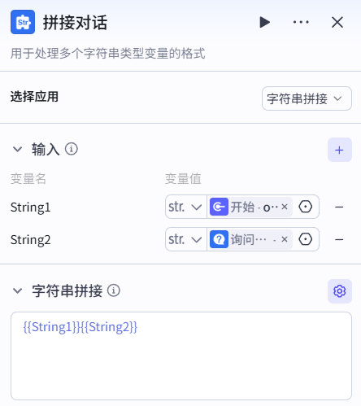

| 属性 | 说明 |
|------|------|
| 节点类型 | 文本处理（concat） |
| 描述 | 当用户选择了退货理由的default分支时，将原始输入 `org_msg` 与用户选项内容 `optionContent` 拼接成一个完整的字符串 |

**输入参数：**
- `String1`：开始节点的 `org_msg`（原始用户输入）
- `String2`：问答节点的 `optionContent`（用户选择内容）

**拼接模板：**
```
{{String1}}{{String2}}
```

**输出参数：**
- `output`（string）：拼接后的字符串

**前序节点：** 询问退换货理由（default分支）

**后续节点：** 走闲聊模块把信息赋值给chat变量（变量赋值）

---

#### 4.3.28 走闲聊模块把信息赋值给chat变量

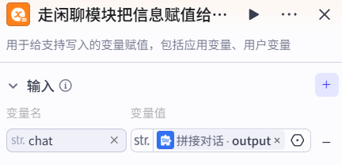

| 属性 | 说明 |
|------|------|
| 节点类型 | 变量赋值 |
| 描述 | 将退货理由拼接结果赋值给用户变量 `chat`，供最终文本处理节点使用 |

**赋值操作：**
- 用户变量 `chat` ← 文本处理节点输出的 `output`

**前序节点：** 拼接对话（文本处理）

**后续节点：** 文本处理（拼接最终输出）

---

#### 4.3.29 记录退换货理由

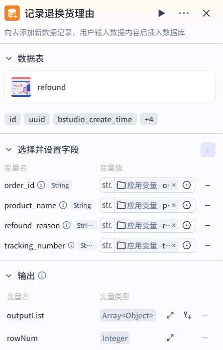

| 属性 | 说明 |
|------|------|
| 节点类型 | 数据库新增 |
| 数据库名称 | refound（退换货理由存储表） |
| 描述 | 将用户的退换货申请信息（订单ID、商品名称、退换货理由、物流编号）插入退换货记录表中，完成退换货登记 |

**插入字段：**
| 字段名 | 来源 |
|--------|------|
| `order_id` | 应用变量 `order_id` |
| `product_name` | 应用变量 `product_name` |
| `refund_reason` | 应用变量 `refound_reason` |
| `tracking_number` | 应用变量 `tracking_id` |

**前序节点：** 退换货理由变量赋值（7个节点均汇聚到此）

**后续节点：** 更新商品信息表（退换货）

---

#### 4.3.30 更新商品信息表（退换货）

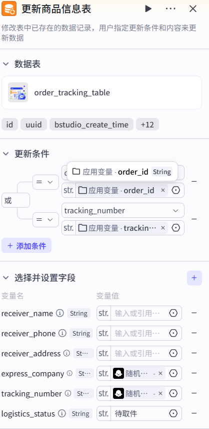

| 属性 | 说明 |
|------|------|
| 节点类型 | 数据库更新 |
| 数据库名称 | order_tracking_table |
| 描述 | 模拟退换货回寄操作，更新订单表中的物流信息（快递公司、物流单号、物流状态设为"待取件"），清空收件人等字段 |

**更新条件（OR逻辑）：**
- `order_id EQUAL {{order_id}}`（应用变量）
- `tracking_number EQUAL {{tracking_id}}`（应用变量）

**更新字段：**
| 字段名 | 新值来源 |
|--------|----------|
| `receiver_name` | 空字符串（清空） |
| `receiver_phone` | 空字符串（清空） |
| `receiver_address` | 空字符串（清空） |
| `express_company` | LLM模拟生成的 `express_company` |
| `tracking_number` | LLM模拟生成的 `tracking_number` |
| `logistics_status` | 固定值 `"待取件"` |

**前序节点：** 记录退换货理由（数据库新增）

**后续节点：** 退换货说明（输出）

---

#### 4.3.31 退换货说明（输出）

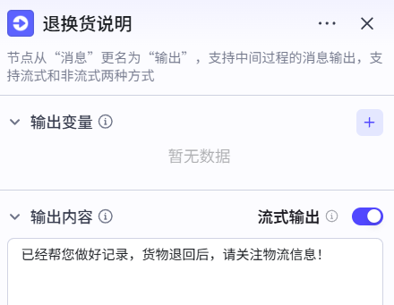

| 属性 | 说明 |
|------|------|
| 节点类型 | 输出 |
| 描述 | 向用户告知已做好退换货记录，提示关注物流信息 |

**输出内容：**
```
已经帮您做好记录，货物退回后，请关注物流信息！
```

**前序节点：** 更新商品信息表（退换货）

**后续节点：** 文本处理（拼接最终输出）

---

#### 4.3.32 没有资格说明（输出）

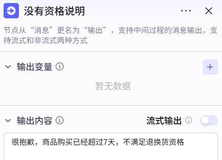

| 属性 | 说明 |
|------|------|
| 节点类型 | 输出 |
| 描述 | 告知用户不满足退换货条件（购买超过7天） |

**输出内容：**
```
很抱歉，商品购买已经超过7天，不满足退换货资格
```

**前序节点：** 先判断是否有退换货资格（false分支）

**后续节点：** 文本处理（拼接最终输出）

---

#### 4.3.33 使用大模型模拟退款操作（HTTP请求）

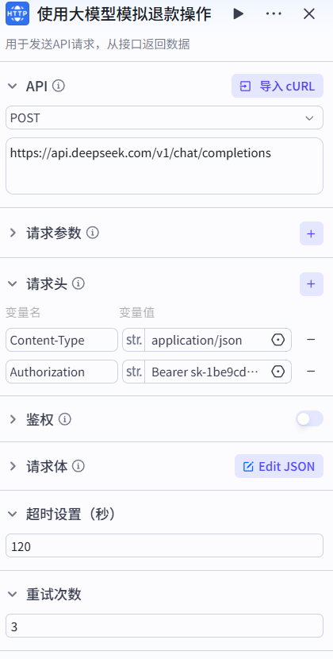

| 属性 | 说明 |
|------|------|
| 节点类型 | HTTP请求 |
| 请求方式 | POST |
| 请求地址 | `https://api.deepseek.com/v1/chat/completions` |
| 描述 | 调用 DeepSeek API，通过 System Prompt 约束 LLM 模拟一个标准化的退款接口，传入订单号、退款金额、退款理由等参数，返回符合业务规范的 JSON 退款结果 |

**请求 Body（JSON格式）：**
```json
{
  "model": "deepseek-chat",
  "messages": [
    {
      "role": "system",
      "content": "你是一个严格遵循企业级RESTful规范的电商退款接口API服务，仅处理退款申请的标准化JSON返回..."
    },
    {
      "role": "user",
      "content": "{\"order_no\": \"{{order_id}}\", \"refund_amount\": {{total_amount}}, \"refund_reason\": \"{{refound_reason}}\", ...}"
    }
  ],
  "response_format": {"type": "json_object"}
}
```

**退款结果规范（code=200成功）：**
```json
{
  "code": 200,
  "msg": "退款申请受理成功，已进入系统退款流程",
  "data": {
    "order_no": "订单号",
    "refund_no": "TK + 13位时间戳 + 6位随机数",
    "refund_amount": 退款金额,
    "refund_status": "SUCCESS",
    "expect_arrive_date": "3个工作日后日期"
  }
}
```

**异常场景：**
- code=400：参数缺失/格式错误
- code=402：退款金额异常
- code=404：订单无效

**请求头：**
- `Content-Type: application/json`
- `Authorization: Bearer <API Key>`

**输出参数：**
- `body`（string）：响应体原始字符串
- `statusCode`（integer）：HTTP状态码
- `headers`（string）：响应头

**前序节点：** 意图识别（退款分支）

**后续节点：** 解析大模型节点输出（代码）

---

#### 4.3.34 解析大模型节点输出

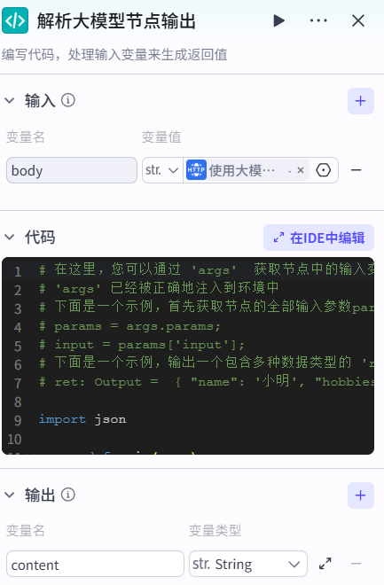

| 属性 | 说明 |
|------|------|
| 节点类型 | 代码（Python） |
| 描述 | 从 HTTP 请求返回的 body 字符串中解析出 choices[0].message.content，提取退款说明文本 |

**输入参数：**
- `body`：来自HTTP请求节点的 `body` 输出

**核心代码逻辑：**
```python
import json

raw_body = params.get("body", "")
data = json.loads(raw_body)
content = data.get("choices", [{}])[0].get("message", {}).get("content", "")
return {"content": content.strip()}
```

**输出参数：**
- `content`（string）：解析后的退款说明文本

**前序节点：** 使用大模型模拟退款操作（HTTP请求）

**后续节点：** 变量赋值——退款

---

#### 4.3.35 变量赋值——退款

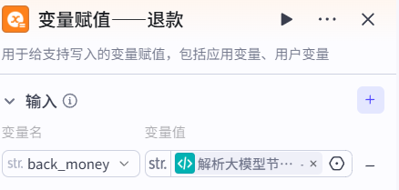

| 属性 | 说明 |
|------|------|
| 节点类型 | 变量赋值 |
| 描述 | 将解析出的退款说明文本保存到应用变量 `back_money` 中，供最终文本处理节点拼接输出 |

**赋值操作：**
- 应用变量 `back_money` ← 代码节点输出的 `content`

**前序节点：** 解析大模型节点输出

**后续节点：** 文本处理（拼接最终输出）

---

#### 4.3.36 先判断是否有维修资格

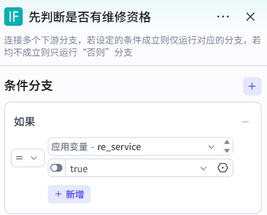

| 属性 | 说明 |
|------|------|
| 节点类型 | 选择器（条件判断） |
| 描述 | 读取应用变量 `re_service`，判断用户是否具有维修资格 |

**判断逻辑：**
- 条件（true分支）：`re_service == true` → 有维修资格
- 否则（false分支）：`re_service != true` → 无维修资格

**前序节点：** 意图识别（维修服务分支）

**后续节点：**
- true → 做维修记录（数据库更新）
- false → 没有维修资格（输出）

---

#### 4.3.37 做维修记录（数据库更新）

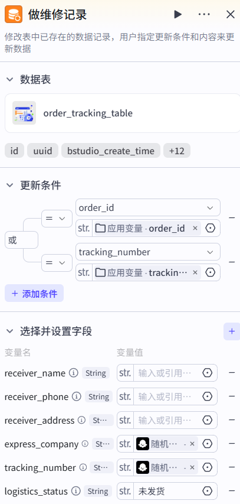

| 属性 | 说明 |
|------|------|
| 节点类型 | 数据库更新 |
| 数据库名称 | order_tracking_table |
| 描述 | 模拟维修寄回操作，更新订单表中的物流信息（快递公司、物流单号、物流状态设为"未发货"），清空收件人等字段 |

**更新条件（OR逻辑）：**
- `order_id EQUAL {{order_id}}`（应用变量）
- `tracking_number EQUAL {{tracking_id}}`（应用变量）

**更新字段：**
| 字段名 | 新值来源 |
|--------|----------|
| `receiver_name` | 空字符串（清空） |
| `receiver_phone` | 空字符串（清空） |
| `receiver_address` | 空字符串（清空） |
| `express_company` | LLM模拟生成的 `express_company` |
| `tracking_number` | LLM模拟生成的 `tracking_number` |
| `logistics_status` | 固定值 `"未发货"` |

> **📝 注意：** 维修服务通常涉及更多流程，这里仅做简单记录演示。

**前序节点：** 先判断是否有维修资格（true分支）

**后续节点：** 维修说明（输出）

---

#### 4.3.38 维修说明（输出）

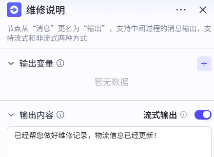

| 属性 | 说明 |
|------|------|
| 节点类型 | 输出 |
| 输出方式 | 流式输出 |
| 描述 | 向用户告知已做好维修记录，物流信息已更新 |

**输出内容：**
```
已经帮您做好维修记录，物流信息已经更新！
```

**前序节点：** 做维修记录（数据库更新）

**后续节点：** 文本处理（拼接最终输出）

---

#### 4.3.39 没有维修资格（输出）

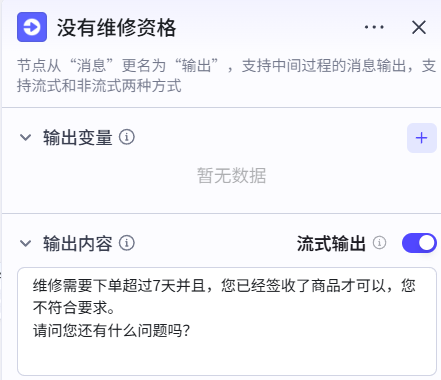

| 属性 | 说明 |
|------|------|
| 节点类型 | 输出 |
| 输出方式 | 流式输出 |
| 描述 | 告知用户不满足维修服务条件（需下单超过7天且已签收） |

**输出内容：**
```
维修需要下单超过7天并且，您已经签收了商品才可以，您不符合要求。
请问您还有什么问题吗？
```

**前序节点：** 先判断是否有维修资格（false分支）

**后续节点：** 文本处理（拼接最终输出）

---

#### 4.3.40 闲聊chat赋值（变量赋值）

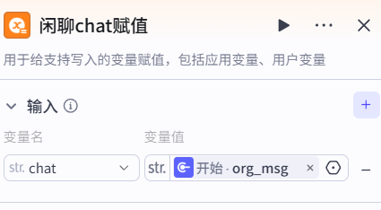

| 属性 | 说明 |
|------|------|
| 节点类型 | 变量赋值 |
| 描述 | 当意图识别结果为default（用户不属于退换货/退款/维修任何一类）时，将原始用户输入保存到用户变量 `chat` 中，供最终文本处理节点使用 |

**赋值操作：**
- 用户变量 `chat` ← 开始节点的 `org_msg`（原始消息）

**前序节点：** 意图识别（default分支）

**后续节点：** 文本处理（拼接最终输出）

---

#### 4.3.41 提示物流ID输入错误（输出）

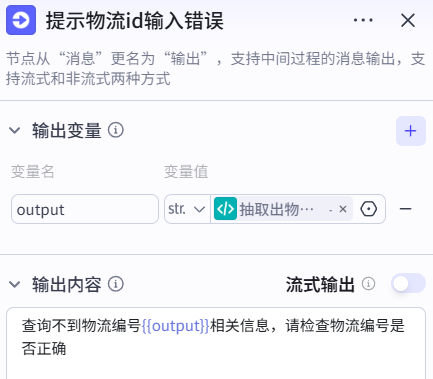

| 属性 | 说明 |
|------|------|
| 节点类型 | 输出 |
| 描述 | 当根据物流编号查询数据库无结果时，提示用户物流单号有误 |

**输出内容（含变量）：**
```
查询不到物流编号{{tracking_str}}相关信息，请检查物流编号是否正确
```

**前序节点：** 判断查询是否成功（物流路径，false分支）

**后续节点：** 文本处理（拼接最终输出）

---

#### 4.3.42 提示订单ID输入错误（输出）

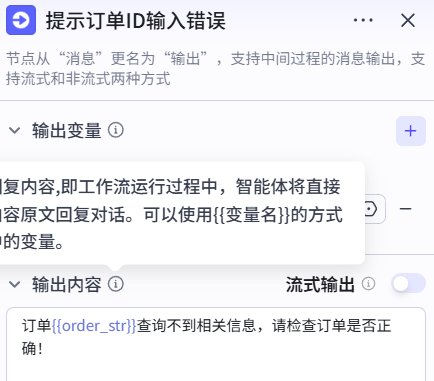

| 属性 | 说明 |
|------|------|
| 节点类型 | 输出 |
| 描述 | 当根据订单编号查询数据库无结果时，提示用户订单号有误 |

**输出内容（含变量）：**
```
订单{{order_str}}查询不到相关信息，请检查订单是否正确！
```

**前序节点：** 判断是否成功返回数据（订单路径，false分支）

**后续节点：** 文本处理（拼接最终输出）

---

#### 4.3.43 文本处理（拼接最终输出）

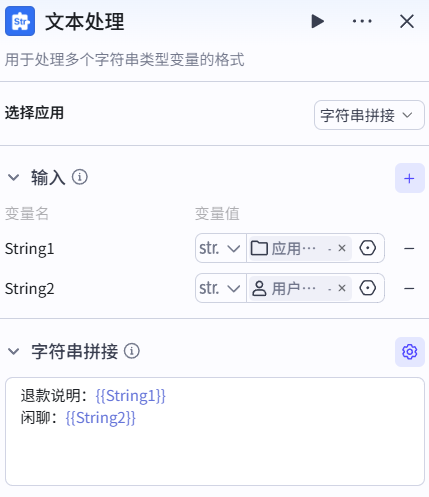

| 属性 | 说明 |
|------|------|
| 节点类型 | 文本处理（concat） |
| 描述 | 将退款说明（`back_money`）和闲聊内容（`chat`）拼接为最终输出字符串，传递给结束节点 |

**输入参数：**
- `String1`：应用变量 `back_money`（退款说明）
- `String2`：用户变量 `chat`（闲聊内容）

**拼接模板：**
```
退款说明：{{String1}}
闲聊：{{String2}}
```

**输出参数：**
- `output`（string）：拼接后的最终文本

**前序节点（多路汇聚）：**
- 退换货说明（输出）
- 没有资格说明（输出）
- 变量赋值——退款（通过 `back_money`）
- 维修说明（输出）
- 没有维修资格（输出）
- 走闲聊模块把信息赋值给chat变量
- 闲聊chat赋值（变量赋值）
- 提示物流ID输入错误（输出）
- 提示订单ID输入错误（输出）

**后续节点：** 结束节点

---

#### 4.3.44 结束节点

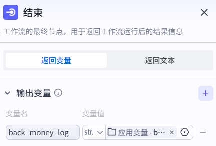

| 属性 | 说明 |
|------|------|
| 节点类型 | 结束 |
| 描述 | 工作流的最终节点，将退款说明日志作为工作流输出 |

**输出参数：**
- `back_money_log`（string）：退款说明（来自应用变量 `back_money`）

**前序节点：** 文本处理（拼接最终输出）

**后续节点：** 无（工作流结束，结果返回主对话流）

---

### 4.4 关键业务逻辑说明

#### 4.4.1 资格判断规则

售后资格判断由大模型（豆包·1.8·深度思考）完成，依据如下：

| 资格类型 | 判断条件 | 变量 |
|----------|----------|------|
| 退换货资格 | 下单时间 ≤7天 **且** 订单状态不是"已签收" | `RE_product = true` |
| 维修服务资格 | 下单时间 >7天 **且** 订单状态是"已签收" | `re_service = true` |

> **设计说明：** 两种资格互斥，购买7天内只能退换货不能维修；超过7天且已签收才支持维修。

#### 4.4.2 退款流程设计

退款流程使用 HTTP 请求直接调用 DeepSeek API，由 LLM 模拟退款接口返回标准化 JSON 结果。这种设计的优点是：
- 无需真实接入支付系统，便于课堂演示
- LLM 返回的结果格式标准化，可直接解析

#### 4.4.3 物流信息更新逻辑

退换货和维修都需要用户将商品寄回，系统通过 LLM 随机模拟一组回寄物流信息（快递公司 + 物流单号），并更新到数据库，同时清空原有收件人信息。

两者区别：
- **退换货**：`logistics_status` 设为 `"待取件"`
- **维修服务**：`logistics_status` 设为 `"未发货"`

---

